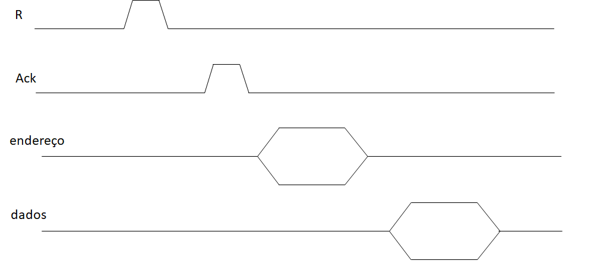

# Lista 9 de exercícios: elementos dos sistemas computacionais
## Mapeamento MP-Cache, barramento e processadores

1)Seja um sistema de memória de uma arquitetura computacional que utilize **mapeamento direto** MP-cache. A memória primária possui 256 MB de capacidade de armazenamento. A cache possui 8 kB de capacidade de armazenamento. Ambas utilizam palavras de 4 bits.  
Responder as perguntas:  
a. Admitindo que cada bloco da cache possua 1kB, quantas linhas de endereço cada bloco possui?  
b. Qual é a faixa de endereços (em hexadecimal) das linhas de endereço **dentro de um bloco**?  
c. Quantos blocos a cache possui?  
d. Qual é a capacidade de armazenamento de cada linha da MP que armazena um bloco da cache?  
e. Apresentar qual é o mapeamento das linhas da MP nos blocos da cache.  
f. Quantos bits, no mínimo, são necessários para endereçar cada linha da MP? Qual é a faixa de representação (em hexadecimal) de cada endereço da MP?  
g. Considerando os dados dos itens anteriores, qual seria o bloco da cache que armazenaria os dados do endereço 5937d da MP requisitado pelo processador?  
h. Em que endereço relativo dentro da linha de MP (dentro do bloco da cache) o referido dado estaria armazenado (em hexadecimal)?  
i. Considerando a requisição do endereço do item g, qual seria o valor do campo de tag do bloco da cache para caracterizar um acerto?  

2)Seja uma arquitetura que utiliza um sistema de memória com **mapeamento MP-cache do tipo associativo**. O projeto contempla a utilização de substituição de dados da cache de acordo com uso de estrutura de dados do tipo FIFO. Admitindo os 8 blocos de cache da questão anterior.
Os campos de *tag* e a FIFO estão populados com os dados apresentados na tabela abaixo.  

| FIFO | *Tag* | Bloco |
| --- | ----- | ----- |
| 0 | 0 | b0 |
| 2 | 53 | b1 |
| 1 | 1 | b2 |
| 3 | 1023 | b3 |
| 7 | 1000 | b4 |
| 5 | 2 | b5 |
| 6 | 3 | b6 |
| 4 | 4 | b7 |

a. No caso de que seja necessário transferir os dados da linha 7 de MP para a cache haveria substituição dos dados da cache? Nesse caso, qual bloco seria substituído? Justitifcar a resposta.  
b. No caso de que seja necessário transferir os dados da linha 53 de MP para a cache haveria substituição dos dados da cache? Nesse caso, qual bloco seria substituído? Justificar a resposta.  
c. Quais são os endereços da MP presentes na cache? Apresentar por faixa de endereçamento, em hexadecimal.  
d. Admitindo que a estrutura de dados utilizada para controlar a substituição de dados na cache fosse LRU ao invés de FIFO, qual seria a modificação no sentido do processo adotado?  
e. Caso a técnica de substituição seja LRU, dada a tabela abaixo, qual seria o primeiro bloco a ter seus dados substituídos em caso de falta?

| t(nseg) | *Tag* | Bloco |
| --- | ----- | ----- |
| 1 | 0 | b0 |
| 5 | 53 | b1 |
| 4 | 1 | b2 |
| 8 | 1023 | b3 |
| 7 | 1000 | b4 |
| 5 | 2 | b5 |
| 6 | 3 | b6 |
| 3 | 4 | b7 |

3)Explicar com suas palavras o motivo pelo qual é necessário aplicar um método para controlar a política de escrita de dados na cache. Quais são as duas técnicas discutidas e a diferença entre elas?   

4)Quanto à funcionalidade, como se classificam os barramentos das arquiteturas de sistemas computacionais? Qual é a função de cada um dos tipos?   

5)Sejam os sinais elétricos apresentados na primeira figura abaixo. Admitindo o clock de 1.5 MHz, reponder as seguintes perguntas.  

  a. O que representa o sinal de clock? Qual é o período de clock utilizado no processo de comunicações?  
  b. Considerando a classificação discutida na questão anterior, como se categorizam os sinais *Rd*, *Dados* e *Endereço*?  
  c. A comunicação estabelecida se classifica como **síncrona** ou **assíncrona**? Justificar a resposta.  
  d. Em quanto tempo o processador realizará a leitura de dados?  
  e. Qual é a diferença, do ponto de vista de controle, entre o protocolo de barrramento da figura abaixo, em comparação com a figura anterior? Quais são as vantagens e desvantagens de cada abordagem?  

6)Os processadores são construídos utilizando duas áreas funcionais básicas. Quais são elas e seu papel?   

7)Havíamos estudado e utilizado instruções de modo de endereçamento imediato e modo de endereçamento direto da arquitetura de Von Neumman.
Discutimos agora que os processadores possuem no *set* de instruções, algumas que empregam **modo de endereçamento indireto**.
Explicar com suas palavras como opera uma instrução desse tipo, as vantagens e desvantagens quando comparadas com as instruções de modo direto e imediato.

___
**[home](https://github.com/claytonjasilva/claytonjasilva.github.io/blob/main/arq_aulas.md)**  

