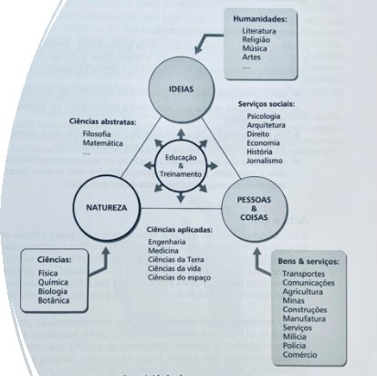
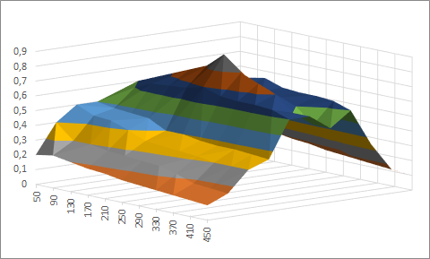

NOTA DE AULA 1 – DESAFIOS DE ENGENHARIA

ENGENHARIA, CIÊNCIA E TECNOLOGIA

PROF. CLAYTON J A SILVA

# **1. O conceito da engenharia**

O que é a engenharia para você? Reserve sua resposta e depois a revise, em função do que discutiremos a seguir.

É difícil definir engenharia em poucas palavras. Alguns exemplos práticos podem auxiliar nesse intuito. Algumas definições mais amplas também podem nos ajudar a compreender melhor:

“Engenharia é a arte da aplicação dos princípios científicos, da experiência, do julgamento e do senso comum, para implementar ideias e ações em benefício da humanidade e da natureza”.

` `Os engenheiros realizam tarefas diversas como projetar pontes, equipamentos médicos, automóveis, desenvolver processos para dejetos tóxicos, ... Em outras palavras, a engenharia envolve o desenvolvimento de um produto técnico ou sistema que seja adequado para resolver uma questão específica, valendo-se, para isso, de técnicas de utilização de materiais que a natureza oferece com a energia para fazer as transformações requeridas. 

Ora como as necessidades da humanidade são variadas também são variadas as especialidades da engenharia. Os engenheiros trabalham em todo tipo de ambiente de negócio, desde as grandes empresas até o chão de fábricas de pequenas companhias; em pátios de obras, fazendas e plataformas oceânicas; no campo e nos centros urbanos; na medicina, no direito e na arte...

Uma outra definição da engenharia pode ser dada por:

“A engenharia visa resolver os problemas de relação do ser humano com o mundo material e as suas transformações...suas atividades estão continuamente mudando de natureza e escopo.” A capacidade do homem de transformar o ambiente ao seu redor é potencializada pela sua capacidade de projetar e utilizar ferramentas. O homem é o ‘fazedor de ferramentas’.

Outra definição ampla da engenharia pode ser apresentada como:

“Engenharia é a aplicação dos saberes científicos para criar algum elemento de valor a partir dos recursos naturais”.

O que é elemento de valor? A definição de valor pode ensejar uma boa discussão. O valor percebido resultante da aplicação dos processos da engenharia depende das necessidades, que por sua vez, variam conforme o contexto temporal, geográfico, comercial etc. 

A Figura 1 apresenta um rol de atividades humanas, nas quais se inserem as ciências aplicadas, entre elas, a engenharia.

Figura 1 – Diagrama das atividades humanas

As atividades humanas são ditadas pela relação com a natureza; pelas ideias abstratas, próprias da condição humana; e pelas relações interpessoais e das pessoas com as coisas, existentes no ambiente que as cercam. 

As ciências entender como os fenômenos naturais ocorrem. São elas, a Física, a Química, a Biologia e a Botânica. As humanidades são voltadas à compreensão do ser humano e de suas ideias, como a literatura, religião, música, artes, entre outras. E os bens e serviços, como transportes, comunicações, entre outras, satisfazem o ser humano na sua necessidade de sobrevivência e seus desejos nas relações interpessoais e com o ambiente. 

As atividades humanas influenciam-se mutuamente. As atividades relacionadas com a natureza são influenciadas pelas ideias e vice-versa. As ciências abstratas, como a filosofia, a matemática etc. buscam entender essas questões. 

Os serviços sociais, como a psicologia, arquitetura, direito, entre outros saberes, promovem a relação das ideias com as relações interpessoais, com o uso e apropriação das coisas pelo ser humano. 

Finalmente, a relação entre as atividades interpessoais e das pessoas com as coisas é condicionada pelos limites do ambiente natural em que se dá e estudada pelas ciências aplicadas, como a engenharia, a medicina, entre outras. 

Ou seja, a engenharia se ocupa de uma questão específica e distinta do cientista. Essa distinção de papeis é bem definida pelo aforismo: “Os cientistas descobrem o mundo que existe; os engenheiros criam o mundo que jamais existiu”. 

Para executar o seu papel na sociedade o engenheiro precisa se valer dos recursos materiais e energéticos para que possa entregar os produtos. Os recursos naturais, ou seja, obtidos da natureza e usados pela engenharia podem ser renováveis ou rapidamente esgotados. Nesse sentido, a engenharia deve ter a preocupação com a conservação desses recursos, o que não significa que ‘não deva utilizá-los’. A verdadeira conservação dos recursos naturais requer o contínuo desenvolvimento de novos recursos, assim como a utilização eficiente dos já existentes. A sociedade deve ser consciente da finitude de alguns recursos, entre eles, a água doce, o petróleo e o minério de ferro.

Em vista do rápido crescimento populacional, do desejo de melhorar a qualidade de vida e do aumento do consumo de energia e materiais, o trabalho de conservação dos recursos naturais está se tornando a principal atividade de alguns engenheiros e cientistas, que têm a missão de descobrir novas fontes, desenvolver métodos melhorados de processamento e revelar recursos alternativos. Os recursos naturais podem ser classificados em: recursos materiais e recursos energéticos.

Os recursos materiais são utilizados com o objetivo de produzir outros objetos. Os materiais usados pela engenharia incluem derivados de animais, vegetais e minerais, sendo alguns naturais ou não. Esses últimos podem ser manufaturados ou processados. Os derivados podem ser muito úteis pelas propriedades que apresentam, como resistência, facilidade de fabricação, leveza, durabilidade, capacidade de isolamento ou condução, características térmicas, magnéticas, elétricas, químicas ou acústicas. 

Os recursos energéticos são usados com o objetivo de produzir energia. A quantidade de fontes importantes de energia é muito menor do que a de recursos materiais como o carvão mineral, o petróleo, o gás natural, o vento, a luz solar, as quedas d’água, as ondas do mar e a fissão nuclear.

Cada forma de energia tem vantagens e desvantagens. A Tabela 1 apresenta uma breve comparação entre os recursos energéticos.

Tabela 1 – Recursos: vantagens e desvantagens 

|**Recurso**|**Vantagens**|**Desvantagens**|
| - | - | - |
|Carvão mineral|- Custo baixo|
- Mineração perigosa

- Impurezas (enxofre) difíceis de remover
|
|Derivados de petróleo||
- Armazenamento requer controle rigoroso

- Tendência de esgotamento
|
|Vento|
- Baixo custo

- Farta disponibilidade
|- Não confiável|
|Queda d’água||- Viabilidade restrita|
|Combustível nuclear|- Custo baixo|
- Conversão em energia cara

- Preocupação social grande quanto à segurança
|

Refletindo sobre as definições anteriores, fica claro que a engenharia, como ciência aplicada, e não ciência pura ou abstrata, se vale de processos, os quais se aproveitam da ciência para gerar suas aplicações. Os engenheiros (engenheirando...) não fazem ciência, mas dela fazem uso.

Da discussão preliminar pode-se concluir que a engenharia cria o artificial. Cria o artificial para proporcionar segurança ao homem, protegendo-o, por exemplo, das intempéries; alcançar poder, para capacitá-lo a sobrepujar suas limitações naturais; entre outras inúmeras motivações. Observe que esse é o valor que se pode obter com a aplicação da engenharia.

No livro *The Sciences of the Artificial*, Herbert Simon observa que o mundo contém dois tipos de seres: naturais e artificiais. Os seres naturais são formados pelos processos da natureza, como vento, chuva, entre outros. O papel das ciências naturais é investigar esses fenômenos naturais. Por outro lado, os seres artificiais que existem em nosso planeta e em outros locais do sistema solar foram todos projetados e construídos com um objetivo: satisfazer as necessidades e desejos complexos da humanidade.

Simon designa no seu livro o termo artificial sem a conotação negativa que muitas vezes é aplicada. Simplesmente para designar “produzido pelo homem” e usa o termo “artefato” para designar os produtos desses processos artificiais. Embora muitos artefatos sejam objetos concretos, também podem assumir formas como a forma de processos, eventos ou serviços.

Uma definição ampla do objetivo das atividades de engenharia pode ser dada por:

“O objetivo principal da engenharia é aplicar a tecnologia, em combinação com fenômenos naturais, para obter as coisas que desejamos ou necessitamos”.

# **2. Ciência e Tecnologia**
A definição acima nos traz agora o uso do termo tecnologia. Embora, em princípio, possamos usar os termos ciência e tecnologia de modo indistinto, não possuem o mesmo sentido.

Podemos definir ciência como o “conjunto organizado dos conhecimentos relativos ao Universo envolvendo seus fenômenos naturais, ambientais e comportamentais, resultante do processo cumulativo do conhecimento humano, gerado pela aplicação de pesquisa ou investigação científica e seguindo o método indutivo-dedutivo.”

Podemos definir tecnologia como o “conjunto organizado de todos os conhecimentos científicos, empíricos ou intuitivos, utilizados na produção e na comercialização de bens e serviços. Prioriza o uso do conhecimento. Sua característica fundamental é a aplicabilidade.”

Historicamente, o homem buscou adaptar-se ao ambiente em que vivia muito antes de desenvolver um pensamento erudito. Por exemplo, para se proteger desenvolveu abrigos usando o material a sua volta. Aquilo já era tecnologia.

Tanto ciência quanto tecnologia resultam do processo cumulativo de conhecimento, no qual cada geração herda um estoque de conhecimento e de técnicas passando-os às gerações seguintes. Como se dá o processo de avanço tecnológico? Quais são os atributos fundamentais para o progresso tecnológico?

Até um certo momento da história da humanidade perdurou um cenário de geração e transferência de tecnologia com base empírica. Cada nova ferramenta era inventada de modo espontâneo, fruto de condições ambientais favoráveis. Com o passar do tempo, os homens passaram a adotar métodos para sistematizar a acumulação e a transferência do conhecimento acumulado ao longo de gerações. Nesse amadurecimento evolutivo surgiu a ciência.

Analisando a transformação dos métodos usados pela ciência, em especial os marcos principais, há que destacar o papel de Francis Bacon, considerado o pai do método empírico ou experimental. Filosoficamente, a indução lógica, definida como a operação de estabelecer uma proposição geral com base no conhecimento de dados singulares, já era a base da ciência e é inerente ao método empírico proposto por Bacon para a interpretação da natureza.

Com sua abordagem, o método empírico se afasta da filosofia e passa à ciência. Atenta para o dever de o observador ater-se apenas aos dados empíricos, os quais devem ser diversificados e amplos. Além disso, destaca a importância dos axiomas médios para chegar ao mais geral, dando uma certa ideia de processo científico, deserdando os “saltos” lógicos diretamente para o axioma geral – por isso sublinha a necessidade de um método científico rígido para que o cientista não desvie do seu caminho.       

Além do método empírico-indutivo de Bacon, notabiliza-se como um marco da ciência moderna o método proposto por René Descartes, considerado pai do racionalismo, em que defendia que a dúvida é o primeiro passo para chegar ao conhecimento. René Descartes propôs o método dedutivo (cartesiano) para aplicação à ciência.

O método cartesiano consiste em:

1. Verificar se existem evidências reais e indubitáveis acerca dos fenômenos do objeto sob estudo;
1. Analisar, ou seja, dividir ao máximo as coisas, em suas unidades mais simples e estudar as unidades mais simples;
1. Sintetizar, ou seja, agrupar novamente as unidades estudadas em um todo verdadeiro;
1. Enumerar todas as conclusões e princípios utilizados, a fim de manter a ordem do pensamento.

Finalmente, cabe destacar nesse conjunto de marcos da evolução da ciência e da tecnologia na acumulação do conhecimento, Galileu Galilei, chamado por muitos como o pai do método científico e pai da ciência moderna.

Em síntese, Galileu propõe que o método científico deve ser indutivo-dedutivo, com uma estruturação racional e a observação controlada dos fenômenos a investigar. A Figura 2 apresenta o resumo do método científico.

Figura 2 – Método científico

Os fenômenos devem ser passíveis de observação sistemática e controlada. Dessa observação são enunciados fatos, que devem ser verificáveis. 

Para explicar os fatos são formuladas hipóteses. Hipóteses são proposições, afirmações, cujo valor lógico é admitido como verdadeiro para explicar o fenômeno. Entretanto, que devem ser passíveis de serem submetidas a testes que possam revelar sua falsidade. Ou seja, as hipóteses devem poder ser falseáveis por testes adequados e, consequentemente, serem refutadas.

Caracterizados os fatos que cercam o fenômeno e as hipóteses que o explicam estabelece-se uma teoria a seu respeito. A teoria deve ser formulada de modo que as implicações do fenômeno sejam levantadas, as previsões dele decorrentes, uma vez aconteça, e conclusões sejam estabelecidas.

O método científico é contínuo e a teoria formulada deve possibilitar que novos experimentos sejam realizados, fatos sejam observados, de modo a certificar se corroboram ou não a base estabelecida. Em caso negativo, ou seja, a teoria não foi corroborada as hipóteses devem ser reavaliadas e recicladas, submetendo-se o fenômeno a uma observação e repetindo o ciclo.

# **3. O voo da humanidade**

Não me arrisco a dizer, com base nas definições preliminares, que a história da evolução da engenharia se confunde com a evolução da ciência e tecnologia. 

Considerando a importância da ciência e da tecnologia no exercício da atividade de engenharia, é fundamental verificar como a evolução humana foi diretamente influenciada pelos saltos tecnológicos pelos quais a sociedade passou. Em especial, o quanto a aceleração da produção de bens e serviços foi acelerada pela adoção de métodos científicos, evidenciando a importância de aportar às atividades de engenharia métodos científicos rigorosos.

Nosso guia é o livro do professor Carlos Amarante, O voo da humanidade, em que elenca as tecnologias de impacto, assim definidas como aquelas que induziram transformações socioculturais revolucionárias na sociedade.

O avanço da civilização humana é marcado por ciclos de evolução estabelecidos por um conjunto de tecnologias de impacto e pelo aprimoramento de antigas tecnologias. A evolução civilizatória da humanidade pode ser bem mais bem compreendida se for dividida em ciclos varridos por sequentes revoluções socioculturais.

Amarante aponta as seguintes revoluções socioculturais e as correlaciona com um conjunto de 101 tecnologias:

- Revolução agrícola;
- Revolução urbana;
- Revolução filosófica;
- Contrarrevolução religiosa;
- Revolução cultural;
- Revolução científica;
- Revolução industrial;
- Revolução tecnológica.

Cada uma das revoluções iniciou-se em um determinado período da civilização humana. A mais antiga das revoluções iniciou-se aproximadamente em 8000 AC, a mais recente, em 1940. A Figura 3 mostra como o intervalo entre o surgimento de novas revoluções tem se tronado cada vez mais curto.

Figura 3 – Comparação entre o início das revoluções socioculturais da humanidade

Cada vértice da figura indica o início da respectiva revolução comparada à revolução mais antiga, a revolução agrícola, que ocupa o centro, traduzida no raio da figura. No sentido horário, a revolução urbana iniciou-se por volta de 3000 AC; a filosófica, em 600 AC; a contrarrevolução religiosa, em 500 DC; a cultural, em 1.100 DC; a científica, em 1.450 DC; a industrial, em 1.750 DC; e a tecnológica, em 1.940 DC. Na figura os raios das revoluções mais recentes são cada vez maiores e mais próximos, indicando que o intervalo entre duas revoluções têm sido cada vez menor.

Não somente o início entre as revoluções tem ocorrido em intervalos cada vez menores. Um outro parâmetro é importante para analisar cada revolução socioeconômica: a duração do fenômeno. A Figura 4 apresenta a duração de cada uma.

Figura 4 – Revoluções socioculturais e sua duração aproximada

O gráfico evidencia que a duração das revoluções tem sido cada vez menor. A duração da atividade mais longa, a revolução agrícola, possui uma duração cerca de 60 vezes maior do que a revolução cuja duração é mais curta, a revolução tecnológica (a despeito desta última ainda estar em curso!). A pergunta é: quando a nova revolução acontecerá? 

Considerando as informações conclui-se que as transformações rotuladas como revoluções socioculturais têm acontecido em intervalos cada vez mais curtos e perdurando cada vez menos tempo. Essa conjunção desses dois fatos produz uma influência sobre cada geração de homens enorme. Uma geração poderá experimentar mais de um ciclo de transformações socioculturais impactantes. Uma das consequências esperadas disso é o aprofundamento do chamado hiato tecnológico, isto é, uma pessoa não conseguir se adaptar a uma nova tecnologia, pois mal teve tempo de se adaptar à anterior, aprofundando a sua defasagem. Sinaliza que as pessoas capacitadas a responderem mais rapidamente às transformações serão mais valorizadas no mercado de trabalho. 

O livro *O voo da humanidade* apresenta a quantidade de tecnologias de impacto em cada revolução, apresentada no gráfico da Figura 5.

Figura 5 - Evolução da quantidade de tecnologias na história da civilização humana

Amarante propõe a discussão das revoluções considerando o contexto em que ocorreram, sintetizada na Tabela 2, passando pelo tipo de setor de produção; da infraestrutura financeira, de comunicações e de transporte; da organização política; e do tipo de sociedade. No contexto, considera também a produção tecnológica.

No que se refere à produção tecnológica, a velocidade da produção é calculada a partir da razão entre o número de tecnologias produzidas e a duração de cada revolução. Verifica-se claramente que a velocidade de produção tem sido cada vez maior. As revoluções mais recentes apresentam uma taxa de produção de tecnologias de impacto cada vez maior. 

Qual é a relação dessa questão com a engenharia? 

Tabela 2 – Tabela de critérios para comparação das revoluções socioculturais

  

Interessa-nos particularmente discutir a evolução e os reflexos na engenharia. A tabela evidencia, que enquanto nas primeiras revoluções as tecnologias tinham base essencialmente empírica, nas revoluções mais recentes na história da civilização humana, possuem uma base científica. 

A engenharia, como ciência aplicada, tem sido cada vez mais dependente da aplicação do método científico, aplicável não somente às ciências da natureza. Por essa razão os currículos de engenharia requerem o aprofundamento das disciplinas de matemática, física etc. 

No entanto, não somente do método científico a engenharia é dependente. Além do método científico, os currículos de engenharia devem contemplar o método da engenharia, que é próprio da finalidade prática dos artefatos produzidos pelos engenheiros. No que ele consiste?

# **4. Método, modelos e sistemas de engenharia**

Quase todos os problemas de engenharia são abertos, ou seja, não possuem solução única. O fato de um problema ter mais de uma solução não significa que seja fácil resolvê-lo. É típico dos problemas abertos também que o enunciado não contenha todas as informações necessárias para solucioná-los. Para superar essa situação é necessário formular hipóteses a fim de aplicar uma técnica conhecida, como resolver uma equação. O conhecimento de quais hipóteses são razoáveis só é obtido através da experiência.

Nesse sentido, o engenheiro deve possuir as competências, entre outras, de:

- Formular um problema de projeto;
- Formular hipóteses;
- Formular possíveis ideias para projetos;
- Buscar soluções;
- Planejar e programar atividades;
- Usar recursos com eficiência;
- Organizar os componentes e os grupos de trabalho.

Podemos sintetizar as tarefas do engenheiro como sendo aquelas relacionadas direta ou indiretamente com a concepção ou projeto e com a análise de artefatos de engenharia, elementos e sistemas.

Para realizar suas tarefas diárias e alcançar os objetivos os engenheiros utilizam o método da engenharia, o qual, com algumas variações de descrição (aprofundaremos o método em uma seção específica da disciplina), pode ser sumariamente apresentado como:

1. Identificar e definir o problema;
2. Reunir a equipe de projeto;
3. Identificar restrições e critérios para atingir o sucesso;
4. Buscar soluções;
5. Analisar cada solução potencial;
6. Selecionar a melhor solução;
7. Documentar a solução;
8. Comunicar a solução à gerência;
9. Construir a solução;
10. Verificar e avaliar o desempenho da solução.

Os engenheiros usam métodos para desenvolver modelos dos seus projetos. Os modelos são versões aproximadas dos sistemas reais, respondendo de modo semelhante, mas que podem ter muitas formas diferentes, desde protótipos até cálculos simples, passando por simulações de computador. A capacidade de usar modelos para descrever processos e fenômenos é uma exigência básica em todos os ramos da engenharia. 

Os modelos podem ser classificados como: modelos qualitativos, modelos matemáticos estatísticos, modelos computacionais e modelos físicos.

Os modelos qualitativos descrevem o comportamento geral do objeto e de suas propriedades, percebidas pela observação ou desejadas. É importante salientar que a observação pode ser realizada a partir do registro de documentos, do registro de imagens e sons, da consulta a pessoas, entre outras formas. Os registros podem ser documentados e expressos. Os dados coletados são preferencialmente descritivos e o “significado” que as pessoas dão às coisas observadas são focos de atenção. A análise de dados e informações tende a seguir um processo indutivo. Para as aplicações de engenharia, os modelos qualitativos normalmente não são suficientes e informações quantitativas são necessárias.

Como a engenharia via de regra requer valores quantitativos, os modelos matemáticos e estatísticos são fundamentais. Ainda que na engenharia sejam fundamentais, os modelos matemáticos e estatísticos muitas vezes não são completos. Fatores podem ser desprezados de modo a reduzir a complexidade da descrição do fenômeno que importa para a solução de engenharia desejada. Os engenheiros raramente precisam de modelos matemáticos completos para resolver seus problemas. Isso não significa que os modelos sejam inúteis por esse motivo. A questão a considerar é: qual é a precisão do modelo desejada para o problema sob estudo?

Por exemplo, quando o engenheiro projeta um sistema de reprodução de músicas em um aparelho de som não é necessário considerar todos os harmônicos de uma onda sonora, pois o ouvido humano consegue perceber frequências limitadas até cerca de 20 kHz. Nesse sentido, a fim de simplificar o projeto e apresentá-lo com uma melhor relação custo-benefício, trabalha-se com as frequências abaixo desse limite, desprezando as frequências superiores.

Nesse contexto, é uma preocupação constante do engenheiro, na formulação dos artefatos de engenharia, conciliar o melhor modelo para o problema que se pretende resolver. Para a engenharia o melhor modelo concilia todas as restrições e conflitos dos requisitos almejados para o artefato. A essa solução dá-se o nome de solução ’ótima’. A pesquisa das soluções ótimas requer a aplicação de várias técnicas, algumas delas rotuladas como pesquisa operacional, otimização etc.

Por exemplo, admita o projeto de uma motocicleta. Três variáveis permitem mensurar os requisitos para a definição da solução de engenharia: desempenho global, medido em uma escala adimensional nos limites entre 0 e 1; peso, medido em quilogramas (kg); e potência do motor, medido em cavalos de força (*horse-power*) (hp). Sejam os dados das variáveis mapeados na Tabela 3, obtidos no curso do projeto da moto.

Tabela 3 – Mapa do desempenho global, *d=f(peso,potência)*

Obviamente, a solução ótima do problema consiste na potência do motor de 130 hp e um peso total de 250 kg, pois o desempenho global alcança 0,9. Graficamente a solução ótima se manifesta como o pico na curva definida pela superfície que define a função *d=f(peso, potência)*, conforme apresenta a Figura 6.

Figura 6 – Gráfico da superfície com a solução ótima *no projeto* veículo automotivo

A Figura 7, adaptada de uma de nossas referências, propicia uma visão interessante sobre a aplicação de modelos qualitativos e modelos matemáticos/estatísticos na solução de problemas de engenharia.

Na parte inferior apresenta-se o conjunto de tentativas para a apresentação da solução de engenharia. O modelo qualitativo, que remete ao subconsciente das percepções, é formulado e testado. Se não responder adequadamente é redesenhado, isto é, uma nova tentativa é buscada. A nova tentativa implica assimilação de conhecimento (pelo menos de como não fazer!).

Caso o modelo qualitativo atenda como solução, o modelo quantitativo, com variáveis capazes de ser mensuradas, é proposto e testado. O modelo quantitativo provoca o que é da consciência no sentido de que produz resultados objetivamente mensuráveis, com limites aceitáveis ou rejeitáveis, de acordo com medidas, métricas e indicadores claramente estabelecidos, utilizando unidades padronizadas.

Figura 7 – O processo de solução de um problema de engenharia

Os modelos matemáticos e estatísticos podem ser resolvidos utilizando sistemas computacionais. Para isso, são utilizados modelos computacionais. Os computadores podem ser programados para resolver os modelos matemáticos e estatísticos que descrevem um artefato de engenharia. Os benefícios de aplicar modelos computacionais à solução de problemas de engenharia são enormes. Embora seja necessário o investimento no sistema computacional (software ou hardware), repetir o fenômeno a ser observado, testando as variáveis com diversos valores possíveis, é normalmente mais barato do que construir diversos modelos que precisam passar por testes destrutivos, ou seja, que não podem ser reaproveitados. Além do baixo custo de testar, a rapidez com que os testes são realizados e repetidos é grande, podendo abreviar sobremaneira o ciclo de desenvolvimento de produtos. Os modelos computacionais proporcionam, com o aumento cada vez maior da capacidade das plataformas computacionais, um nível de precisão da observação dos fenômenos muito próximo da realidade. 

Decorre da aplicação dos modelos computacionais propiciam a simulação computacional. As simulações são o resultado da aplicação do modelo e devem permitir a apresentação útil para a validação ou refutação das hipóteses formuladas.

Finalmente, os modelos físicos, embora muitas vezes sejam caros e demorados para construir, em muitas circunstâncias são importantes antes da produção do artefato a ser construído pela engenharia.    

Como os modelos simplificam sistemas de engenharia, naturalmente o objeto do estudo da engenharia são os sistemas artificiais. É necessário entender a noção de sistema. Sistema é “um conjunto ou montagem de entidades ligadas, associadas, ou interdependentes, de modo a formar uma unidade complexa.” Pensar em termos de sistemas permite desenhar uma curva fechada em torno de uma parte de uma rede e considerar essa parte como uma entidade única.

Figura 8 – Um sistema

Como a Figura 8 apresenta, essa curva é chamada de ‘limite do sistema’ e a região do lado de fora do limite é chamada de ‘ambiente’.

Os componentes do sistema podem ser considerados eles próprios como sistemas, que recebem o nome de subsistemas. Esse arranjo é encontrado em todos os tipos de projetos de engenharia.

Os sistemas desempenham um importante papel nos projetos de engenharia, tanto por uma razão psicológica, quanto por uma razão prática. A organização psicológica é que a organização clássica de ‘caixas dentro de caixas’ dos sistemas de engenharia reflete diretamente o modo como organizamos e recuperamos informações em nossa mente. Dividir um problema complexo em subproblemas, ou dividir um sistema em subsistemas, permite esquecer os detalhes e lidar com um número menor de conceitos de cada vez. Além disso, permite que várias pessoas trabalhem simultaneamente em diferentes partes de um projeto.

A justificativa física para usarmos o conceito de sistemas é que os projetos organizados desta forma tendem a ser mais robustos, no sentido de que todos os elementos estejam presentes e operem conjuntamente de modo estável.

Relacionado a essa robustez se associa o conceito de complexidade do sistema. Os elementos do sistema interagem com maior ou menor intensidade, dependendo do sistema. Essa interação se relaciona com a hierarquização e com a especialização dos elementos dos sistemas. A hierarquização diz respeito ao nível de decomposição em que se insere o elemento (para usar a mesma metáfora, em ‘qual caixa’ o elemento se enquadra). A especialização diz respeito à função ou resultado que o elemento entrega quando lhe são apresentadas entradas. Os elementos interagem por meio de interfaces internas.

Os sistemas apresentam um desempenho que é maior do que a soma do comportamento de suas partes.  Às vezes se diz que o comportamento do sistema emerge quando os seus componentes funcionam conjuntamente de modo sinérgico. Quanto mais complexo é o sistema, mais se revela a importância da sinergia do comportamento de seus elementos.

Além da importância da relação entre os elementos do sistema, nos projetos de engenharia é importante também a interação do sistema com o seu ambiente.  Um sistema interage com o ambiente através de ligações que cruzam o limite. Em determinadas circunstâncias é fácil definir o limite de um sistema, no entanto isso não é sempre óbvio.

Quando algum problema ocorre no projeto de um sistema complexo, muitas vezes decorre de algum problema relacionado ao limite ou interface externa. 

A interligação que existe entre os elementos do sistema e do sistema com os elementos do ambiente caracteriza as redes, inerente à complexidade dos problemas e soluções de engenharia. Os diagramas auxiliam a visualização de sistemas complexos, em particular das redes. Um tipo de diagrama que permite visualizar as redes são os chamados ‘grafos’, como apresentado na Figura 9.

Figura 9 – Grafos com nós e arestas

Um  grafo é formado por uma série de nós, normalmente desenhados como círculos ou quadrados, ligados por linhas retas designadas como arestas. Os nós podem representar pessoas, lugares, eventos, equipamentos e diversos outros elementos que podem integrar uma rede. As arestas representam ligações entre dois objetos, físicos ou abstratos. A ligação pode ser física, como um fio, ou uma troca de informações.

Nos projetos de engenharia entender não somente os nós da rede, mas também entender as arestas é importante para conceber os sistemas. A definição adequada das arestas propicia um projeto adequado para as interfaces internas e externas, consequentemente fortalece a sinergia entre os elementos do sistema.

Em qualquer projeto, por exemplo, estruturar o trabalho a realizar de modo adequado conduz a uma boa solução. Organizar o trabalho na forma de sistema e subsistemas facilita, tanto física quanto conceitualmente, a abordagem, pois possibilita distribuir o esforço para colaboradores diferentes da equipe, reduzindo a dependência mútua do trabalho entre eles. Não obstante os subsistemas serem interdependentes, a definição conceitual de suas relações e a construção de suas interfaces podem ser estabelecidas mais facilmente.

A Figura 10 apresenta uma abordagem sistêmica na formulação do escopo de um projeto de automóvel, a título de exemplo.

Figura 10 – Escopo de automóvel organizado com visão sistêmica 

Os sistemas de engenharia têm se tornado cada vez mais complexos e aplicar as técnicas adequadas para conceber e selecionar a solução mais vantajosa; para desenhar a solução de engenharia, apresentando-a de acordo com os modelos que a descrevem, assim como os modelos que descrevem a sua construção, montagem e instalação; e para assegurar a operação e suporte é essencial ao engenheiro contemporâneo. A esse conjunto de técnicas se dá o nome de Engenharia de Sistemas. 

` `Retornando à compreensão sobre o exercício da engenharia, vimos que duas são as vertentes de atuação do engenheiro: 

- no projeto; e 
- na análise de sistemas. 

Pela vertente do projeto de artefatos, conhecer as ferramentas e desenvolver as habilidades para conceber artefatos é cada vez mais importante no mercado de trabalho. 

# **5. Projetos de engenharia**

Define-se projeto como o empreendimento de trabalho singular, ou seja, que entrega um resultado único, produto ou serviço, que se desenrola em uma janela temporal, portanto tem início, meio e fim. Entregar o produto (usando o termo indistintamente para produtos e serviços) satisfazendo os requisitos negociados do objeto, ou seja, atendendo ao escopo para satisfazer a necessidades, de acordo com o cronograma acordado com os interessados e dentro do orçamento comunicado permite classificar qualquer empreendimento como bem ou malsucedido.

Gerenciar adequadamente o esforço que se define como um projeto é importante para o engenheiro na atualidade. Trata-se de mais uma competência requerida para o exercício da engenharia. A Figura 11 apresenta o rol de algumas das competências que já discutimos aqui, incluindo a capacidade de gerenciamento de projetos.

Figura 11 – Algumas das disciplinas da engenharia

Existem várias metodologias recomendadas para gerenciar projetos de engenharia e que podem ser genericamente classificadas em: métodos tradicionais de gerenciamento (também chamados de clássicos e em cascata); ou métodos ágeis de gerenciamento.

Em vários contextos, a aplicação dos chamados métodos clássicos (modelos em cascata) de gestão de projetos é a forma mais adequada de assegurar as entregas com sucesso do resultado do projeto. Em síntese os métodos em cascata de gestão operam conforme mostra a Figura 12.

Figura 12 – Modelo em cascata típico para gestão de projetos

Tipicamente, os modelos em cascata pressupõem um investimento grande no planejamento e no desenvolvimento do produto, o qual será entregue ao cliente após testes e a aprovação. O conjunto de etapas de compreensão dos requisitos do negócio e iniciação; é seguido por um planejamento meticuloso e detalhado; com base no qual a construção do produto é realizada, monitorada e controlada; até, finalmente, após exaustivos testes serem realizados, a entrega é feita ao cliente.

Por muitos esses métodos de gerenciamento prevaleceram no mercado até que, há alguns anos, a indústria de software passou por uma transformação significativa no que se refere à maneira como gerenciava os projetos de desenvolvimento das aplicações. Os métodos empregados para os projetos de serviços e produtos aplicados não se revelaram eficazes para a natureza dos softwares e a dinâmica do mercado. 

Em razão disso, pesquisadores se reuniram, discutiram e lançaram doze princípios que consagram o chamado Manifesto Ágil para orientar a gestão do desenvolvimento de sistemas de software. Entre outras questões, o manifesto salienta a necessidade de realizar entregas contínuas do produto pedido, flexibilidade para aceitar as mudanças de requisitos quando for exigido, aproximar os desenvolvedores das equipes de negócio, otimizar a comunicação, minimizar o esforço que não esteja relacionado com a entrega do produto e assegurar equipes auto-organizadas que proporcionem alto rendimento. Essas características são aquelas que diferenciam decisivamente os métodos ágeis de gestão dos métodos em cascata, conforme mostra a Figura 13.

Figura 13 – Entregas contínuas dos modelos ágeis de gestão de projetos

Além das entregas contínuas, destaca-se no modelo de gestão ágil a entrega de valor ao cliente o mais cedo possível, o que é alcançado pelos métodos clássicos somente após um intervalo de tempo longo.

Figura 14 – Entrega de valor ao cliente

A Figura 14 apresenta uma comparação dos métodos clássicos com o método Scrum, que estudaremos mais tarde. As entregas contínuas realizadas pela equipe do Scrum devem priorizar sempre, desde que não haja dependência lógica que impeça, as funcionalidades mais importantes do produto (depois discutiremos em mais detalhes) o mais cedo possível, satisfazendo o negócio a ser atendido. 

Vários métodos que aplicaram os princípios de gestão ágil surgiram, foram bem-sucedidos e atualmente são aplicados em uma gama bastante ampla de trabalhos, não especificamente à gestão de projetos.
Página 1/34
