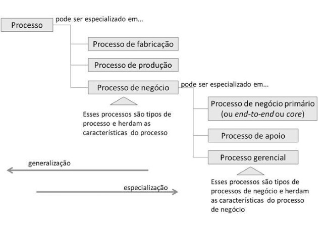
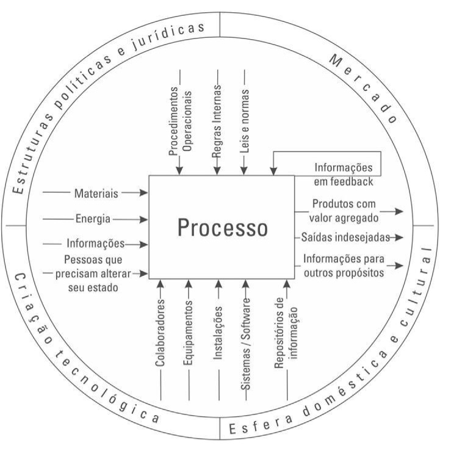
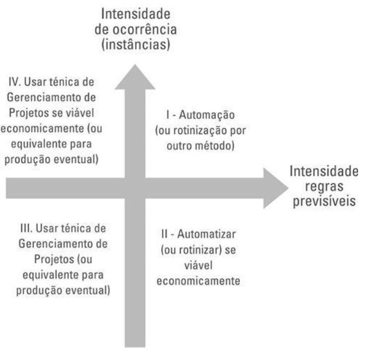
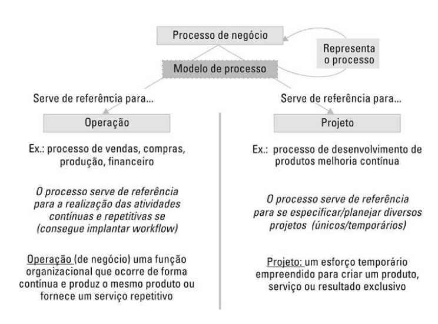
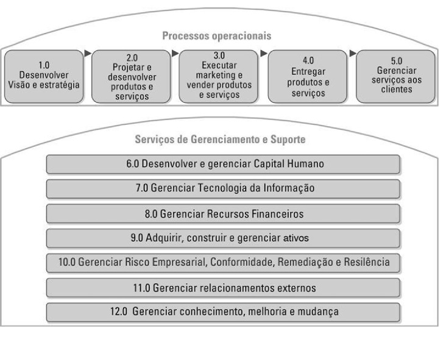
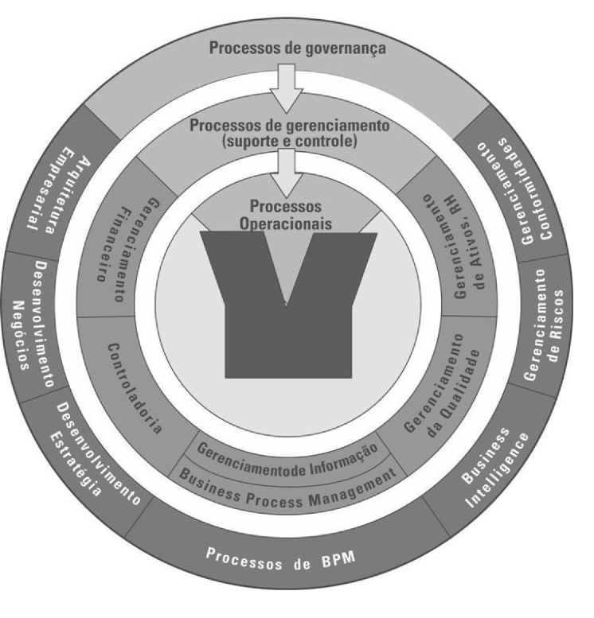
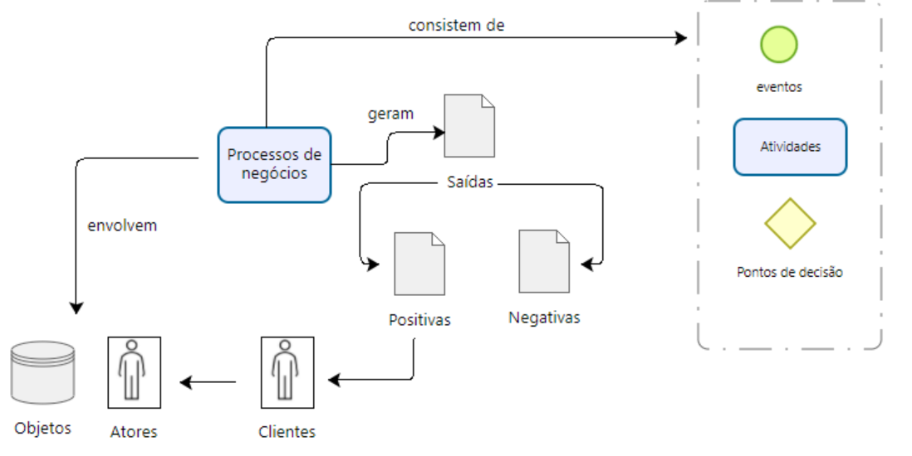
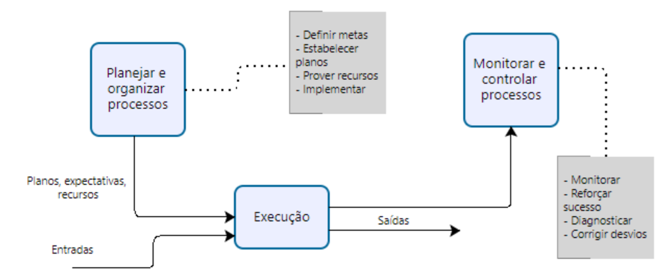
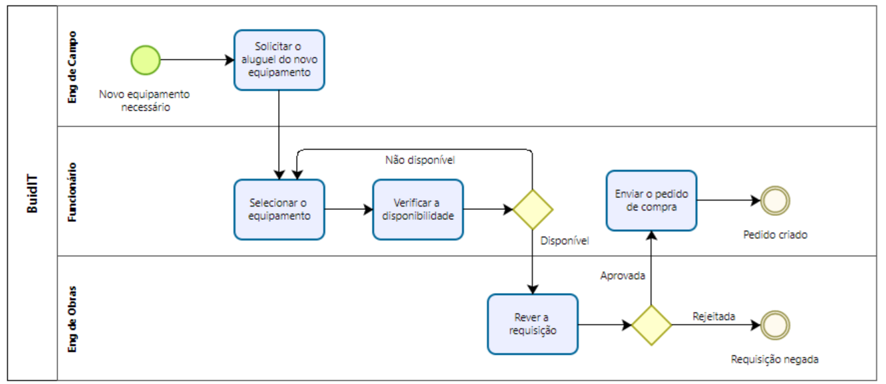
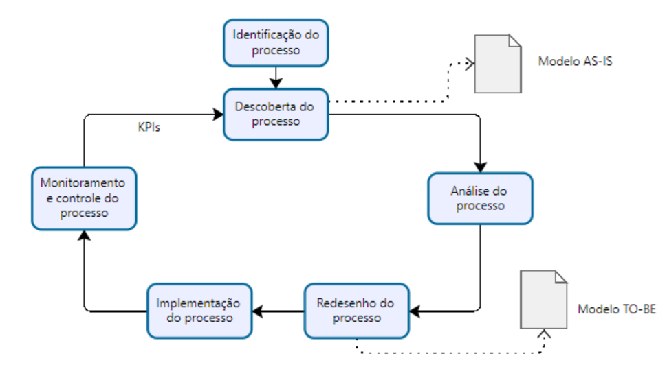

# Capítulo 1

## Introdução à Gestão de Processos de Negócio

A Gestão de Processos de Negócio (BPM) é a arte e ciência de supervisionar como o trabalho é realizado em uma organização para garantir resultados consistentes e aproveitar oportunidades de melhoria. Neste contexto, o termo "melhoria" pode ter diferentes significados, dependendo dos objetivos da organização. Exemplos típicos de objetivos de melhoria incluem a redução de custos, redução dos tempos de execução e redução das taxas de erro. Iniciativas de melhoria podem ser pontuais, mas também podem exibir uma natureza mais contínua. Importante, BPM não é sobre melhorar a forma como atividades individuais são realizadas. Em vez disso, trata-se de gerenciar cadeias inteiras de eventos, atividades e decisões que, em última análise, agregam valor à organização e aos seus clientes. Essas "cadeias de eventos, atividades e decisões" são chamadas de processos.

Neste capítulo, introduzimos alguns conceitos essenciais por trás do BPM. Começaremos com uma descrição de processos típicos encontrados em organizações contemporâneas. Em seguida, discutiremos os ingredientes básicos de um processo de negócio e forneceremos uma definição para o conceito, bem como para o BPM. Para colocar o BPM em uma perspectiva mais ampla, apresentaremos um histórico da disciplina BPM. Finalmente, discutiremos como uma iniciativa de BPM em uma organização normalmente se desenrola. Esta discussão nos levará à definição de um ciclo de vida de BPM em torno do qual o curso é organizado.

### 1.1 O que são processos?

Fonte: Gerenciamento de Processos de Negócios - BPM: Uma Referência para Implantação Prática, Roquemar Baldam, Henriq Rozenfeld

Em nossa sociedade, **bens materiais e serviços** são produzidos e consumidos em massa. Racionalizar o suo de recursos é fundamental. A produção em massa baseia-se numa racionalização que inclui tarefas repetitivas, uso de ferramentas bem específicas e apropriadas, técnicas de execução em tempo mínimo. 

Dessa necessidade nasce a ideia geral de processo. Há certamente diversas perspectivas sobre processos, contudo todas concordam num ponto: o propósito de qualquer processo é transformar uma entrada qualquer (energia, informação, materiais ou clientes) em uma ou mais saídas, com maior valor econômico ou social. 

Processos só existem se geram algum benefício para algum interessado. Entretanto, frequentemente nos deparamos com processos organizacionais cuja agregação de valor não está clara para os seus próprios operadores, nem tampouco para os clientes. 

Em inúmeros outros casos, o que se ignora são as saídas indesejadas (poluição, por exemplo). Neste sentido, uma boa gestão dos processos serve, antes de tudo, para dar maior transparência à organização. As organizações fornecem produtos (bens e serviços) a seus clientes. O meio através do qual elas atingem este fim são os processos. Logo, todas as empresas têm processos (SMART, MADDERN e MAULL, 2009). 

Os processos existem nas organizações, gerenciados de forma às vezes consciente (modelados, e/ou conhecidos, e/ou definidos, e/ou indicados etc), às vezes inconscientes; **estruturados de forma às vezes explícita**, às vezes não documentada. O gerenciamento de processos faz parte do capital estrutural da organização, mesmo que de modo **tácito**.

Assim, é necessário que a organização entenda os seus processos para que depois possa gerenciá-los (DUBANI, SOH e SEELING, 2010). Smart, Maddern e Maull (2009) destacam a importância da consciência no gerenciamento de processos: ela é fundamental para se atingir melhores resultados e para facilitar a disseminação da própria cultura de orientação por processo dentro da empresa. 

Esse é um fator chave para o sucesso da implementação de BPM e da contínua melhoria dessa filosofia dentro da organização (SKRINJAR & TRKMAN, 2012). 

#### 1.1.1 Conceitos comuns

A palavra “processo” está presente em diversas áreas e atividades do cotidiano: processos judiciais, processos mecânicos, processos químicos etc. No contexto da gestão, o termo recebe significados às vezes um pouco conflitantes, ou pelo menos diferentes. 

Por exemplo, processo de fabricação, processo de produção e processo de negócio parecem se confundir; de fato, o uso de cada um destes termos dependerá sobretudo da cultura interna da organização. Espontaneamente, uma fábrica de parafusos, uma hidrelétrica e uma seguradora pensarão a obtenção de seu produto principal como, respectivamente, um processo de fabricação, um processo de produção e um processo de negócio. O termo “processo de negócio” tomou força no setor de serviços, como paralelismo aos “processos de fabricação” usado nas operações que envolvem produtos materiais. Nos setores financeiro, de telecomunicações e de consultorias fala-se livremente em “processo de negócio” para deixar claro que se trata dos processos que compõem a atividade fim. Expressões do tipo “em uma indústria automotiva não há processo de negócio, só de fabricação” não possuem nenhum efeito prático. Dificilmente há problema sobre a aplicação dos conceitos. 

A Figura 1 apresenta uma estrutura de decomposição hierárquica dos processos.

  
Uma visão de decomposição de processos

Vale ressaltar que quase todos os conceitos de processo mencionam um **fluxo de entradas e saídas**. Fica assim claro que qualquer processo tem como objetivo a **transformação de insumos** (que podem ser materiais, formas de energia, informações ou os próprios clientes) **em produtos com valor adicionado**, a serem **disponibilizados para clientes** internos ou externos (aço, energia aproveitável, dados relevantes, pacientes curados etc.). É comum haver também adição de valor público (empregos, impostos, benefícios à vizinhança etc.), raramente documentada ou explicitada. Há também saídas indesejadas, como impactos ambientais ou acidentes de trabalho.

A Figura 2 mostra o que está diretamente envolvido num processo em particular (entradas, saídas, recursos e controles). Mostra também as influências externas oriundas do contexto da organização, que podem alterar o modo de funcionamento do processo e até mesmo os produtos por ele produzidos. Por exemplo, o nível de emissões permitido pode variar de um país para outro, logo, as saídas indesejadas (poluição) e a forma de produzir poderão ser diferentes, mesmo que o produto desejado nos processos seja o mesmo. 

  
Esquema geral de processos

Quanto às características dos processos, Smith e Fingar (2003) mencionam: 
- complexidade e extensão (tamanho e/ou duração); 
- dinamicidade; 
- podem ser amplamente distribuídos (ou seja, executar múltiplas aplicações em plataformas tecnológicas diversas);
- são **automatizáveis**, quando se busca velocidade e confiabilidade;
- dependem da tecnologia;
- dependem de julgamento e apoio da inteligência humana;
- nem sempre são facilmente percebidos (geralmente, não são conscientes nem explícitos) e necessitam de coordenação. 

As organizações, muitas vezes, **não conseguem identificar diferenças entre operações, processos e projetos**. Para uma atividade ser considerada como operação ela deve ser caracterizada por ocorrência repetitiva, inclusive com simultaneidade (coexistência de várias instâncias de processo, como no pagamento de faturas). Já um projeto é caracterizado por início e fim bem definidos. 

#### 1.1.2 Automação de processos

Automatizar ou usar técnicas de Gerenciamento de Projeto depende da frequência de ocorrência (**instâncias**) e da intensidade de regras previsíveis. 

  
Uso de automação ou de técnica de gerenciamento de projeto em função de intensidade de instâncias e regras previsíveis

A visão de que nem todo processo deva ser necessariamente informatizado e automatizado é ainda apoiada por Slack et al. (2008), que argumentam que se deve observar o volume, a variedade de atividades, a variação de produtos resultante do processo e a visibilidade do mesmo.6 Quanto menor o volume e maiores a variedade, a variação e a visibilidade, menor tendência à automação. Sandhu & Gunasekaran (2004) aplicam uma abordagem dupla de gerenciamento de processos e de projetos nos casos de EPC.7 Neles, há uso intenso tanto de técnicas de gerenciamento de projetos, como de gestão de processos utilizada para a realização de operações (autorizações de compra, passagens, autorizações de projeto, liberações de operação, ou seja, toda uma miríade de ações repetitivas necessárias à perfeita execução do projeto). Por fim, há ainda um entendimento segundo o qual os processos de negócios de uma organização servem de referência tanto para operações como para projetos, conforme esquematizado na Figura 4. 

  
Processo de negócio como referência para operações e projetos.

#### 1.1.3 Modelos de referência

Cada Modelo de Referência possui uma forma própria de representar atividades (processuais ou não), sempre adequada a um determinado propósito. Embora nenhum modelo possa contemplar todos os inúmeros processos de negócios existentes nas organizações do mundo inteiro, a APQC (American Productivity & Quality Center, fundada em 1977) sugere uma Estrutura de Trabalho para Classificação de Processos (Process Classification Framework – PCF). Por ter sido elaborada com propósito de benchmarking, engloba atividades corriqueiras nas organizações, criando uma referência geral. Não são listadas todas as atividades de uma organização específica, nem todas as atividades listadas estão presentes em todas as organizações. Trata-se de uma visão de alto nível; um modelo neutro, que descreve as atividades independentemente do setor econômico a que as organizações pertencem. 

  
Modelo de estrutura para classificação de processos.

Apesar de referir-se explicitamente a processos, a PCF lista atividades, sem especificar se serão realizadas como processo ou como projeto, mas vendo-as de modo horizontal e não segundo a tradicional vista por organograma. Esta lista de atividades facilita aos iniciantes a compreensão dos processos relacionados às diversas áreas das organizações. 

A distribuição de macroprocessos principais possui similaridades com a Cadeia de Valor de Porter (1989). Outra forma interessante de entender os diferentes processos de organizações em geral é o modelo proposto por Scheer (2006). 

Este autor divide basicamente os processos em três categorias, conforme mostra a Figura 6: 
- Processos de governança, que envolvem processos como gerenciamento de conformidades, gerenciamento de riscos, Business Intelligence, processos de BPM, desenvolvimento de estratégia, desenvolvimento de negócios e arquitetura empresarial.
- Processos de gerenciamento (suporte e controle), que envolvem as atividades diárias e mais comuns de gerenciamento da organização, como gerenciamento financeiro, da controladoria, de informação, do BPM propriamente dito, da qualidade, de recursos humanos e de ativos. 
- Processos operacionais, que envolvem processos destinados a desenvolver a atividade fim da empresa: CRM, logística, desenvolvimento de produto, PCP, gestão de material.

  
Processo de negócio como referência para operações e projetos.

#### 1.1.4 Bens e serviços

### 1.2 Processos em Todo Lugar

Toda organização—seja um órgão governamental, uma organização sem fins lucrativos ou uma empresa—precisa gerenciar uma série de processos. Exemplos típicos de processos que podem ser encontrados na maioria das organizações incluem:

- **Pedido-para-pagamento**: Este é um tipo de processo realizado por um fornecedor, que começa quando um cliente envia um pedido para comprar um produto ou serviço e termina quando o produto ou serviço em questão foi entregue ao cliente e o cliente fez o pagamento correspondente. Um processo de pedido-para-pagamento engloba atividades relacionadas à verificação do pedido de compra, envio (no caso de produtos físicos), entrega, faturamento, recebimento do pagamento e reconhecimento.

- **Orçamento-para-pedido**: Este tipo de processo normalmente precede um processo de pedido-para-pagamento. Começa no ponto em que um fornecedor recebe uma "Solicitação de Orçamento" (RFQ, do inglês *Request for Quote*) de um cliente e termina quando o cliente em questão faz um pedido de compra com base no orçamento recebido. O processo de pedido-para-pagamento assume o controle a partir desse ponto. A combinação de um orçamento-para-pedido e o processo de pedido-para-pagamento correspondente é chamado de processo de orçamento-para-pagamento.

- **Compra-para-pagamento**: Este tipo de processo começa quando alguém em uma organização determina que um determinado produto ou serviço precisa ser comprado. Termina quando o produto ou serviço foi entregue e pago. Um processo de compra-para-pagamento inclui atividades como obtenção de orçamentos, aprovação da compra, seleção de um fornecedor, emissão de um pedido de compra, recebimento das mercadorias (ou consumo do serviço), verificação e pagamento da fatura. Um processo de compra-para-pagamento pode ser visto como o dual do processo de orçamento-para-pagamento no contexto de interações business-to-business. Para cada processo de compra-para-pagamento, há um processo de orçamento-para-pagamento correspondente no lado do fornecedor.

- **Problema-para-resolução**: Este tipo de processo começa quando um cliente levanta um problema ou questão, como uma reclamação relacionada a um defeito em um produto ou um problema encontrado ao consumir um serviço. O processo continua até que o cliente, o fornecedor, ou preferencialmente ambos, concordem que o problema foi resolvido. Uma variante deste processo pode ser encontrada em companhias de seguros que lidam com "sinistros". Esta variante é frequentemente chamada de sinistro-para-resolução.

- **Aplicação-para-aprovação**: Este tipo de processo começa quando alguém solicita um benefício ou privilégio e termina quando o benefício ou privilégio em questão é concedido ou negado. Este tipo de processo é comum em agências governamentais, por exemplo, quando um cidadão solicita uma licença de construção ou quando um empresário solicita uma permissão para abrir um negócio (por exemplo, um restaurante). Outro processo que se enquadra nesta categoria é o processo de admissão em uma universidade, que começa quando um estudante se inscreve para admissão em um curso. Outro exemplo é o processo de aprovação de pedidos de férias ou licenças especiais em uma empresa.

Como os exemplos acima ilustram, os processos de negócios são o que as empresas fazem sempre que **entregam um serviço ou produto** aos clientes. A forma como os processos são projetados e executados afeta tanto a **qualidade do serviço** que os clientes percebem quanto a **eficiência com que os serviços são entregues**. Uma organização pode superar outra organização que oferece tipos semelhantes de serviço se tiver processos melhores e executá-los melhor. Isso é verdade não apenas para processos voltados para o cliente, mas também para processos internos, como o processo de compra-para-pagamento, que é realizado para atender a uma necessidade interna.

**Exemplo 1.1 Processo de compra-para-pagamento na BuildIT.**
A BuildIT é uma empresa de construção especializada em obras públicas (estradas, pontes, oleodutos, túneis, ferrovias, etc.). Dentro da BuildIT, frequentemente acontece que engenheiros que trabalham em um canteiro de obras (chamados de engenheiros de campo) precisam de um equipamento, como um caminhão, uma escavadeira, um trator, uma bomba de água, etc. A BuildIT possui muito pouco equipamento e, em vez disso, aluga a maior parte de seu equipamento de fornecedores especializados.

O processo de negócios existente para alugar equipamentos é o seguinte. Quando os engenheiros de campo precisam alugar um equipamento, eles preenchem um formulário chamado "Solicitação de Aluguel de Equipamento" e enviam este pedido por e-mail para um dos funcionários no depósito da empresa. O funcionário no depósito recebe a solicitação e, após consultar os catálogos dos fornecedores de equipamentos, seleciona o equipamento mais econômico que atende ao pedido. Em seguida, o funcionário verifica a disponibilidade do equipamento selecionado com o fornecedor por telefone ou e-mail. Às vezes, a opção selecionada não está disponível e o funcionário precisa selecionar um equipamento alternativo e verificar sua disponibilidade com o fornecedor correspondente.

Uma vez que o funcionário encontra um equipamento adequado disponível para aluguel, ele adiciona os detalhes do equipamento selecionado à solicitação de aluguel. Cada solicitação de aluguel deve ser aprovada por um engenheiro de obras, que também trabalha no depósito. Em alguns casos, o engenheiro de obras rejeita a solicitação de aluguel de equipamento. Algumas rejeições levam ao cancelamento do pedido (nenhum equipamento é alugado). Outras rejeições são resolvidas substituindo o equipamento selecionado por outro—como um equipamento mais barato ou um equipamento mais apropriado para o trabalho. Neste último caso, o funcionário precisa realizar outra consulta de disponibilidade.

Quando um engenheiro de obras aprova uma solicitação de aluguel, o funcionário envia uma confirmação ao fornecedor. Esta confirmação inclui um Pedido de Compra (PC) para alugar o equipamento. O pedido de compra é produzido pelo sistema de informações financeiras da BuildIT usando informações inseridas pelo funcionário. O funcionário também registra o compromisso do equipamento em uma planilha que é mantida para rastrear todos os aluguéis de equipamentos.

Enquanto isso, o engenheiro de campo pode decidir que o equipamento não é mais necessário. Nesse caso, o engenheiro pede ao funcionário para cancelar o pedido de aluguel do equipamento.

No devido tempo, o fornecedor entrega o equipamento alugado ao canteiro de obras. O engenheiro de campo inspeciona o equipamento. Se tudo estiver em ordem, o engenheiro aceita o compromisso e o equipamento é colocado em uso. Em alguns casos, o equipamento é devolvido porque não atende aos requisitos do engenheiro de campo. Nesse caso, o engenheiro de campo precisa iniciar o processo de aluguel novamente.

Quando o período de aluguel expira, o fornecedor vem buscar o equipamento. Às vezes, o engenheiro de campo pede uma extensão do período de aluguel, entrando em contato com o fornecedor por e-mail ou telefone 1-2 dias antes da retirada. O fornecedor pode aceitar ou rejeitar esse pedido.

Alguns dias após a retirada do equipamento, o fornecedor do equipamento envia uma fatura ao funcionário por e-mail. Nesse ponto, o funcionário pede ao engenheiro de campo para confirmar que o equipamento foi realmente alugado pelo período indicado na fatura. O funcionário também verifica se os preços de aluguel indicados na fatura estão de acordo com os do PO. Após essas verificações, o funcionário encaminha a fatura ao departamento financeiro e o departamento financeiro eventualmente paga a fatura.

### 1.2 Ingredientes de um Processo de Negócio

O exemplo acima mostra que um processo de negócio abrange uma série de **eventos** e **atividades**. Eventos correspondem a **fatos que acontecem de forma atômica, ou seja, não têm duração**. A chegada de um equipamento em um canteiro de obras é um evento. Este evento pode desencadear a execução de uma série de atividades. Por exemplo, quando um equipamento chega, o engenheiro de campo o inspeciona. Esta inspeção é uma atividade, no sentido de que leva tempo. A atividade pode ser definida como um **esforço de trabalho que requer a alocação de um recurso**.

Quando uma atividade é bastante simples e pode ser vista como **uma única unidade de trabalho, chamamos isso de tarefa**. Por exemplo, se a inspeção que o engenheiro de campo realiza é bastante simples — por exemplo, apenas verificar se o equipamento recebido corresponde ao que foi pedido — podemos dizer que a inspeção do equipamento é uma tarefa. Se, por outro lado, a inspeção do equipamento requer muitas etapas—como verificar se o equipamento atende às especificações incluídas no pedido de compra, verificar se o equipamento está em funcionamento e verificar se o equipamento vem com todos os acessórios e dispositivos de segurança necessários—chamamos isso de atividade.

Além de eventos e atividades, um processo típico envolve **pontos de decisão, momentos em que uma decisão é tomada que afeta a forma como o processo é executado**. Por exemplo, como resultado da inspeção, o engenheiro de campo pode decidir que o equipamento deve ser devolvido ou que o equipamento deve ser aceito. Esta decisão afeta o que acontece a seguir no processo.

Um processo também envolve vários **atores** (atores humanos, organizações ou sistemas de software atuando em nome de atores humanos ou organizações), **objetos físicos** (equipamentos, materiais, produtos, documentos em papel) e **objetos imateriais** (documentos eletrônicos e registros eletrônicos). Os atores e objetos constituem **recursos**, os quais são alocados para o empreendimento de trabalho. Por exemplo, o processo de aluguel de equipamentos envolve três tipos de ator humano (funcionário, engenheiro de campo e engenheiro de obras) e dois tipos de ator organizacional (BuildIT e os fornecedores de equipamentos). O processo também envolve objetos físicos (o equipamento alugado), documentos eletrônicos (solicitações de aluguel de equipamentos, PCs, faturas) e registros eletrônicos (registros de compromissos de equipamentos mantidos em uma planilha).

Finalmente, a execução de um processo leva a um ou vários **resultados**. Por exemplo, o processo de aluguel de equipamentos leva a um equipamento sendo usado pela BuildIT, bem como a um pagamento sendo feito ao fornecedor do equipamento. Idealmente, **um resultado deve entregar valor aos atores envolvidos no processo**, que neste exemplo são a BuildIT e o fornecedor. Em alguns casos, esse valor não é alcançado ou é apenas parcialmente alcançado. Por exemplo, quando um equipamento é devolvido, nenhum valor é obtido, nem pela BuildIT nem pelo fornecedor. Isso corresponde a um resultado negativo, em oposição a um resultado positivo que entrega valor aos atores envolvidos.

Entre os atores envolvidos em um processo, **aquele que consome o produto do processo desempenha um papel especial, chamado de cliente**. Por exemplo, no processo acima, o cliente é o engenheiro de campo, pois é o engenheiro de campo quem coloca o equipamento alugado em uso. Também é o engenheiro de campo que provavelmente ficará insatisfeito se o resultado do processo for insatisfatório (resultado negativo) ou se a execução do processo for atrasada. Neste exemplo, o cliente é interno à BuildIT, significando que o cliente é um funcionário da organização. Em outros processos, como um processo de pedido-para-pagamento, o cliente é externo à organização. Às vezes, há vários clientes em um processo. Por exemplo, em um processo de venda de uma casa, há um comprador, um vendedor, um agente imobiliário, um ou vários fornecedores de hipotecas e pelo menos um notário. O resultado do processo é uma transação de venda. Esse resultado fornece valor tanto para o comprador, que obtém a casa, quanto para o vendedor, que monetiza a casa. Portanto, tanto o comprador quanto o vendedor podem ser vistos como clientes nesse processo, enquanto os demais atores fornecem vários serviços.

**Exercício 1.1** Considere o seguinte processo para a admissão de estudantes de pós-graduação em uma universidade.

Para se inscrever para admissão, os estudantes primeiro preenchem um formulário online. As inscrições online são registradas em um sistema de informações ao qual todos os funcionários envolvidos no processo de admissão têm acesso. Após o estudante ter enviado o formulário online, um documento PDF é gerado e o estudante é solicitado a baixá-lo, assiná-lo e enviá-lo pelo correio junto com os documentos exigidos, que incluem:

- Cópias certificadas do diploma anterior e históricos acadêmicos.
- Resultados do teste de proficiência em inglês.
- Curriculum vitae.

Quando esses documentos são recebidos pelo escritório de admissões, um funcionário verifica a completude dos documentos. Se algum documento estiver faltando, um e-mail é enviado ao estudante. O estudante deve enviar os documentos faltantes pelo correio. Supondo que a inscrição esteja completa, o escritório de admissões envia as cópias certificadas dos diplomas para uma agência de reconhecimento acadêmico, que verifica os diplomas e dá uma avaliação de sua validade e equivalência em termos de padrões educacionais locais. Esta agência exige que todos os documentos sejam enviados por correio e todos os documentos devem ser cópias certificadas dos originais. A agência envia de volta sua avaliação para a universidade por correio também. Supondo que a verificação do diploma seja bem-sucedida, os resultados do teste de proficiência em inglês são então verificados online por um funcionário do escritório de admissões. Se a validade dos resultados do teste de inglês não puder ser verificada, a inscrição é rejeitada (essas notificações de rejeição são enviadas por e-mail).

Uma vez que todos os documentos de um determinado estudante tenham sido validados, o escritório de admissões encaminha esses documentos por correio interno ao comitê acadêmico correspondente responsável por decidir se oferece admissão ou não. O comitê toma sua decisão com base nos históricos acadêmicos e no CV. O comitê se reúne uma vez a cada 2 a 3 semanas e examina todas as inscrições que estão prontas para avaliação acadêmica no momento da reunião. No final da reunião do comitê, o presidente do comitê notifica o escritório de admissões sobre os resultados da seleção. Esta notificação inclui uma lista de candidatos admitidos e rejeitados. Alguns dias depois, o escritório de admissões notifica o resultado a cada candidato por e-mail. Além disso, os candidatos bem-sucedidos recebem uma carta de confirmação por correio.

Com relação ao processo acima, considere as seguintes perguntas:

1. Quem são os atores neste processo?
2. Quais atores podem ser considerados o cliente (ou clientes) neste processo?
3. Que valor o processo entrega ao(s) cliente(s)?
4. Quais são os possíveis resultados deste processo?

À luz do exposto, definimos um processo de negócio como uma coleção de eventos, atividades e pontos de decisão inter-relacionados que envolvem vários atores e objetos, e que coletivamente levam a um resultado que é de valor para pelo menos um cliente.

 Ingredientes de um processo de negócio

Armados com esta definição de processo de negócio, **definimos BPM como um corpo de métodos, técnicas e ferramentas para descobrir, analisar, redesenhar, executar e monitorar processos de negócio**.

Esta definição reflete o fato de que processos de negócio são o ponto focal do BPM, e também o fato de que o BPM envolve diferentes fases e atividades no ciclo de vida dos processos de negócio, como discutiremos mais adiante neste capítulo. Outras disciplinas além do BPM lidam com processos de negócio de diferentes maneiras, como explicado na seção "Disciplinas Relacionadas". Uma das características comumente associadas ao BPM é sua **ênfase no uso de modelos de processo** ao longo do ciclo de vida dos processos de negócio.

**Disciplinas Relacionadas**
O BPM não é de forma alguma a única disciplina que se preocupa com a melhoria do desempenho operacional das organizações. Abaixo, introduzimos brevemente algumas disciplinas relacionadas e identificamos as principais relações e diferenças entre essas disciplinas e o BPM.

- **Total Quality Management (TQM)** é uma abordagem que tanto historicamente precedeu quanto inspirou o BPM. O foco do TQM é na melhoria contínua e sustentação da qualidade dos produtos e, por extensão, também dos serviços. Dessa forma, é semelhante ao BPM em sua ênfase na necessidade de esforços contínuos de melhoria. Mas onde o TQM coloca a ênfase nos produtos e serviços em si, a visão por trás do BPM é que a qualidade dos produtos e serviços pode ser melhor alcançada focando na melhoria dos processos que criam esses produtos e serviços. Deve-se admitir que essa visão é um tanto controversa, pois os adeptos contemporâneos do TQM prefeririam ver o BPM como uma das várias práticas comumente encontradas dentro de um programa TQM. Não tanto uma distinção teórica, mas uma empírica é que as aplicações do TQM são encontradas principalmente em domínios de manufatura—onde os produtos são tangíveis—enquanto o BPM é mais orientado para organizações de serviços.

- **Gestão de Operações** é um campo preocupado com a gestão das funções físicas e técnicas de uma empresa ou organização, particularmente aquelas relacionadas à produção e manufatura. Teoria da probabilidade, teoria das filas, análise de decisão, modelagem matemática e simulação são todas técnicas importantes para otimizar a eficiência das operações a partir dessa perspectiva. Tais técnicas também são úteis no contexto de iniciativas de BPM. O que é bastante diferente entre a gestão de operações e o BPM é que a gestão de operações geralmente se preocupa com o controle de um processo existente sem necessariamente alterá-lo, enquanto o BPM frequentemente se preocupa com fazer mudanças em um processo existente para melhorá-lo.

- **Lean** é uma disciplina de gestão que se origina da indústria de manufatura, em particular da filosofia de engenharia da Toyota. Um dos principais princípios do Lean é a eliminação de desperdícios, ou seja, atividades que não agregam valor ao cliente. A orientação ao cliente do Lean é semelhante à do BPM e muitos dos princípios por trás do Lean foram absorvidos pelo BPM. Nesse sentido, o BPM pode ser visto como uma disciplina mais abrangente do que o Lean. Outra diferença é que o BPM coloca mais ênfase no uso da tecnologia da informação como uma ferramenta para melhorar os processos de negócio e torná-los mais consistentes e repetíveis.

- **Six Sigma** é outro conjunto de práticas que se originaram da manufatura, em particular das práticas de engenharia e produção da Motorola. A principal característica do Six Sigma é seu foco na minimização de defeitos (erros). O Six Sigma coloca uma forte ênfase na medição dos resultados dos processos ou atividades, especialmente em termos de qualidade. O Six Sigma incentiva os gestores a comparar sistematicamente os efeitos das iniciativas de melhoria nos resultados. Na prática, o Six Sigma não é necessariamente aplicado sozinho, mas em conjunto com outras abordagens. Em particular, uma abordagem popular é combinar a filosofia do Lean com as técnicas do Six Sigma, levando a uma abordagem conhecida como Lean Six Sigma. Atualmente, muitas das técnicas do Six Sigma são comumente aplicadas no BPM também.

Em resumo, podemos dizer que o BPM herda a filosofia de melhoria contínua do TQM, abraça os princípios e técnicas da gestão de operações, Lean e Six Sigma, e os combina com as capacidades oferecidas pela tecnologia da informação moderna, a fim de alinhar de forma otimizada os processos de negócio com os objetivos de desempenho de uma organização.

### 1.3 Origens e História do BPM

Para entender melhor por que as organizações se engajam em BPM e quais benefícios ele traz, vale a pena olhar para as razões pelas quais o BPM surgiu e evoluiu ao longo do tempo. Abaixo, examinamos os motores da disciplina BPM de uma perspectiva histórica. Começamos com o surgimento das organizações funcionais, continuamos com a introdução do pensamento de processo, até as inovações e falhas da reengenharia de processos de negócio. Esta discussão fornece a base para a definição do ciclo de vida do BPM posteriormente.

#### 1.3.1 A Organização Funcional

A ideia principal do BPM é focar em processos ao organizar e gerenciar o trabalho em uma organização. Esta ideia pode parecer intuitiva e direta à primeira vista. De fato, se alguém está preocupado com a qualidade de um determinado produto ou serviço e a velocidade de sua entrega a um cliente, por que não considerar os próprios passos que são necessários para produzi-lo? Embora intuitivo, foram necessários vários passos evolutivos para que essa ideia se tornasse parte integrante das estruturas de trabalho das organizações.

Nas sociedades primitivas, os consumidores e produtores de um determinado bem eram frequentemente as mesmas pessoas. Em termos industriais, as pessoas realizavam seus próprios processos de produção. Como resultado, eles tinham conhecimento de como produzir muitas coisas diferentes. Em outras palavras, eles eram **generalistas**.

A estrutura de trabalho baseada em generalistas evoluiu para um **nível intermediário de especialização**. As pessoas começaram a se especializar na arte de entregar um tipo específico de bens.

Este maior grau de especialização do trabalhador historicamente deslocou-se ainda mais para uma forma de especialização pura. Um nome inseparavelmente ligado a isso é o de Frederick W. Taylor (1856–1915), que propôs um conjunto de princípios conhecidos como gestão científica. Um elemento-chave na abordagem de Taylor era uma forma extrema de divisão do trabalho. Ao estudar meticulosamente as atividades laborais, como as etapas individuais necessárias para manusear ferro-gusa em siderúrgicas, Taylor desenvolveu instruções de trabalho muito específicas para os trabalhadores. Os trabalhadores estariam envolvidos apenas com a realização de uma das muitas etapas do processo de produção. Não apenas na indústria, mas também em ambientes administrativos, como organizações governamentais, o conceito de divisão do trabalho tornou-se a forma mais dominante de organizar o trabalho. O resultado dessa evolução foi que os trabalhadores se tornaram **especialistas puros** que se preocupavam apenas com uma única parte de um processo de negócio.

Um efeito colateral das ideias de Taylor e seus contemporâneos foi o surgimento de uma classe inteiramente nova de profissionais, a dos gestores. Afinal, alguém precisava supervisionar a produtividade de grupos de trabalhadores preocupados com a mesma parte de um processo de produção. Os **gestores** eram responsáveis por estabelecer as metas de produtividade para os trabalhadores individuais e garantir que essas metas fossem cumpridas.

Após o surgimento dos gestores, as organizações passaram a ser estruturadas com base nos princípios da divisão do trabalho. Um próximo e óbvio desafio surgiu então: como diferenciar entre as responsabilidades de todos esses gestores? A solução foi criar **unidades funcionais** nas quais pessoas com um foco semelhante em parte do processo de produção foram agrupadas. Essas unidades eram supervisionadas por gestores com diferentes responsabilidades. Além disso, as unidades e seus gestores eram estruturados hierarquicamente: por exemplo, grupos estão sob departamentos, departamentos estão sob unidades de negócios, etc. O que vemos aqui é a raiz das unidades funcionais que nos são familiares hoje quando pensamos em organizações: compras, vendas, armazenamento, finanças, marketing, gestão de recursos humanos, etc.

#### 1.3.2 O Nascimento do Pensamento de Processo

Um dos eventos revolucionários para o desenvolvimento do BPM foi a aquisição pela Ford de uma grande participação financeira na Mazda durante os anos 1980. Ao visitar as fábricas da Mazda, uma das coisas que os executivos da Ford notaram foi que as unidades dentro da Mazda pareciam consideravelmente subdimensionadas em comparação com unidades comparáveis dentro da Ford, mas operavam normalmente. Um estudo de caso famoso ilustrando esse fenômeno, narrado pela primeira vez por Michael Hammer e subsequentemente analisado por muitos outros, trata do processo de compras da Ford.

Fundamentalmente, simplificando, o problema é que na linha de produção da Ford detectava-se e resolvia-se problemas um a um, enquanto a Mazda evitava as discrepâncias em primeiro lugar. Após uma comparação mais detalhada com a Mazda, a Ford realizou várias mudanças em seu próprio processo de compras, levando a uma mudança da sequência de atividades da sua linha de produção. Seguindo a nova configuração, a Ford conseguiu reduzir sua força de trabalho nas contas a pagar em de 76%.

Essa visão característica de como olhar para o desempenho organizacional foi apresentada em um artigo seminal de Tom Davenport e James Short. Neste artigo, os autores instaram os gestores a **olharem para processos inteiros ao tentar melhorar as operações de seus negócios, em vez de olhar para uma tarefa ou função de negócio em particular**. Vários casos foram discutidos onde, de fato, essa abordagem se mostrou bem-sucedida. No mesmo artigo, o importante papel da TI foi enfatizado como um facilitador para criar um redesenho de processos de negócio existentes. De fato, ao olhar para o exemplo da Ford-Mazda, pareceria difícil mudar o procedimento tradicional sem as qualidades específicas da TI, que em geral permite o acesso à informação de uma forma independente de tempo e lugar.

#### 1.3.3 A Ascensão e Queda da BPR

O trabalho de Davenport e Short, bem como o de outros, desencadeou o surgimento e a adoção generalizada de um conceito de gestão que foi referido como Redesenho de Processos de Negócio ou Reengenharia de Processos de Negócio, frequentemente abreviado convenientemente para BPR. Inúmeros white papers, artigos e livros apareceram sobre o tema ao longo dos anos 1990 e empresas em todo o mundo montaram equipes de BPR para revisar e redesenhar seus processos.

O entusiasmo pelo BPR diminuiu, no entanto, no final dos anos 1990. Muitas empresas encerraram seus projetos de BPR e pararam de apoiar novas iniciativas de BPR. O que aconteceu? Em uma análise retrospectiva, vários fatores podem ser distinguidos:

1. **Mau uso do conceito**: Em algumas organizações, quase todos os programas de mudança ou projetos de melhoria foram rotulados como BPR, mesmo quando os processos de negócio não eram o foco central desses projetos. Durante os anos 1990, muitas corporações iniciaram reduções consideráveis em sua força de trabalho (downsizing) que, como muitas vezes eram apresentados como projetos de redesenho de processos, desencadearam intensa ressentimento entre o pessoal operacional e a gerência média contra o BPR. Afinal, não estava nada claro que a melhoria operacional estava realmente impulsionando tais iniciativas.

2. **Excesso de radicalismo**: Alguns dos primeiros defensores do BPR, incluindo Michael Hammer, enfatizaram desde o início que o redesenho precisava ser radical, no sentido de que um novo design para um processo de negócio tinha que reformular a forma como o processo era inicialmente organizado. Um indicativo revelador é um dos primeiros artigos de Michael Hammer sobre o assunto, que tinha como subtítulo: "Não automatize, destrua". Embora uma abordagem radical possa ser justificada em algumas situações, é claro que muitas outras situações requerem uma abordagem muito mais gradual (incremental).

3. **Imaturidade do suporte**: Mesmo em projetos que eram centrados no processo desde o início e adotavam uma abordagem mais gradual para melhorar o processo de negócio em questão, as pessoas se depararam com o problema de que as ferramentas e tecnologias necessárias para implementar tal novo design não estavam disponíveis ou eram suficientemente poderosas. Um problema particular centrava-se no fato de que muitas lógicas sobre como os processos deveriam se desenrolar estavam codificadas nas aplicações de TI de suporte da época. Compreensivelmente, as pessoas ficavam frustradas quando percebiam que seus esforços para redesenhar um processo eram frustrados por uma infraestrutura rígida.

Subsequentemente, dois eventos-chave reviveram algumas das ideias por trás do BPR e lançaram as bases para o surgimento do BPM. Primeiro, estudos empíricos apareceram mostrando que **organizações orientadas a processos** — ou seja, organizações que buscavam melhorar processos como base para ganhar eficiência e satisfazer seus clientes—de fato se saíam melhor do que organizações não orientadas a processos. Enquanto os gurus iniciais do BPR forneceram estudos de caso convincentes, como o da Ford-Mazda, permanecia incerto para muitos se esses eram exceções ou a regra. Em um dos primeiros estudos empíricos sobre o assunto, Kevin McCormack investigou uma amostra de 100 organizações de manufatura dos EUA e descobriu que organizações orientadas a processos apresentavam melhor desempenho geral, tendiam a ter um melhor espírito de corpo no local de trabalho e sofriam menos de conflitos interfuncionais. Estudos de acompanhamento confirmaram esse quadro, dando uma nova credibilidade ao pensamento de processo.

Um segundo desenvolvimento importante foi de natureza tecnológica. Diferentes tipos de sistemas de TI surgiram, mais notavelmente os Sistemas de Planejamento de Recursos Empresariais (ERP) e os Sistemas de Gestão de Workflow (WfMSs). 

- Os sistemas ERP são essencialmente sistemas que armazenam todos os dados relacionados às operações comerciais de uma empresa de maneira consistente, para que todos os *stakeholders* que precisam de acesso a esses dados possam obtê-lo. Esta ideia de um banco de dados compartilhado e centralizado permite a otimização do uso da informação e das trocas de informações, o que é um facilitador chave da melhoria de processos.
- Os WfMSs, por outro lado, são sistemas que distribuem trabalho para vários atores em uma empresa com base em modelos de processo, facilitando a implementação de mudanças nos processos de negócio, pois as mudanças feitas no modelo de processo podem ser colocadas em execução com relativa facilidade, em comparação com a situação onde as regras para a execução do processo estão codificadas dentro de sistemas de software complexos e enterradas em dezenas de milhares de linhas de código. À medida que os WfMSs se tornaram mais sofisticados e melhor **integrados com outros sistemas empresariais**, passaram a ser conhecidos como **Sistemas de Gestão de Processos de Negócio (BPMSs)**.

 Funções de um gestor responsável por um processo (também chamado de dono do processo)

A figura mostra que um gestor responsável por um processo de negócio — também chamado de **dono do processo** — está preocupado com o planejamento e a organização do processo, por um lado, e com o monitoramento do processo, por outro. O BPM fornece conceitos, métodos, técnicas e ferramentas que cobrem todos os aspectos da gestão de um processo—planejamento, organização, monitoramento, controle—bem como sua execução real. Para salientar um ponto importante, o redesenho de processos (discutido anteriormente) deve ser visto como um subconjunto de técnicas que podem ser usadas no contexto do BPM.

### 1.4 O Ciclo de Vida do BPM

Em geral, a primeira pergunta que uma equipe que embarca em uma iniciativa de BPM precisa esclarecer é

``
"quais processos de negócio estamos pretendendo melhorar?"
``

 Logo no início e antes da possibilidade de aplicar o BPM ser colocada na mesa, provavelmente já haverá uma ideia de quais problemas operacionais a equipe precisa abordar e quais processos de negócio estão causando esses problemas operacionais. Em outras palavras, a equipe não começará do zero. Por exemplo, se o problema é que os engenheiros de campo reclamam que seu trabalho está sendo prejudicado por dificuldades em garantir equipamentos de construção quando necessário, e sabendo que esse equipamento é em grande parte alugado, é claro que esse problema deve ser abordado olhando para o processo de aluguel de equipamentos. Ainda assim, é necessário delimitar esse processo. Em particular, é necessário responder a perguntas como: O processo começa a partir do momento em que os fornecedores de aluguel são selecionados? Termina quando o equipamento alugado é entregue no canteiro de obras ou termina quando o equipamento é devolvido ao fornecedor, ou continua até que a taxa de aluguel do equipamento tenha sido paga ao fornecedor?

Essas perguntas podem ser fáceis ou difíceis de responder, dependendo de quanto pensamento de processo ocorreu na organização anteriormente. Se a organização já se engajou em iniciativas de BPM antes, é provável que exista um inventário de processos de negócio e que o escopo desses processos tenha sido definido, pelo menos em certa medida. **Em organizações que não se engajaram em BPM antes, a equipe de BPM precisa começar pelo menos identificando os processos relevantes para o problema em questão, delimitando o escopo desses processos e identificando as relações entre esses processos**, como por exemplo relações de parte-de (ou seja, um processo sendo parte de outro processo). Esta fase inicial de uma iniciativa de BPM é chamada de **identificação de processos**. Esta fase leva a uma chamada **arquitetura de processos**, que tipicamente assume a forma de uma coleção de processos e links entre esses processos representando diferentes tipos de relação.

Em geral, o propósito de se engajar em uma iniciativa de BPM é garantir que os processos de negócio cobertos pela iniciativa de BPM levem a resultados consistentemente positivos e **entreguem o máximo de valor** à organização ao atender seus clientes. Medir o valor entregue por um processo é um passo crucial no BPM. Como o renomado engenheiro de software Tom DeMarco uma vez colocou famosamente: "Você não pode controlar o que não pode medir". Então, antes de começar a analisar qualquer processo em detalhe, é importante definir claramente as medidas de desempenho do processo, também chamadas de métricas de desempenho do processo ou **indicadores chaves de desempenho (KPIs)**, que serão usadas para determinar se um processo está em "boa forma" ou em "má forma".

Medidas relacionadas a **custos** são uma classe recorrente de medidas no contexto do BPM. Por exemplo, voltando ao processo de aluguel de equipamentos, uma medida de desempenho possível é o custo total de todos os equipamentos alugados pela BuildIT por intervalo de tempo (por exemplo, por mês). Outra classe ampla e recorrente de medidas são aquelas relacionadas ao **tempo**. Um exemplo é a quantidade média de tempo decorrido entre o momento em que uma solicitação de aluguel de equipamento é enviada por um engenheiro de campo e a entrega do equipamento no canteiro de obras. Esta medida é geralmente chamada de **tempo de ciclo**. Finalmente, uma terceira classe de medidas recorrentes são aquelas relacionadas à **qualidade**, e especificamente **taxas de erro**. Taxa de erro é a porcentagem de vezes que uma execução do processo termina em um resultado negativo. No caso do processo de aluguel de equipamentos, uma medida é o número de equipamentos devolvidos porque são inadequados ou devido a defeitos no equipamento entregue. A identificação de tais medidas de desempenho (e objetivos de desempenho associados) é crucial em qualquer iniciativa de BPM. Esta identificação é geralmente vista como parte da fase de identificação de processos, embora em alguns casos possa ser adiada para fases posteriores.

**Exercício 1.2** Considere o processo de admissão de estudantes descrito no Exercício 1.1. Do ponto de vista do cliente, identifique pelo menos duas medidas de desempenho que podem ser atribuídas a este processo.

Uma vez que a equipe de BPM identificou quais processos estão lidando e quais medidas de desempenho devem ser usadas, a próxima fase para a equipe é entender o processo de negócio em detalhe. Chamamos esta fase de **descoberta de processos**. Tipicamente, um dos resultados desta fase é um ou vários **modelos de processo AS-IS**. Estes modelos de processo AS-IS devem refletir o entendimento que as pessoas na organização têm sobre como o trabalho é realizado. Os modelos de processo são destinados a facilitar a comunicação entre os *stakeholders* envolvidos em uma iniciativa de BPM. Portanto, eles precisam ser fáceis de entender. Em princípio, poderíamos modelar um processo de negócio por meio de descrições textuais, como a descrição textual no Exemplo 1.1. No entanto, tais descrições textuais são trabalhosas de ler e fáceis de interpretar erroneamente devido à ambiguidade inerente ao texto livre. É por isso que é prática comum **usar diagramas para modelar processos de negócio**. Os diagramas nos permitem compreender mais facilmente o processo. Além disso, se o diagrama for feito usando uma notação compreendida por todos os stakeholders, há menos espaço para mal-entendidos. Observe que esses diagramas podem ainda ser complementados com descrições textuais; de fato, é comum ver analistas documentando um processo usando uma combinação de diagramas e texto.

Existem muitas linguagens para modelar processos de negócio diagramaticamente. Talvez uma das mais antigas sejam os **fluxogramas**. Várias extensões dos fluxogramas existem, como os **fluxogramas organizacionais cruzados**, onde o fluxograma é dividido em chamadas **raias** que denotam diferentes unidades organizacionais (por exemplo, diferentes departamentos em uma empresa). Na Linguagem de Modelagem Unificada (UML), os **Diagramas de Atividade** da UML são fluxogramas organizacionais cruzados, que fornecem símbolos para capturar objetos de dados, sinais e paralelismo, entre outros aspectos. Outra linguagem para modelagem de processos é as **Cadeias de Processos Dirigidas por Eventos (EPCs)**, que têm algumas semelhanças com os fluxogramas, mas diferem dos fluxogramas no sentido de que tratam eventos como cidadãos de primeira classe. Outras linguagens usadas para modelagem de processos incluem **diagramas de fluxo de dados** e **IDEF3**, só para citar duas.

Independentemente da notação específica usada, um modelo de processo diagramático tipicamente consiste em três tipos de nó:

- nós de atividade - descrevem unidades de trabalho que podem ser realizadas por humanos ou aplicativos de software, ou uma combinação deles
- nós de controle - capturam o fluxo de execução entre atividades.
- nós de evento - captura um fato que pode ou deve acontecer, dentro do processo ou no ambiente do processo, que exige uma reação, como por exemplo a chegada de uma mensagem de um cliente solicitando o cancelamento de seu pedido de compra. 

Outros tipos de nó podem aparecer em um modelo de processo, mas podemos dizer que nós de atividade, nós de evento e nós de controle são os mais básicos.

Hoje em dia existe um padrão amplamente utilizado para modelagem de processos, a **Notação de Modelagem de Processos de Negócio (BPMN)**. A versão mais recente do BPMN é o BPMN 2.0. Foi lançada como um padrão pelo Object Management Group (OMG) em 2011. No BPMN, as atividades são representadas como retângulos arredondados. Os nós de controle (chamados gateways) são representados usando formas de losango. As atividades e os nós de controle são conectados por meio de arcos (chamados fluxos) que determinam a ordem em que o processo é executado. A Figura 1.6 fornece um modelo representando um fragmento inicial do processo de aluguel de equipamentos, até o ponto em que o engenheiro de obras aprova ou rejeita a solicitação de aluguel de equipamentos. Este modelo de processo mostra dois pontos de decisão. No primeiro, o processo segue um dos dois caminhos, dependendo se o equipamento está disponível ou não. No segundo, a solicitação de aluguel de equipamentos é aprovada ou rejeitada. O modelo também mostra os participantes do processo envolvidos neste fragmento do processo, a saber, o engenheiro de campo, o funcionário e o engenheiro de obras. Cada um desses participantes é mostrado como uma raia separada contendo as atividades realizadas pelo participante em questão.

 Modelo de processo para um fragmento inicial do processo de aluguel de equipamentos

O modelo de processo na Figura 1.6 é capturado em um alto nível de abstração. Na melhor das hipóteses, pode servir para dar a uma pessoa externa um resumo do que acontece neste processo. Em alguns casos, no entanto, o modelo precisa de mais detalhes para ser útil. Quais detalhes adicionais devem ser incluídos em um modelo de processo depende do propósito. Frequentemente, os modelos de processos são destinados a servir como documentação da forma como uma organização trabalha. Neste caso, as características-chave dos modelos de processo são simplicidade e compreensibilidade. Consequentemente, anotações de texto adicionais podem ser adicionadas ao modelo de processo para esclarecer o significado de certas atividades ou eventos, mas além dessas anotações, não seriam adicionados muitos detalhes adicionais. Em outros casos, os modelos de processos são destinados a serem analisados em detalhes, por exemplo, para medir o desempenho do processo. Neste caso, podem ser necessários mais detalhes, como quanto tempo cada tarefa leva (em média). Finalmente, em alguns casos, os modelos de processos são destinados a serem implantados em um BPMS com o propósito de coordenar a execução do processo. Nesse último caso, o modelo precisa ser estendido com uma quantidade significativa de detalhes sobre as entradas e saídas do processo e de cada uma de suas atividades.

Tendo entendido o processo AS-IS em detalhe, o próximo passo é identificar e **analisar** as questões neste processo. Um problema potencial no processo de aluguel de equipamentos da BuildIT é que o tempo de ciclo é muito alto. Como resultado, os engenheiros de campo não conseguem obter o equipamento necessário a tempo. Isso pode causar atrasos em várias tarefas de construção, o que pode se refletir em atrasos nos projetos de construção. Para analisar essas questões, um analista precisaria coletar informações sobre o tempo gasto em cada tarefa do processo, incluindo tanto a quantidade de tempo que os participantes do processo gastam realmente fazendo o trabalho quanto a quantidade de tempo ocioso, ou seja, o tempo que a solicitação de equipamento está bloqueada, aguardando que algo aconteça. Este tempo ocioso também é chamado de tempo de espera. Além disso, o analista precisaria reunir informações sobre a quantidade de retrabalho que ocorre no processo. Aqui, retrabalho significa que uma ou várias tarefas são repetidas porque algo deu errado. Por exemplo, quando o funcionário identifica um equipamento adequado no catálogo de um fornecedor, mas depois descobre que o equipamento não está disponível nas datas necessárias, o funcionário pode precisar procurar novamente um equipamento alternativo de outro fornecedor. Tempo valioso é gasto pelo funcionário indo e voltando entre consultar os catálogos e entrar em contato com os fornecedores para verificar a disponibilidade dos equipamentos. Para analisar essa questão, o analista precisaria descobrir em que porcentagem dos casos a verificação de disponibilidade falha e, assim, com que frequência o funcionário precisa fazer algum retrabalho para identificar equipamentos alternativos e verificar sua disponibilidade. Com essas informações, um analista de processos pode empregar várias técnicas a serem discutidas ao longo deste livro, para rastrear a(s) causa(s) dos longos tempos de ciclo e identificar maneiras de alterar o processo para reduzir o tempo de ciclo.

Outra questão potencial no processo de aluguel de equipamentos da BuildIT é que, às vezes, o equipamento entregue no canteiro de obras é inadequado, e o engenheiro de campo precisa rejeitá-lo. Este é um exemplo de resultado negativo. Para analisar essa questão, um analista precisaria descobrir com que frequência tais resultados negativos estão ocorrendo. Em segundo lugar, os analistas precisariam obter informações que lhes permitam entender por que tais resultados negativos estão acontecendo. Em outras palavras, onde as coisas deram errado em primeiro lugar? Às vezes, esse resultado negativo pode derivar de uma falha de comunicação, por exemplo, entre o engenheiro de campo e o funcionário. Caso contrário, pode vir de dados imprecisos (por exemplo, erros na descrição do equipamento) ou de um erro do lado do fornecedor. Somente identificando, classificando e, finalmente, entendendo as principais causas de tais resultados negativos, um analista pode descobrir qual seria a maneira mais adequada de resolver essa questão. A identificação e avaliação de questões e oportunidades de melhoria de processos é denominada fase de análise de processos.

Observamos que as duas questões discutidas acima estão intimamente relacionadas a **medidas de desempenho**. Por exemplo, a primeira questão acima está ligada ao **tempo de ciclo** e ao **tempo de espera**, ambos típicas medidas de desempenho de um processo. Da mesma forma, a segunda questão está ligada à "percentagem de rejeições de equipamentos", que é essencialmente uma taxa de erro—outra medida de desempenho típica. Assim, avaliar as questões de um processo muitas vezes anda de mãos dadas com medir o estado atual do processo em relação a certas medidas de desempenho.

**Exercício 1.3** Considere novamente o processo de admissão de estudantes descrito no Exercício 1.1. Do ponto de vista do cliente, pense em pelo menos duas questões que esse processo pode ter.

Uma vez que as questões em um processo foram analisadas e possivelmente quantificadas, a próxima fase é identificar e analisar possíveis soluções para essas questões. Neste ponto, o analista considerará várias opções possíveis para resolver um problema. Ao fazer isso, o analista precisa ter em mente que uma mudança em um processo para resolver uma questão pode potencialmente causar outras questões no futuro. Por exemplo, para acelerar o processo de aluguel de equipamentos, pode-se pensar em remover as etapas de aprovação envolvendo o engenheiro de obras. Se levado ao extremo, no entanto, essa mudança significaria que o equipamento alugado às vezes pode não ser ideal, pois o ponto de vista do engenheiro de obras não é levado em consideração. O engenheiro de obras tem uma visão global dos projetos de construção e pode ser capaz de propor maneiras alternativas de atender às necessidades de equipamentos de um projeto de construção de maneira mais eficaz.

Mudar um processo não é tão fácil quanto parece. As pessoas estão acostumadas a trabalhar de uma certa maneira e podem resistir às mudanças. Além disso, se a mudança implicar na modificação do(s) sistema(s) de informação que sustentam o processo, a mudança pode ser cara ou pode exigir mudanças não apenas na organização que coordena o processo, mas também em outras organizações. Por exemplo, uma maneira de eliminar o retrabalho que o funcionário precisa fazer ao verificar a disponibilidade de equipamentos seria que os fornecedores fornecessem informações sobre a disponibilidade dos equipamentos. Dessa forma, o funcionário usaria a mesma interface para procurar equipamentos adequados e verificar a disponibilidade dos equipamentos para o período necessário. No entanto, essa mudança no processo exigiria que os fornecedores alterassem seu sistema de informação, para que seu sistema expusesse informações atualizadas de disponibilidade de equipamentos para a BuildIT. Essa mudança está pelo menos parcialmente fora do controle da BuildIT. Supondo que os fornecedores pudessem fazer tais mudanças, uma solução mais radical que poderia ser considerada seria fornecer dispositivos móveis e conexão à Internet para os engenheiros de campo, para que eles possam consultar o catálogo de equipamentos (incluindo informações de disponibilidade) a qualquer momento e em qualquer lugar. Dessa forma, o funcionário não precisaria estar envolvido no processo durante a fase de busca de equipamentos, evitando, portanto, falhas de comunicação entre o engenheiro de campo e o funcionário. Se essa mudança mais radical é viável ou não, exigiria uma análise aprofundada do custo de mudar o processo dessa maneira em relação aos benefícios que tal mudança proporcionaria.

**Exercício 1.5** Dadas as questões no processo de admissão identificadas no Exercício 1.3, quais possíveis mudanças você acha que poderiam ser feitas para resolver essas questões?

Munidos de um entendimento de uma ou várias questões em um processo e um conjunto de possíveis soluções, os analistas podem propor uma versão redesenhada do processo, em outras palavras, um processo TO-BE que resolveria as questões identificadas no processo AS-IS. Este processo TO-BE é o principal resultado da fase de **redesenho de processos**. Aqui, é importante ter em mente que análise e redesenho estão intrinsecamente relacionados. Pode haver várias opções de redesenho e cada uma dessas opções precisa ser analisada, para que uma escolha informada possa ser feita sobre qual opção deve ser escolhida.

Uma vez redesenhado, as mudanças necessárias nas formas de trabalho e nos sistemas de TI da organização devem ser implementadas para que o processo TO-BE possa ser finalmente colocado em execução. Esta fase é chamada de **implementação de processos**. No caso do processo de aluguel de equipamentos, a fase de implementação de processos significaria colocar em prática um sistema de informação para registrar e rastrear solicitações de aluguel de equipamentos, PCs associados a solicitações aprovadas e faturas associadas a esses PCs. Implantar tal sistema de informação significa não apenas desenvolver os componentes de TI desse sistema. Também estaria relacionado a treinar os participantes do processo para que realizem seu trabalho no espírito do processo redesenhado e façam o melhor uso dos componentes de TI do sistema.

Mais geralmente, a implementação de processos pode envolver duas facetas complementares: **gestão de mudanças organizacionais** e **automação de processos**. A gestão de mudanças organizacionais refere-se ao conjunto de atividades necessárias para mudar a forma de trabalho de todos os participantes envolvidos no processo. Essas atividades incluem:

- Explicar as mudanças aos participantes do processo até que entendam tanto quais mudanças estão sendo introduzidas quanto por que essas mudanças são benéficas para a empresa.
- Colaborar com os participantes do processo para identificar potenciais barreiras organizacionais às mudanças propostas e propor maneiras de superar essas barreiras.
- Coordenar o trabalho das diferentes partes interessadas de maneira a garantir que todos estejam cientes das mudanças e se sintam responsáveis pelo processo to-be.
- Preparar um plano de contingência para lidar com problemas inesperados que podem surgir durante e após a transição.

Em contraste, a automação de processos refere-se à implementação de sistemas de TI que suportam o processo de negócio redesenhado. Quando tais sistemas de TI estão no centro da operação do processo de negócio redesenhado, dizemos que o processo é automatizado, no sentido de que a maior parte do trabalho coordenativo (por exemplo, atribuir trabalho aos participantes do processo, encaminhar documentos de um participante para outro, lembrar os participantes de prazos e gerenciar inventários) é feito pelo sistema de TI, enquanto as tarefas individuais são deixadas para os participantes do processo.

Após a implementação de um processo redesenhado, ele entra em execução. Essa fase é chamada de **execução de processos**. Dependendo do grau em que a automação de processos foi adotada, a execução de processos pode ser suportada por um BPMS (BPM Suite), conjunto de ferramentas de software para gerenciamento automatizado do processo. No caso do processo de aluguel de equipamentos, o BPMS registraria todas as solicitações de aluguel de equipamentos, alocaria tarefas aos funcionários e engenheiros de obras, encaminharia as solicitações aprovadas para os fornecedores e rastrearia as respostas dos fornecedores (como confirmações de pedidos e faturas). Mesmo se o BPMS não estiver em uso, é desejável monitorar a execução do processo a fim de identificar as lacunas entre o processo to-be e a execução real do processo. Essa atividade é denominada monitoramento de processos. O monitoramento de processos pode ser realizado por meio de auditorias periódicas dos documentos que registram as atividades de aluguel de equipamentos. O monitoramento de processos é necessário para coletar dados sobre o desempenho do processo e suas questões. Esses dados podem ser analisados para avaliar se as medidas de desempenho foram atingidas e para entender as razões de qualquer desvio dessas medidas de desempenho. Com base nos resultados da análise de desempenho, novas mudanças podem ser propostas ao processo, dando início a um novo ciclo de BPM.

**Exercício 1.5** Considere novamente o processo de admissão de estudantes descrito no Exercício 1.1. Do ponto de vista do cliente, como você mediria o desempenho deste processo?

**Exercício 1.6** Usando a Figura 1.1 como referência, pense em um processo no qual você esteve envolvido em algum ponto. O que era necessário para completar o processo? Quais foram os eventos envolvidos? Quais eram as atividades? Quais atores estavam envolvidos? Quem pode ser considerado o cliente? Qual foi o resultado desejado?

Esta seção forneceu uma visão geral do ciclo de vida do BPM, ilustrado na Figura 1.7. Como será discutido ao longo do curso, um ciclo de vida de BPM bem sucedido raramente se desdobra de maneira tão ordenada como pode parecer. Existem muitas iterações, retornos, curvas e dificuldades inesperadas, algumas das quais são mais fáceis de superar do que outras. No entanto, ao adotar o ciclo de vida do BPM como um guia, podemos desenvolver uma compreensão estruturada de como gerenciar processos de negócio e alcançar um entendimento claro sobre quais partes interessadas devem estar envolvidas, o que precisa ser feito em diferentes fases, que habilidades e técnicas são necessárias para realizar cada fase e o que deve ser entregado em cada fase.

 O ciclo de vida do BPM
