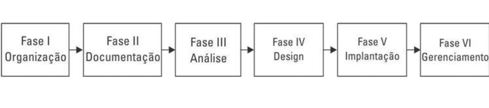
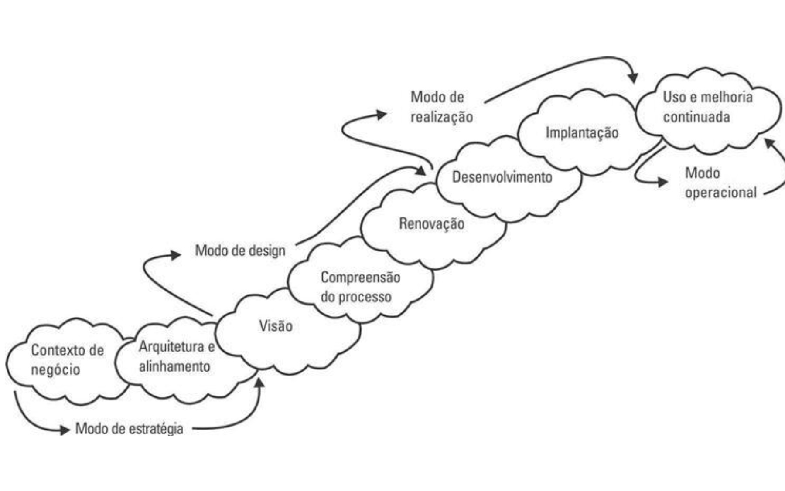
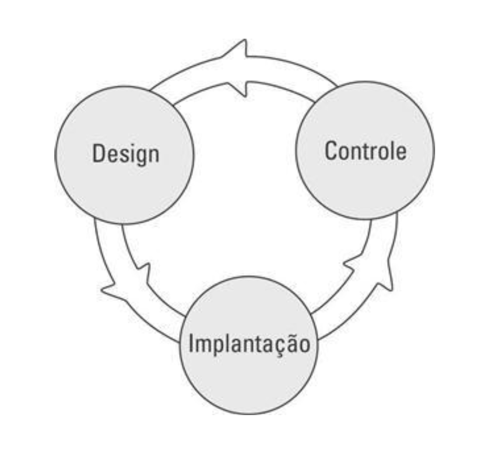
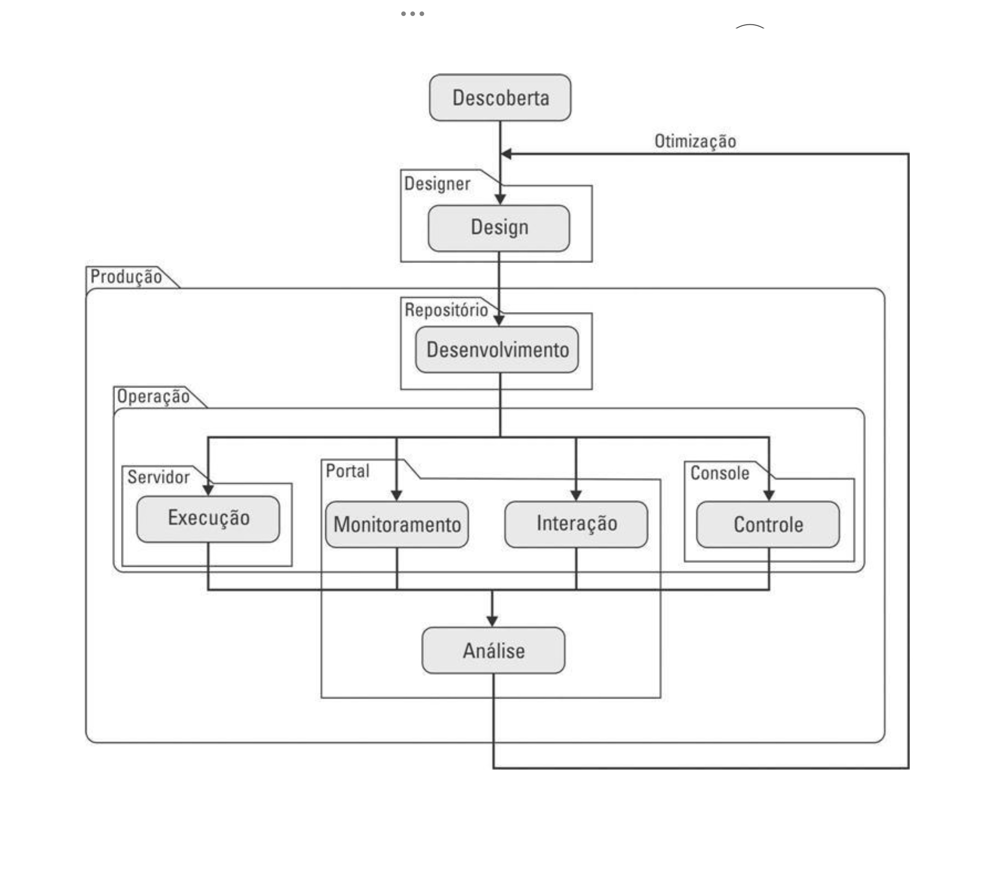
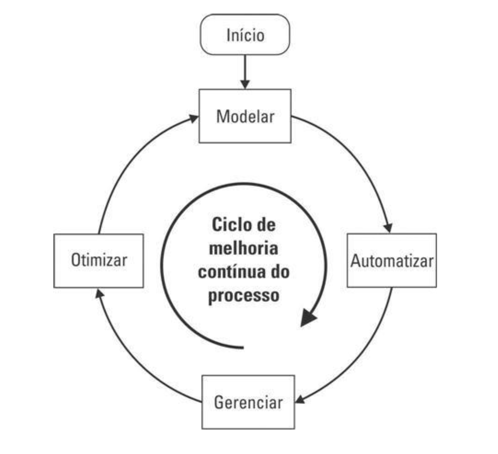
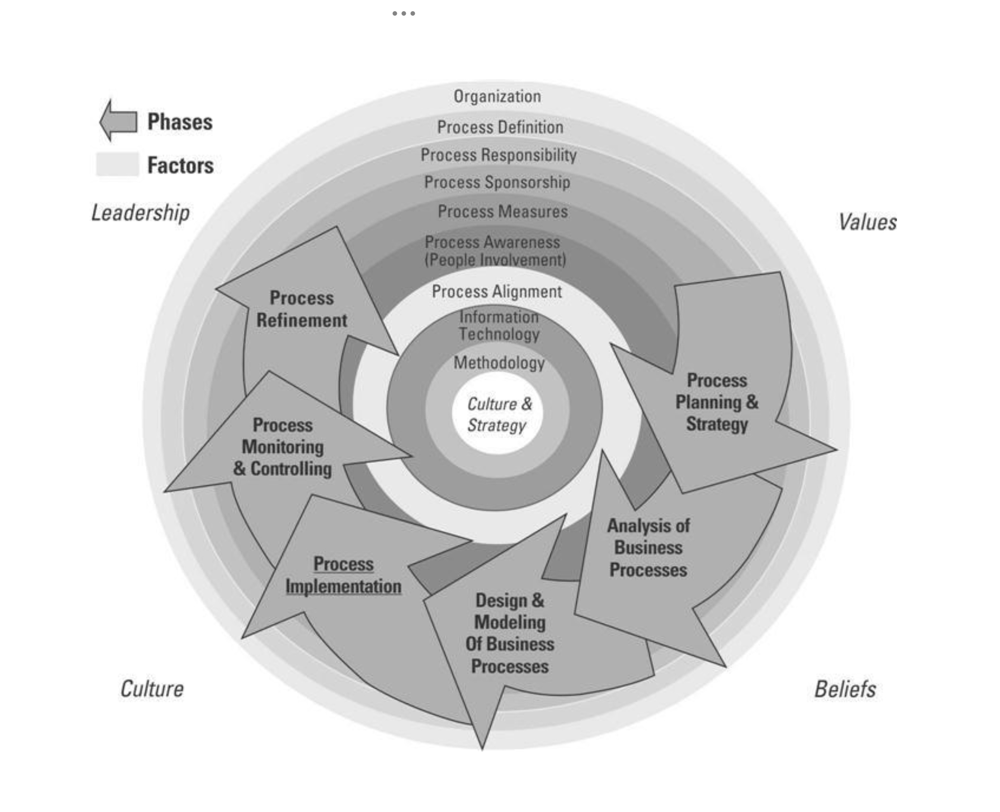

# 1 Modelos de referência de BPM

As imagens a seguir apresentam alguns modelos de referência para gestão de processos de negócios.

## Modelo de Harrington, Esseling & Nimwegen (1997)

 Modelo de Harrington, Esseling & Nimwegen

## Modelo de Burlton (2001)

 Modelo de Burlton

## Modelo de Jost & Scheer (2002)

 Modelo de Jost & Scheer

## Modelo de Smith & Fingar (2003)

 Modelo de Smith & Fingar

## Modelo de Khan (2003)

 Modelo de Khan

## Modelo da ABPMP (2009)

A figura abaixo ilustra o modelo da ABPMP:  
 Modelo da ABPMP

### Fases do modelo ABPMP
1. Planejamento e estratégia: o plano começa com a compreensão da estratégia da organização e das metas desejadas. É estabelecida a abordagem holística do trabalho para garantir alinhamento da estratégia, pessoas, processos e sistemas.

2. Análise de processos: incorpora diversas metodologias com propósito de entender o processo no contexto das metas desejadas. 
Design: indica em alto nível as características desejadas pela organização para o processo indicando o que será feito, como, quem, onde etc. 

3. Modelagem: é a construção do modelo propriamente dito, indicando adicionalmente restrições, avaliações de impactos. • Implementação do processo: fase em que efetivamente o processo será configurado, instalado e posto em marcha de operação.

4. Monitoramento e controle: provê informações necessárias para saber se o processo está sob controle e o que fazer para melhorá-lo. 
Refinamento do Processo: procedimento interativo de melhoria continuada dos processos. É de se esperar que todas estas fases de gestão sejam influenciadas pelos valores da organização, sua cultura, crenças e liderança. 

### Fatores de sucesso

Uma série de fatores de sucesso para uso do BPM devem ser considerados, que influenciarão sua cultura e estratégia em processos: 
- **Organização**: sua organização possui uma abordagem centrada em processos? Que nível de preocupação e ênfase há na gestão, entre os envolvidos e colaboradores? Qual seu nível de sucesso em gerenciamento de processos?
- **Definição de processos**: os processos são definidos? Documentados? Com que extensão? O sucesso em processos depende de indivíduos ou de times? Possui processos padronizados cruzando a organização? 
- **Responsabilidade em processos**: As responsabilidades foram definidas? Quem é o responsável? • Patrocinador do processo: Quem é o patrocinador primário de um processo definido? A gerência de alto escalão? A gerência média? O departamento? A TI? 
- **Medidas de desempenho de processos**: Há medidas de processos definidas? Usadas? Planejadas?
Conscientização do processo (envolvimento das pessoas): Qual o nível de envolvimento das pessoas na definição dos processos? Análise? Melhoria? Que nível de métodos de gestão da mudança são utilizados? Há um treinamento contínuo alinhado com os processos?
- **Alinhamento dos processos**: As metas de processo são alinhadas com as estratégias do negócio? Os processos são alinhados com as metas da organização? As descrições de cargos são alinhadas com os processos? As avaliações de colaboradores são conectadas aos processos? 
- **Tecnologia da informação**: a gestão de TIC usa BPM para seus processos? Aplicações de suporte ao BPM são definidas e usadas nos processos chave? São usadas aplicações de suporte ao monitoramento do desempenho? 
Metodologia: são usadas ferramentas de BPM, metodologia de processos ou estruturas para gerenciar o BPM na organização? Com sucesso?
