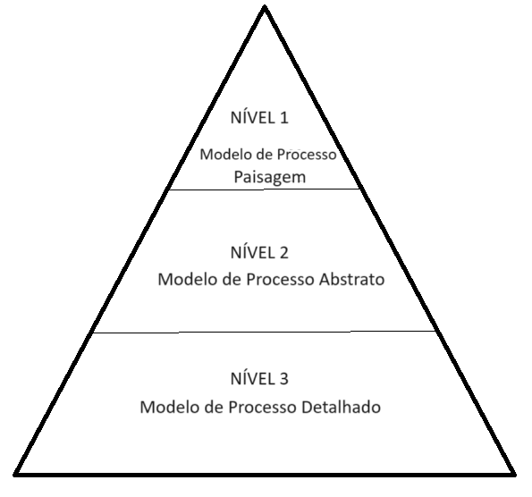
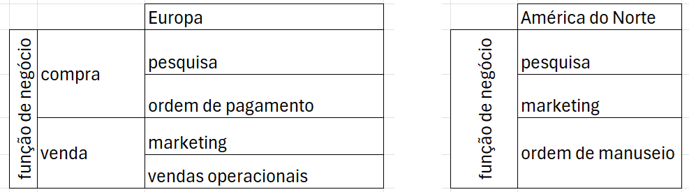
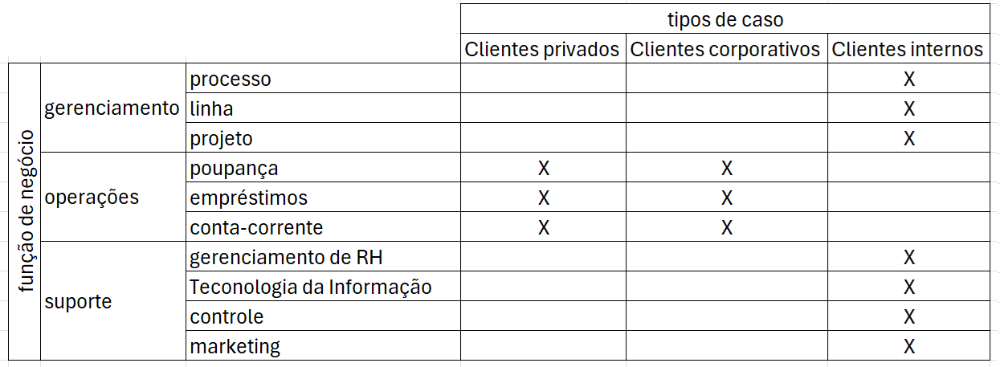
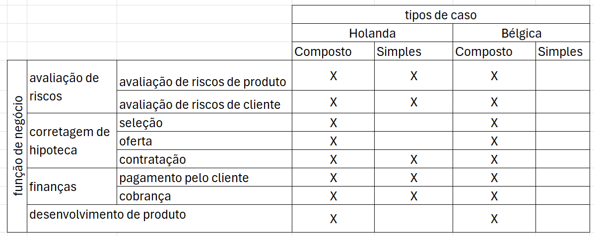
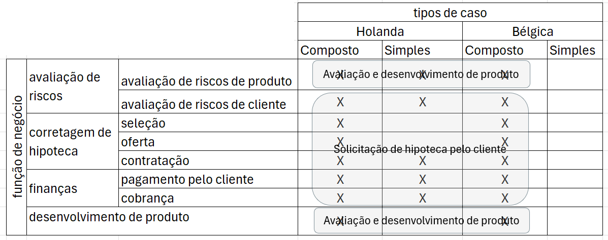
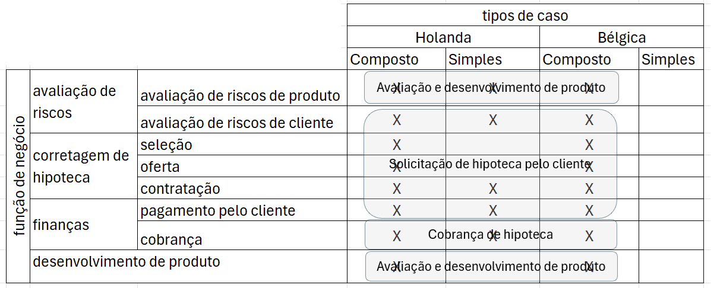
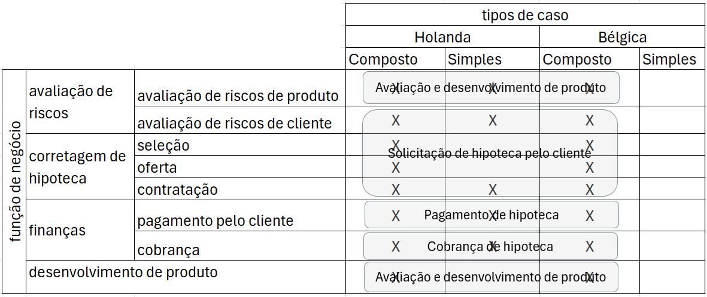
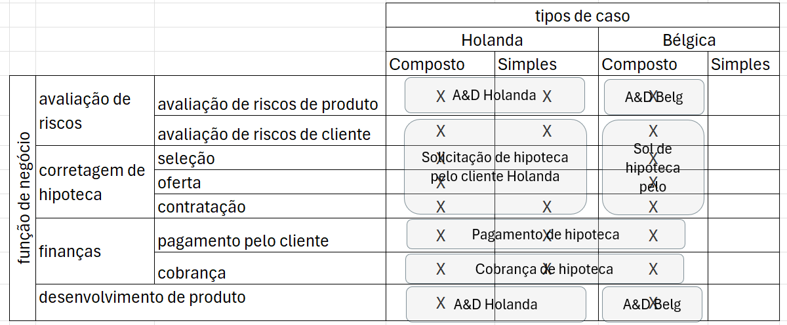
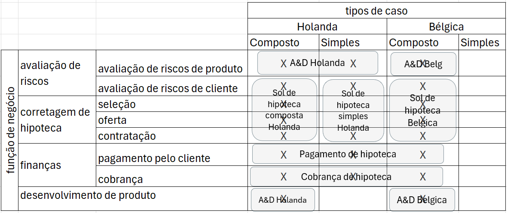
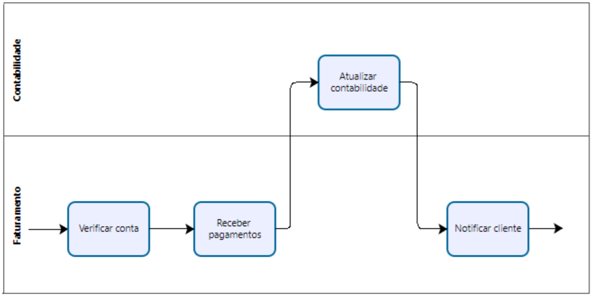

# Capítulo 2: Identificação de Processos

A identificação de processos é um **conjunto de atividades que visa definir sistematicamente os processos de negócios de uma empresa e estabelecer critérios claros para priorizá-los**. O resultado da identificação de processos é uma **arquitetura de processos**, que representa os processos de negócios e suas inter-relações. Uma arquitetura de processos serve como uma estrutura para definir as prioridades e o escopo dos projetos de modelagem e redesenho de processos.

Neste capítulo, apresentamos um método para identificação de processos baseado em duas fases: **designação** e **avaliação**. A fase de designação está preocupada com a **definição de uma lista inicial de processos**. A fase de avaliação considera critérios adequados para **definir prioridades desses processos**. Em seguida, discutimos e ilustramos um método para transformar o resultado deste método em uma arquitetura de processos.

## 2.1 Focando em Processos-Chave

Poucas organizações têm os recursos necessários para modelar todos os seus processos em detalhes, para analisar e redesenhar rigorosamente cada um deles, para implantar tecnologia de automação a fim de apoiar cada um desses processos e, finalmente, para monitorar continuamente o desempenho de todos os processos em detalhes. Mesmo que tais recursos estivessem disponíveis, não seria economicamente viável gastá-los dessa maneira. BPM não é gratuito. Como qualquer outro investimento, os investimentos em BPM precisam compensar. Assim, é imperativo que todas as organizações envolvidas em BPM concentrem sua atenção em um subconjunto de processos.

Alguns processos precisam receber prioridade porque são de importância estratégica para a sobrevivência de uma organização. Outros processos podem apresentar problemas marcantes, que devem ser resolvidos em benefício de todas as partes interessadas envolvidas. Em outras palavras, os processos nos quais uma organização deve se concentrar são encontrados **em áreas onde há grande valor criado** ou **problemas significativos presentes** (ou ambos). Para complicar ainda mais as coisas, o subconjunto de processos de alta prioridade em uma organização está sujeito à **dinâmica do tempo**. Alguns processos podem ser problemáticos em um momento, mas uma vez que os problemas tenham sido identificados e resolvidos por um programa de melhoria de processos, uma organização pode se contentar com inspeções periódicas por algum tempo. Por exemplo, uma seguradora que sofre de altos níveis de insatisfação do cliente naturalmente tende a se concentrar em seus processos orientados para o cliente, digamos, seu processo de gestão de sinistros. Uma vez que esse processo tenha melhorado e a satisfação do cliente esteja novamente dentro da faixa desejada, a ênfase pode se deslocar para seus processos de avaliação de risco, que são importantes para a viabilidade e competitividade a longo prazo da empresa.

Além da dinâmica do tempo, o que pode ser processos de importância estratégica para uma organização em algum momento pode se tornar menos importante à medida que o tempo passa. As demandas do mercado podem mudar e novas regulamentações ou a introdução de novos produtos podem limitar o que antes era uma atividade comercial lucrativa. Por exemplo, a chegada de novos concorrentes oferecendo apólices de seguro com desconto por meio de canais baseados na Web pode levar uma empresa estabelecida a redesenhar seus processos de vendas de seguros para torná-los mais enxutos, rápidos e acessíveis pela Web.

Para abordar a necessidade de focar em um subconjunto de processos-chave, a equipe de gestão, analistas de processos e proprietários de processos precisam ter respostas para as seguintes duas perguntas: 

- (i) quais processos são executados na organização? e
- (ii) em quais a organização deve se concentrar?

Em outras palavras, uma organização envolvida em iniciativas de BPM precisa manter um **mapa de seus processos**, bem como critérios claros para determinar quais processos têm maior prioridade. Vimos no Capítulo 1 que há uma variedade de partes interessadas envolvidas na gestão e execução de um processo de negócios. Geralmente, apenas um punhado dessas partes interessadas tem uma visão completa de todos os processos de negócios em uma organização. No entanto, é precisamente esse insight que é necessário para identificar o subconjunto de processos que precisam ser gerenciados ou melhorados de perto. Capturar esse conhecimento e mantê-lo atualizado é precisamente o objetivo da identificação de processos.

### 2.1.1 A Fase de Designação

Se uma organização está no início de se transformar em uma organização centrada em processos, a primeira tarefa difícil que enfrenta é elaborar uma enumeração significativa de seus processos existentes. Uma dificuldade aqui surge da natureza hierárquica dos processos de negócios: diferentes critérios podem ser considerados para determinar quais cadeias de operações podem ser vistas como formando um processo de negócios independente e quais são vistas como parte de outro processo. Existem várias visões sobre como categorizar processos de negócios (ver a caixa "Categorias de Processos de acordo com Porter"). Algumas dessas apoiam a ideia de que na verdade existem muito poucos processos dentro de qualquer organização. Por exemplo, alguns pesquisadores argumentaram pela existência de apenas dois processos: (1) gerenciar a linha de produtos e (2) gerenciar o ciclo do pedido. Outros identificam três processos principais: desenvolver novos produtos, entregar produtos aos clientes e gerenciar relacionamentos com clientes.

**CATEGORIAS DE PROCESSOS DE ACORDO COM PORTER**

Diferentes categorizações para processos de negócios foram propostas. Uma das mais influentes é o **modelo da Cadeia de Valor**, de Michael Porter. Ele distingue **duas categorias** de processos:

- processos principais (chamados de atividades primárias) e
- processos de suporte (atividades de suporte).

Processos principais cobrem a criação essencial de valor de uma empresa, ou seja, **a produção de bens e serviços** pelos quais os clientes pagam. Porter menciona **logística interna**, **operações**, **logística externa**, **marketing e vendas**, e **serviços**. 

Processos de suporte permitem a execução desses processos principais. Porter lista **infraestrutura**, **recursos humanos**, **desenvolvimento de tecnologia** e **compras** como processos de suporte. Como uma terceira categoria, outros autores estendem esse conjunto de duas categorias com processos de gestão. Por exemplo, o processo periódico para avaliar a força dos concorrentes é um processo de gestão. A distinção entre processos principais, de suporte e de gestão é de importância estratégica para uma empresa. Portanto, se tal distinção for explicitada, por exemplo, na fase de identificação de processos ou durante a criação de uma arquitetura de processos, é provável que seja um tópico muito discutido.

A questão é se uma visão excessivamente grosseira dos processos, sem qualquer subdivisão adicional, é útil para uma organização que busca se tornar centrada em processos. Lembre-se de que a ideia de gestão de processos é gerenciar ativamente os processos de negócios na busca de satisfazer seus clientes específicos. Se alguém escolher processos de negócios para serem entidades tão grandes, o resultado pode ser que esses processos não possam ser gerenciados facilmente separadamente, tanto em termos de escopo quanto de velocidade de ação. Considere, por exemplo, como seria difícil modelar ou redesenhar um processo quando ele cobre metade de todas as operações dentro de uma organização. Um modelo realista de tal processo de negócios levaria muito tempo para ser desenvolvido e poderia se tornar extremamente complexo. Além disso, redesenhar um processo tão grande seria uma tarefa demorada, sem mencionar a implementação de tal redesenho. Dependendo da situação, uma organização pode não ter esse tempo.

A principal conclusão disso é que o **número de processos identificados na fase de designação deve representar um equilíbrio entre impacto e capacidade de gerenciamento**. Quanto menor o número de processos que se deseja identificar, maior será o seu **escopo** individual, ou seja, os limites das atividades envolvidas. Em outras palavras, se apenas um pequeno número de processos for identificado, cada um deles cobrirá inúmeras operações. A principal vantagem de um escopo de processo grande é que potencialmente aumenta o impacto que se pode ter gerenciando ativamente esse processo. Quanto mais operações forem consideradas parte de um processo, mais fácil será, por exemplo, identificar oportunidades de ganhos de eficiência eliminando trabalhos redundantes.

Por outro lado, um escopo grande de um processo de negócios traz uma série de questões que tornam mais difícil gerenciá-lo como um processo:

- O envolvimento de um grande número de funcionários tornará a comunicação eficaz entre eles problemática.
- Será mais difícil manter os modelos de um processo grande atualizados.
- Projetos de melhoria relacionados a um processo grande são mais complexos.

Para equilibrar as vantagens e desvantagens de um escopo de processo grande, Davenport sugeriu que pode ser útil identificar tanto processos de escopo amplo quanto de escopo estreito. Processos amplos são identificados em áreas onde uma organização sente que é importante reformular completamente as operações existentes em algum momento, por exemplo, devido a fortes forças competitivas. Imagine que uma organização tenha descoberto que seus custos de aquisição são excessivamente altos em comparação com seus concorrentes. Eles selecionam a aquisição como um processo amplo, que cobre todos os serviços e produtos que a empresa adquire de outras partes. Por outro lado, processos estreitos não são direcionados para grandes reformulações; eles precisam ser monitorados ativamente e estão sujeitos a ajustes e atualizações contínuas. Um processo estreito pode ser, por exemplo, como a mesma empresa lida com sugestões de melhoria de seus próprios funcionários.

**Exercício 2.1:** Explique como o equilíbrio entre impacto e capacidade de gerenciamento funciona para processos amplos e estreitos, respectivamente.

Qualquer enumeração de processos de negócios deve buscar um resultado razoavelmente detalhado, que precisa estar alinhado com os objetivos específicos da gestão de processos da organização. Para a maioria das organizações, como regra geral, isso se traduzirá em uma dúzia a algumas dezenas de processos de negócios. Organizações muito grandes e diversificadas podem se beneficiar identificando algumas centenas de processos. Para ilustrar isso: dentro de uma empresa multinacional de investimentos, que emprega cerca de 3.000 funcionários e possui ativos na faixa de €300 bilhões, foram identificados 120 processos de negócios diferentes. Para cada um desses processos de negócios, é atribuído um proprietário de processo, que supervisiona o desempenho do processo e monitora a realização de seus objetivos em termos de satisfação do cliente, lucratividade e responsabilidade. Modelos de processos detalhados são mantidos atualizados, tanto como um meio de documentar mudanças planejadas em qualquer processo quanto para atender aos requisitos das autoridades financeiras. Em contraste, para uma pequena clínica médica na Holanda, que emprega especialistas médicos, enfermeiros e funcionários administrativos, foram identificados 10 processos de tratamento diferentes. Alguns desses foram mapeados na forma de modelos de processos e estão agora em processo de automação com um sistema de gestão de processos de negócios. Para todos os outros processos, é suficiente estar ciente das opções de tratamento distintas que podem fornecer a diferentes categorias de pacientes.

**Exercício 2.2:** Quais são os potenciais motivadores para a empresa de investimentos descrita identificar um grande número de processos?

Além de uma visão bastante detalhada sobre quais processos de negócios existem, é necessário **desenvolver uma compreensão sobre as relações entre os vários processos**. Em uma situação onde as organizações definem processos estreitos e amplos, para evitar confusão, é importante mapear como os processos estreitos se relacionam com processos mais amplos. Um processo amplo como a gestão de pedidos, por exemplo, pode estar relacionado aos processos mais estreitamente definidos de reserva de pedidos, faturamento, envio e entrega. Todos esses podem ser considerados subprocessos de gestão de pedidos. Podemos chamar isso de um exemplo de relações hierárquicas entre processos. Os processos também podem estar relacionados de maneira diferente. O faturamento, no exemplo que acabamos de usar, é um processo anterior em comparação ao envio: para o mesmo pedido, a fatura é enviada geralmente antes dos bens pedidos serem enviados. Outra maneira de expressar essa relação é, obviamente, que o envio pode ser considerado um processo posterior em comparação ao faturamento. Isso ilustra como os processos podem estar sequencialmente relacionados.

**Exercício 2.3:** Discuta em que medida a gestão de pedidos pode estar sequencialmente relacionada à reserva, faturamento, envio e entrega.

Na maioria das vezes, a percepção das relações entre processos pode ser menos do que estritamente exata. O objetivo mais importante de capturar relações dependentes é entender como o desempenho de um processo está relacionado ao de outro. Se alguém, por exemplo, redesenhar um processo existente, é útil entender quais processos dependem dos resultados de tal processo. Esses processos posteriores podem precisar estar preparados para receber informações ou bens em uma frequência ou forma diferente do que antes e medidas devem ser tomadas para evitar quaisquer interrupções.

**Exercício 2.4:** Até este ponto, discutimos relações hierárquicas e sequenciais entre processos de negócios. Você consegue pensar em outros tipos de relação que são úteis para distinguir entre processos? Como dica, você pode querer pensar sobre o propósito de identificar as relações entre processos de negócios.

Embora a designação de processos de negócios e suas inter-relações esteja sujeita a diferentes escolhas de design e preferências, algumas orientações gerais estão disponíveis.

1. Em primeiro lugar, existem vários chamados modelos de referência para identificação de processos de negócios. Estes são desenvolvidos por uma variedade de consórcios industriais, associações sem fins lucrativos, programas de pesquisa governamentais e academia. Os exemplos mais conhecidos são a **Biblioteca de Infraestrutura de Tecnologia da Informação (ITIL)**; o **Modelo de Referência de Operações da Cadeia de Suprimentos (SCOR)**, pelo Conselho da Cadeia de Suprimentos; o ***Framework* de Classificação de Processos (PCF)**, pelo American Productivity and Quality Center (APQC); o **Modelo de Referência de Valor (VRM)**, pelo Value Chain Group; e o ***Framework* de Desempenho de Rummler-Brache**. Os modelos de referência padronizam o que pode ser visto como processos diferentes, com características únicas e entregando produtos distinguíveis, e como seu desempenho pode ser medido. Seu maior valor está na identificação de processos regulamentares ou altamente específicos da indústria, ou quando a comparação de desempenho com pares e concorrentes é o objetivo de uma organização centrada em processos. Em outros casos, esses modelos de referência ainda podem ser úteis em exercícios de identificação na forma de uma lista de verificação. Por exemplo, uma organização pode usar o PCF do APQC para inventariar os processos no framework que utilizam, marcar aqueles que não utilizam e adicionar seus próprios processos únicos. Vamos analisar mais de perto o PCF na Seção 2.2.
2. Uma segunda corrente de suporte está disponível na forma de abordagens de design específicas para desenvolver uma chamada arquitetura de processos. Uma arquitetura de processos é uma visão organizada dos processos que existem dentro de um contexto organizacional, frequentemente acompanhada de diretrizes sobre como eles devem ser organizados. As abordagens de design para arquiteturas de processos de negócios usam uma certa lógica para chegar à identificação de processos de negócios. Na Seção 2.2, entraremos em mais detalhes com relação a uma abordagem de design específica.
3. Finalmente, vale a pena notar com relação à fase de designação que os processos mudam ao longo do tempo, deliberadamente ou não. Isso naturalmente implica que a **identificação de processos é de natureza contínua**. Para evitar a situação de ficar atolado na fase de identificação de processos, a atividade deve ser considerada como uma empreitada exploratória e iterativa. Quando uma visão geral estável é criada, ela pode ser muito bem utilizável por um período de dois a três anos.

### 2.1.2 A Fase de Avaliação

Como mencionado anteriormente, nem todos os processos são igualmente importantes e nem todos os processos podem receber a mesma quantidade de atenção. A gestão de processos envolve compromisso, propriedade, investimento em aprimoramento de desempenho e otimização. Portanto, processos que criam perda ou risco demandam consolidação, descomissionamento ou eliminação total. Vários critérios foram propostos para orientar essa avaliação. Os mais comumente usados são os seguintes:

- **Importância:** Este critério está preocupado em avaliar a relevância estratégica de cada processo. O objetivo é descobrir quais processos têm o maior impacto nos objetivos estratégicos da empresa, por exemplo, considerando lucratividade, continuidade ou contribuição para uma causa pública. Faz sentido selecionar aqueles processos para gestão ativa que mais diretamente se relacionam com os objetivos estratégicos de uma organização.
- **Disfunção:** Este critério visa render um julgamento de alto nível da "saúde" de cada processo. A questão aqui é determinar quais processos estão em maiores dificuldades. Esses processos são os que podem lucrar mais com iniciativas centradas em processos.
- **Viabilidade:** Para cada processo, deve-se determinar o quão suscetíveis eles são a iniciativas de gestão de processos, seja incidentalmente ou de forma contínua. Mais notavelmente, cultura e política envolvidas em um determinado processo podem ser obstáculos para obter resultados de tais iniciativas. Em geral, a gestão de processos deve se concentrar naqueles processos onde é razoável esperar benefícios.

Observe que todos esses critérios assumem que há certas informações disponíveis. Por exemplo, para avaliar a importância estratégica de um processo, é de suma importância que uma organização tenha uma ideia de seu curso estratégico. É suficiente se tais considerações estratégicas forem definidas em um nível muito abstrato. Neste ponto, por exemplo, muitas organizações veem o benefício estratégico de serem capazes de mudar o tipo de produtos que oferecem para atender às demandas dos clientes. Zara, a varejista espanhola de roupas, é um exemplo principal de uma organização que segue uma estratégia de medir e reagir. Ela envia agentes para shoppings para ver o que as pessoas já estão vestindo para determinar os estilos, tecidos e cores dos produtos que deseja entregar. Tal organização pode olhar com interesse específico para os processos de produção e logística que são mais capazes de apoiar essa estratégia.

Da mesma forma, para determinar a potencial disfunção de um processo de negócios, uma organização precisa de informações. Aqui, encontramos um problema do tipo "ovo e galinha". Muitas organizações que não estão trabalhando de maneira centrada em processos não têm uma boa visão quantitativa do desempenho de seus processos individuais. Uma das iniciativas centradas em processos que tal organização pode buscar seria exatamente colocar os sistemas e procedimentos em prática para coletar os dados necessários para uma avaliação de desempenho. **Nesses casos, uma organização precisará usar abordagens mais qualitativas para determinar quais de seus processos não estão funcionando bem, por exemplo, dependendo das impressões que a gestão ou os participantes do processo têm sobre a eficiência ou eficácia dos vários processos**. Outra abordagem seria confiar em avaliações de clientes, seja coletadas por meio de pesquisas ou espontaneamente entregues na forma de reclamações.

O critério de viabilidade também precisa de alguma atenção. Tornou-se prática comum para as organizações passarem por um fluxo contínuo de programas para melhorar seu desempenho em uma dimensão ou outra. Considere a Philips, a multinacional de eletrônicos. Ela passou por uma série intermitente de programas de melhoria desde os anos 1980 para aumentar seu desempenho. O mesmo fenômeno pode agora ser observado dentro de muitas organizações de telecomunicações e utilitários. Como a lucratividade dos produtos muda drasticamente de um ano para o outro, isso exige mudanças contínuas nos portfólios de produtos e nas prioridades de mercado. Nesses tipos de contexto volátil, pode acontecer que os gerentes e participantes do processo se tornem cansados ou totalmente hostis a novas iniciativas. Esse tipo de situação não é um bom ponto de partida para iniciativas de gestão de processos. Afinal, como outras medidas organizacionais, tais iniciativas também dependem da cooperação e das boas intenções daqueles diretamente envolvidos. Embora não abordemos o assunto da gestão de mudanças em detalhes neste livro, é importante perceber que sensibilidades políticas dentro de uma organização podem afetar a taxa de sucesso dos esforços de gestão de processos também.

**AVALIAÇÃO DE MATURIDADE EM BPM**

Uma abordagem mais detalhada para olhar a fase de avaliação é baseada na **maturidade**. A avaliação de maturidade em BPM é um **conjunto de técnicas para determinar o nível de pensamento sistemático de processos em uma organização**. Uma avaliação de maturidade em BPM essencialmente envolve dois aspectos. O primeiro aspecto é avaliar em que medida uma determinada organização **cobre a gama de processos que se espera idealmente dela**. O segundo aspecto é avaliar em que **grau esses processos estão documentados e suportados**. Portanto, uma avaliação de maturidade visa estabelecer uma linha de base para discutir a completude e a qualidade do conjunto de processos executados em uma organização.

Um dos *frameworks* mais amplamente usados para avaliação de maturidade é o *framework* **Capability Maturity Model Integrated (CMMI)**. Este *framework* distingue várias chamadas áreas de processo. Várias dessas áreas são específicas para um determinado domínio nas várias especificações do CMMI. As áreas independentes de domínio incluem: gestão de processos, gestão de projetos e suporte.

A cobertura de áreas de processo e o grau de suporte fornecem a base para uma avaliação de maturidade em termos dos cinco níveis de maturidade do CMMI:

- **Nível 1 (Inicial):** Nesta fase inicial, a organização executa seus processos de forma *ad-hoc*, sem qualquer definição clara desses processos. O controle está ausente.
- **Nível 2 (Gerenciado):** Nesta fase, o planejamento juntamente com o monitoramento e controle de processos foram colocados em prática. A medição e análise são estabelecidas, assim como a garantia de qualidade de processos e produtos.
- **Nível 3 (Definido):** Organizações nesta fase adotaram um foco em processos. Definições de processos estão disponíveis e o treinamento organizacional é fornecido para permitir que as partes interessadas em toda a organização se envolvam na documentação e análise de processos. Gestão integrada de projetos e riscos estão em vigor. Análise e resolução de decisões também estão em vigor.
- **Nível 4 (Gerenciado Quantitativamente):** Nesta fase, o desempenho dos processos organizacionais é rastreado. A gestão é realizada usando técnicas quantitativas.
- **Nível 5 (Otimização):** Nesta fase de maturidade, a organização estabeleceu a gestão do desempenho organizacional acompanhada de análise e resolução de causas.

A avaliação de uma organização em termos desses níveis leva a uma chamada avaliação. Avaliações podem ser conduzidas internamente dentro de uma organização (também chamadas de autoavaliações) ou por uma organização externa com experiência em avaliação de maturidade. Diferentes tipos de avaliação são distinguidos e definidos no Método Padrão de Avaliação do CMMI para Melhoria de Processos (SCAMPI).

**Pergunta:** Dados todos os critérios discutidos, uma avaliação da importância, disfunção e viabilidade sempre me apontará os mesmos processos para gerenciar ativamente?

Não, não há garantia para isso. Pode muito bem ser que um processo estrategicamente importante também seja o processo que pode ser o mais difícil de gerenciar, simplesmente porque muitos esforços anteriores de melhoria já falharam. Uma organização pode não ter escolha em tal situação. Se um processo estratégico não pode ser melhorado, isso pode ser fatal para a organização como um todo. Pense em uma situação onde o processo para desenvolver novos produtos cria muita confusão e conflitos dentro da organização: se os problemas não puderem ser resolvidos, a empresa pode parar de funcionar rapidamente. Em outras configurações, pode ser mais importante ganhar credibilidade com atividades de gestão de processos primeiro. Isso pode ser alcançado concentrando-se em processos problemáticos de menor importância estratégica, mas onde há um grande desejo de mudança. Se for bem-sucedido, um projeto de melhoria em tal lugar pode dar credibilidade à abordagem de gestão de processos. Essas não são escolhas que podem ser facilmente prescritas sem levar em consideração o contexto específico. Os vários resultados da avaliação devem ser equilibrados para chegar a uma lista dos processos que devem receber prioridade sobre os outros.

**Pergunta:** Todos os processos que são disfuncionais, de importância estratégica e viáveis de serem gerenciados devem ser submetidos a iniciativas de gestão de processos?

A resposta geral a esta pergunta é que para a maioria das organizações isso não é viável. Lembre-se novamente que a gestão de processos consome recursos. Mesmo quando há um claro incentivo para, por exemplo, redesenhar vários processos de negócios existentes, a maioria das organizações carece de recursos suficientes—pessoas, fundos e tempo—para fazer isso. Apenas as maiores organizações são capazes de apoiar mais de um punhado de projetos de melhoria de processos ao mesmo tempo. Um bom exemplo é a IBM, uma organização conhecida por ter projetos de melhoria de processos em andamento dentro de todos os seus processos de negócios existentes de forma contínua. Outro ponto negativo de realizar muitos esforços de gestão de processos simultaneamente é que isso criará complexidade de coordenação. Lembre-se de que os processos podem estar ligados entre si em vários aspectos, de modo que as medidas tomadas para um processo devem ser sincronizadas com aquelas tomadas para outros.

Como Davenport descreve:
"A maioria das empresas opta por abordar um pequeno conjunto de processos de negócios para ganhar experiência com iniciativas de inovação e concentra seus recursos nos processos mais críticos. Cada iniciativa bem-sucedida se torna um modelo para futuros esforços."

O que está acontecendo em algumas organizações é que esforços generalizados são feitos para pelo menos modelar todos os processos de negócios importantes, adiando a decisão de dar o passo para esforços mais avançados de BPM (por exemplo, redesenho ou automação de processos). A ideia é que os modelos de processos são a pedra angular de qualquer esforço futuro de BPM em qualquer caso e que sua existência ajudará a entender melhor onde as melhorias podem ser obtidas. Criar um modelo de um processo leva ao valioso insight de como esse processo funciona e pode fornecer uma boa base para pequenas melhorias que podem ser facilmente implementadas. No lado negativo, essa abordagem traz o risco de que grandes melhorias sejam perdidas e as partes interessadas desenvolvam um sentimento de falta de retorno pelos esforços. Deve-se enfatizar aqui também que a modelagem real de processos de negócios não é um elemento da fase de identificação de processos.

Figura 2.1 Os diferentes níveis de detalhe em uma arquitetura de processos

### 2.2 Projetando uma Arquitetura de Processos

Uma **arquitetura de processos é um modelo conceitual que mostra os processos de uma empresa e torna suas relações explícitas**. Tipicamente, essas relações são definidas em duas direções. Por um lado, os processos podem estar em uma **relação consumidor-produtor**. Isso significa que um processo fornece uma saída que outro processo toma como entrada. Na primeira parte do curso, distinguimos o processo de cotação para pedido e processos de pedido para pagamento. A saída do primeiro (o pedido) é a entrada para o segundo. Observe que este é o mesmo tipo de ordenação que a relação a montante e a jusante que distinguimos anteriormente. Além da relação consumidor-produtor, uma arquitetura de processos define diferentes níveis de detalhe. Isso é ilustrado como uma pirâmide na Fig. 2.1.

A parte da arquitetura de processos que cobre os processos no nível um é conhecida como **modelo de paisagem** de processos ou simplesmente a arquitetura de processos para o **nível um**. Ele mostra os principais processos em um nível muito abstrato. Cada um dos elementos do modelo de paisagem de processos aponta para processos de negócios mais concretos no nível dois. Este nível dois mostra os processos em um grau mais fino de granularidade, mas ainda de maneira bastante abstrata. Cada elemento no nível dois aponta ainda para um modelo de processo no nível três. Os modelos de processo neste terceiro nível mostram o detalhe dos processos, incluindo o fluxo de controle, entradas e saídas de dados e atribuição de participantes, conforme discutiremos nos capítulos de modelagem.

O desafio mais importante para a definição de uma arquitetura de processos é a definição do modelo de paisagem de processos, ou seja, capturar os processos no nível um. A arquitetura de processos no nível um deve ser compreensível em primeiro lugar, mostrando não muito mais do que aproximadamente 20 categorias de processos de negócios de uma empresa. Além disso, deve ser suficientemente completa para que todos os funcionários da empresa possam se relacionar com ela em seu trabalho diário e aceitá-la como uma descrição consensual da empresa. Portanto, é importante definir a arquitetura de processos de maneira sistemática, com um foco específico na derivação do modelo de paisagem de processos.

Várias perspectivas e abordagens foram definidas para a definição de uma arquitetura de processos. Aqui, vamos nos concentrar em uma abordagem desenvolvida por Dijkman. Esta abordagem específica leva a uma arquitetura de processos no nível um ao longo de duas dimensões: **tipo de caso** e **função de negócios**. 

A dimensão do tipo de caso classifica os tipos de casos que são tratados por uma organização. Um caso é algo que uma organização (ou parte dela) lida. Tipicamente, **um caso é um produto ou serviço que é entregue por uma organização aos seus clientes**, como um seguro (um serviço) ou um brinquedo (um produto). Observe que, dependendo da parte da organização para a qual a arquitetura de processos é projetada, os casos podem representar produtos ou serviços que são entregues aos clientes da organização. No entanto, eles também podem se referir a produtos ou serviços que são entregues por um departamento da organização a outro departamento. Por exemplo, pense na configuração de um local de trabalho para um novo funcionário pelo departamento de instalações.

Os **casos podem ser deliberadamente classificados**, usando qualquer número de **propriedades**. Por exemplo, uma seguradora lida com seguros, que podem ser classificados de acordo com o tipo de produto (seguro residencial, seguro de carro e seguro de vida), mas também de acordo com o canal que a empresa usa para interagir com seus clientes (telefone, escritório e internet). Uma combinação dessas propriedades também pode ser usada para classificar casos. No exemplo de seguro, os casos seriam então classificados usando tanto o tipo de produto quanto o canal (seguro residencial por telefone, seguro residencial por escritório, seguro de carro por telefone, etc.).

A dimensão da função classifica as funções de uma organização. **Uma função é, simplesmente, um trabalho que uma organização realiza**. Tipicamente, pode-se fazer uma **decomposição hierárquica de funções**: uma função consiste em subfunções, que, por sua vez, também podem ser decompostas em níveis inferiores de subfunções. Por exemplo, uma empresa de produção realiza funções de compras, produção e vendas. A função de compras, por sua vez, pode ser decomposta em funções de seleção de fornecedores e aquisição operacional. Seja um exemplo de uma arquitetura de processos para uma autoridade portuária, que usa as dimensões tipo de caso e função de negócios para estruturar seus processos. No exemplo caracteriza-se uma organização de processos por tipo de caso na dimensão horizontal e por função de negócios na dimensão vertical. 

A dimensão da função mostra o que a organização faz: lidar com a pré-chegada de navios marítimos, o que envolve notificar as partes relevantes sobre o tempo estimado de chegada do navio e o que o navio está transportando; lidar com a chegada real do navio, o que envolve guiar o navio até o cais; etc. A dimensão do tipo de caso mostra os tipos de casos que a organização lida: navios marítimos, caminhões, trens e transporte interno por barcaça. Existem três processos criados para lidar com esses tipos de casos, usando as diferentes funções. Estes três são mostrados como cobrindo as várias funções e tipos de casos. O processo de planejamento de entrada é usado para lidar com a pré-chegada de navios marítimos. O processo de manuseio de entrada é usado para lidar com a chegada e o transbordo de navios marítimos e o processo de manuseio de saída é usado para lidar com o transbordo e a partida de caminhões, trens e barcaças.

Para chegar a uma arquitetura de processos de negócios em um sentido semelhante ao que descrevemos aqui, propomos uma abordagem que consiste nas seguintes quatro etapas:

1. Identificar tipos de caso
2. Identificar funções para tipos de caso
3. Construir uma ou mais matrizes caso/função
4. Identificar processos

Agora discutiremos essas etapas em mais detalhes.

#### 2.2.1 Identificar Tipos de Caso

Na primeira etapa, uma classificação de tipos de caso é desenvolvida para a organização. Isso é feito **selecionando as propriedades do caso que serão usadas para a classificação**. O principal objetivo de **identificar diferentes classes** nessa dimensão da arquitetura de processos é determinar as diferentes maneiras pelas quais processos (similares) são tratados na organização. É importante ter isso em mente, porque as únicas propriedades que devem ser incluídas na classificação são aquelas que levam a comportamentos organizacionais diferentes. Propriedades que podem distinguir casos, mas que não levam a comportamentos diferentes, não devem ser incluídas. Por exemplo, uma loja de material de escritório vende muitos tipos diferentes de produtos. No entanto, vende todos esses tipos de produto da mesma maneira. Portanto, 'tipo de produto' não é uma dimensão útil ao classificar os casos tratados por uma loja de varejo. Uma seguradora também vende diferentes tipos de produtos (seguros) e, ao contrário da loja de varejo, os produtos que vende são tratados de forma diferente. Por exemplo, para um seguro de vida é necessário preencher uma declaração de saúde, mas para um seguro de carro isso não é um requisito. Portanto, o 'tipo de produto' é, de fato, uma propriedade útil para classificar os tipos de casos tratados por uma seguradora; isso não é verdade ao classificar os tipos de casos tratados por uma loja de varejo.

Uma classificação dos tipos de casos que uma organização lida pode ser desenvolvida usando qualquer número de propriedades. No entanto, algumas das propriedades mais comumente usadas são:

- **Tipo de Produto:** Esta propriedade identifica os tipos de produtos que são tratados por uma organização. Estes podem ser decompostos hierarquicamente. Por exemplo, uma seguradora lida com produtos de seguro de danos e seguro de vida. Na classe de seguros de danos, uma decomposição adicional é possível em seguro de carro e seguro residencial; da mesma forma, dentro da classe de seguro de vida, uma decomposição adicional é possível em seguro de saúde e seguro contra acidentes.
- **Tipo de Serviço:** Se (uma parte de) uma organização lida com serviços em vez de produtos, esta propriedade identifica os tipos de serviços que a organização trata, semelhante à maneira como o tipo de produto identifica os tipos de entregas tangíveis.
- **Canal:** Esta propriedade representa o canal através do qual a organização entra em contato com seus clientes. Podemos, por exemplo, distinguir: contato presencial (balcão), contato telefônico ou pela internet.
- **Tipo de Cliente:** Esta propriedade representa os tipos de cliente com os quais a organização lida. Uma companhia aérea, por exemplo, pode distinguir passageiros frequentes de viajantes regulares.

Observe novamente que, embora estas sejam as propriedades mais comumente usadas para distinguir diferentes tipos de casos, certamente há outras propriedades que podem ser usadas. Qualquer propriedade que distinga tipos de casos tratados de maneira diferente pode ser usada. Por exemplo, se uma organização faz coisas de maneira diferente na América do Norte e na Europa, os casos podem ser classificados de acordo com a localização. Outro exemplo: se os casos são tratados de maneira diferente dependendo da expertise necessária para tratá-los, eles podem ser classificados de acordo com a expertise.

Além disso, observe novamente que a classificação pode ser desenvolvida usando qualquer número e combinação de propriedades. Se uma empresa vende seguros tanto na América do Norte quanto na Europa e o tratamento dos seguros difere nesses continentes devido a regulamentações locais, então uma classificação de casos de acordo com o tipo de produto e localização pode ser usada.

**Exercício 2.5:** Considere o caso de um banco e os critérios de classificação tipo de produto, tipo de serviço, canal e tipo de cliente. Em que medida esses critérios estão relacionados entre si?

#### 2.2.2 Identificar Funções para Tipos de Caso

Na segunda etapa, uma classificação é desenvolvida das **funções de negócios que são realizadas nos diferentes tipos de caso**. Esta etapa requer que cada um dos tipos de caso seja examinado em detalhes e, para cada tipo de caso, as funções que podem ser realizadas nele sejam identificadas. Potencialmente, as funções realizadas em uma organização podem estar relacionadas a classificações existentes propostas por modelos de referência. Já mencionamos alguns desses. Os modelos de referência podem servir como ponto de partida para desenvolver uma classificação de funções de negócios e podem ser adaptados às necessidades específicas da organização.

Seja essa identificação de funções iniciada com um modelo de referência ou não, ela **requer entrevistas com diferentes pessoas na organização**. Essas entrevistas servem para identificar diretamente as funções ou verificar em que medida as funções de um modelo de referência se aplicam à organização. As entrevistas devem ser realizadas tanto com funcionários envolvidos nos diferentes casos que a organização trata quanto com gerentes de produto (e serviço) dos diferentes produtos e serviços que a organização trata. Portanto, é importante observar que as diferentes pessoas envolvidas podem muito bem usar termos diferentes para funções de negócios semelhantes. Homônimos e sinônimos são problemáticos nesse contexto. Por exemplo, o que é chamado de 'aquisição' em uma parte da organização pode ser chamado de 'pesquisa de mercado' em outra (sinônimo). Ao mesmo tempo, duas funções chamadas 'implementação' podem representar atividades diferentes: uma pode representar a implementação de software, enquanto a outra representa a implementação de novas regulamentações na organização (homônimo). Além de estar ciente dos vários termos que estão sendo usados, uma compreensão intrincada das operações de uma organização é importante para resolver essas questões. *Frameworks* como o da APQC (American Productivity & Quality Center), uma organização líder mundial em benchmarking, melhores práticas, melhoria de processos e desempenho, e gestão do conhecimento, podem ajudar na classificação das funções.

***FRAMEWORK* DE FUNÇÕES DA APQC**

| **Nível Um**                                   | **Nível Dois**                                                  |
|-------------------------------------------------|----------------------------------------------------------------|
| 1.0 Desenvolver Visão e Estratégia              | 1.1 Definir o conceito de negócio e a visão de longo prazo      |
|                                                 | 1.2 Desenvolver a estratégia de negócios                       |
|                                                 | 1.3 Gerenciar iniciativas estratégicas                         |
| 2.0 Desenvolver e Gerenciar Produtos e Serviços | 2.1 Gerenciar portfólio de produtos e serviços                 |
|                                                 | 2.2 Desenvolver produtos e serviços                            |
| 3.0 Comercializar e Vender Produtos e Serviços  | 3.1 Entender mercados, clientes e capacidades                  |
|                                                 | 3.2 Desenvolver estratégia de marketing                        |
|                                                 | 3.3 Desenvolver estratégia de vendas                           |
|                                                 | 3.4 Desenvolver e gerenciar planos de marketing                |
|                                                 | 3.5 Desenvolver e gerenciar planos de vendas                   |
| 4.0 Entregar Produtos e Serviços                | 4.1 Planejar e alinhar recursos da cadeia de suprimentos       |
|                                                 | 4.2 Adquirir materiais e serviços                              |
|                                                 | 4.3 Produzir/Fabricar/Entregar produto                         |
|                                                 | 4.4 Entregar serviço ao cliente                                |
|                                                 | 4.5 Gerenciar logística e armazenagem                          |
| 5.0 Gerenciar Atendimento ao Cliente            | 5.1 Desenvolver estratégia de atendimento ao cliente           |
|                                                 | 5.2 Planejar e gerenciar operações de atendimento ao cliente   |
|                                                 | 5.3 Medir e avaliar operações de atendimento ao cliente        |
| 6.0 Desenvolver e Gerenciar Capital Humano      | 6.1 Desenvolver e gerenciar planejamento, políticas e estratégias de RH |
|                                                 | 6.2 Recrutar, obter e selecionar funcionários                  |
|                                                 | 6.3 Desenvolver e orientar funcionários                        |
|                                                 | 6.4 Recompensar e reter funcionários                           |
|                                                 | 6.5 Realocar e aposentar funcionários                          |
|                                                 | 6.6 Gerenciar informações dos funcionários                     |
| 7.0 Gerenciar Tecnologia da Informação          | 7.1 Gerenciar o negócio da tecnologia da informação            |
|                                                 | 7.2 Desenvolver e gerenciar relações com clientes de TI        |
|                                                 | 7.3 Desenvolver e implementar controles de segurança, privacidade e proteção de dados |
|                                                 | 7.4 Gerenciar informações empresariais                         |
|                                                 | 7.5 Desenvolver e manter soluções de tecnologia da informação  |
|                                                 | 7.6 Implementar soluções de tecnologia da informação           |
|                                                 | 7.7 Entregar e suportar serviços de tecnologia da informação   |
| 8.0 Gerenciar Recursos Financeiros              | 8.1 Realizar planejamento e contabilidade gerencial            |
|                                                 | 8.2 Realizar contabilidade de receitas                         |
|                                                 | 8.3 Realizar contabilidade geral e relatórios                  |
|                                                 | 8.4 Gerenciar contabilidade de projetos de ativos fixos        |
|                                                 | 8.5 Processar folha de pagamento                               |
|                                                 | 8.6 Processar contas a pagar e reembolsos de despesas          |
|                                                 | 8.7 Gerenciar operações de tesouraria                          |
|                                                 | 8.8 Gerenciar controles internos                               |
|                                                 | 8.9 Gerenciar impostos                                         |
|                                                 | 8.10 Gerenciar fundos/consolidação internacional               |
| 9.0 Adquirir, Construir e Gerenciar Ativos      | 9.1 Projetar e construir/adquirir ativos não produtivos        |
|                                                 | 9.2 Planejar manutenção                                        |
|                                                 | 9.3 Obter e instalar ativos, equipamentos e ferramentas        |
|                                                 | 9.4 Descartar ativos produtivos e não produtivos               |
| 10.0 Gerenciar Riscos, Conformidade e Resiliência Empresarial | 10.1 Gerenciar risco empresarial                     |
|                                                 | 10.2 Gerenciar resiliência empresarial                         |
|                                                 | 10.3 Gerenciar saúde e segurança ambiental                     |
| 11.0 Gerenciar Relacionamentos Externos         | 11.1 Construir relações com investidores                       |
|                                                 | 11.2 Gerenciar relações com governo e indústria                |
|                                                 | 11.3 Gerenciar relações com o conselho de administração        |
|                                                 | 11.4 Gerenciar questões legais e éticas                        |
|                                                 | 11.5 Gerenciar programa de relações públicas                   |
| 12.0 Desenvolver e Gerenciar Capacidades de Negócio | 12.1 Gerenciar processos de negócios                         |
|                                                 | 12.2 Gerenciar portfólio, programa e projeto                   |
|                                                 | 12.3 Gerenciar qualidade                                       |
|                                                 | 12.4 Gerenciar mudanças                                        |
|                                                 | 12.5 Desenvolver e gerenciar capacidade de gestão do conhecimento (KM) |
|                                                 | 12.6 Medir e comparar                                          |

Além disso, as funções podem ser organizadas de maneira diferente. Considere, por exemplo, a Figura 2.2. Ela foi retirada de um caso do mundo real e mostra partes das decomposições funcionais de dois departamentos da mesma organização, um na Europa e outro na América do Norte. O departamento europeu distingue entre compras e vendas, onde tanto compras quanto vendas são divididas em funções operacionais. Essas funções dizem respeito ao fornecimento e pedido a pagar para compras, por um lado, e marketing e operações de vendas para vendas, por outro. O departamento norte-americano distingue entre fornecimento, marketing e gestão de pedidos. Aqui, a gestão de pedidos envolve tanto o pedido a pagar quanto as atividades de vendas operacionais (mas não é decomposta mais adiante).

 

Figura 2.2 Decomposições funcionais diferentes na mesma organização

Claramente, no exemplo desta organização, pode ser necessária uma **etapa de negociação** entre as diferentes pessoas envolvidas para unificar as decomposições funcionais em suas partes europeias e norte-americanas. Isso é particularmente necessário se a decomposição funcional for mais do que apenas um exercício de modelagem. Ela pode também representar propriedades organizacionais reais. No caso ilustrado na Figura 2.3, os gerentes estão em posições para as diferentes funções nos diferentes níveis de decomposição. Na Europa, um gerente é nomeado para vendas, outro para compras e gerentes de nível inferior para fornecimento, pedido a pagar, marketing e vendas operacionais. Na América do Norte, há gerentes para fornecimento, marketing e gestão de pedidos. Portanto, quando a decomposição funcional dos departamentos precisa ser harmonizada, a estrutura de gestão também deve ser sujeita à harmonização.

Uma decomposição funcional não deve ser confundida com uma decomposição de acordo com o tipo de caso. É possível que uma organização seja estruturada de acordo com a função de negócios e outras propriedades. Pode ser tentador desenvolver a decomposição funcional adicionalmente de acordo com essas outras propriedades. No entanto, essas outras propriedades devem ser refletidas na dimensão do tipo de caso, e não na dimensão da função. Por exemplo, uma organização pode ser estruturada de acordo com funções de negócios em um departamento de vendas e um departamento de compras, com gerentes liderando cada um dos departamentos. Pode ser ainda estruturada de acordo com a localização, tendo tanto um departamento de vendas quanto um departamento de compras na Europa, bem como na América do Norte. Nessa situação, a decomposição funcional termina com a decomposição em vendas e compras. Se uma decomposição adicional de acordo com a localização for relevante, então essa decomposição deve ser refletida na dimensão do tipo de caso, não na dimensão da função.

Uma decisão importante que deve ser tomada ao desenvolver a decomposição funcional é **determinar o nível apropriado de decomposição** no qual a decomposição funcional termina. Em teoria, a decomposição funcional pode ser realizada até um nível que represente as tarefas realizadas pelo funcionário individual (preencher formulário, verificar a correção das informações no formulário, fazer com que um colega verifique a correção das informações no formulário, etc.). No entanto, para uma arquitetura de processos, geralmente é escolhido um nível mais grosseiro de decomposição. Duas regras práticas que podem ser usadas para escolher o nível de decomposição no qual a decomposição funcional termina são as seguintes:

1. A decomposição funcional deve, pelo menos, ser realizada até um nível no qual as funções correspondem a diferentes unidades organizacionais (com gerentes correspondentes). Por exemplo, se uma organização tem tanto um departamento de fornecimento quanto um departamento de pedido a pagar e ambos têm seus próprios gerentes, isso é um forte indício de que a decomposição funcional deve conter as funções realizadas por esses departamentos.
2. A decomposição funcional deve incluir diferentes funções para os diferentes papéis em cada departamento. Por exemplo, se o departamento de fornecimento tem compradores, que fazem análise de requisitos e seleção de fornecedores, bem como compradores seniores, que fazem gestão de relacionamento com fornecedores e gestão de contratos, isso pode levar a uma decisão de incluir análise de requisitos, seleção de fornecedores, gestão de relacionamento com fornecedores e gestão de contratos como funções.

Observe que essas são regras práticas, que deixam espaço para tratá-las de maneira flexível. Elas apenas fornecem uma ajuda para determinar o nível mais baixo de decomposição que deve ser usado.

**Exercício 2.6:** Considere o caso de uma universidade e os processos de nível um listados no PCF do APQC. Que tipo de funções mais específicas uma universidade normalmente cobre nas categorias 2.0 Desenvolver e Gerenciar Produtos e Serviços e 5.0 Gerenciar Serviço ao Cliente?

#### 2.2.3 Construir Matrizes Caso/Função

As duas etapas anteriores da abordagem descrita levam a uma matriz que tem os diferentes tipos de caso como colunas e as diferentes funções como linhas. Uma célula na matriz contém um 'X', se a função correspondente puder ser realizada para o tipo de caso correspondente. A Figura 2.3 mostra um exemplo de uma matriz caso/função. A matriz mostra uma decomposição de tipos de caso por tipo de cliente, resultando em três tipos de caso: um para clientes privados, um para clientes corporativos e um para clientes internos. A figura também mostra uma decomposição funcional em três funções principais e uma subsequente decomposição dessas funções principais em dez subfunções. Funções de gestão e suporte são realizadas apenas para clientes internos, enquanto funções operacionais são realizadas para clientes privados e corporativos.

Uma matriz caso/função pode ser dividida em várias matrizes para melhorar a legibilidade. Normalmente, dividiríamos uma matriz caso/função caso uma partição das funções e tipos de caso da matriz seja possível de modo que todos os X's sejam preservados. Por exemplo, a matriz da Figura 2.3 pode ser particionada em, por um lado, uma matriz que contém as funções de gestão e suporte e os clientes internos e, por outro, uma matriz que contém as funções operacionais e os clientes privados e corporativos.

 

Figura 2.3 Uma matriz caso/função

#### 2.2.4 Identificar Processos

Na quarta e última etapa da abordagem proposta, determinamos **quais combinações de funções de negócios e tipos de caso formam um processo de negócios**. Para determinar isso, precisamos encontrar um equilíbrio entre dois extremos, um no qual **toda a matriz forma um grande processo** e um no qual **cada cruzamento na matriz forma um processo**. Estabelecemos esse equilíbrio usando a regra geral de que, em princípio, toda a matriz forma um grande processo, que será dividido apenas se certas regras se aplicarem. Essas regras podem ser formuladas como **oito diretrizes**.

Quando uma diretriz se aplica, isso pode levar a uma separação de processos entre linhas (uma divisão vertical) ou a uma separação de processos entre colunas (uma divisão horizontal). Algumas das diretrizes (Diretrizes 5, 6 e 8) só podem levar a divisões verticais, enquanto outras (Diretrizes 1-4) só podem levar a divisões horizontais. Observe que as diretrizes não são absolutas: elas podem ou não se aplicar a uma organização específica e não são as únicas regras que devem ser consideradas em casos específicos.

 

Figura 2.4 Uma matriz caso/função evoluindo para um modelo de paisagem de processos

A Figura 2.4 mostra o exemplo em execução que usaremos para explicar as diretrizes. A figura mostra uma matriz caso/função para uma corretora de hipotecas, que intermedia hipotecas tanto na Holanda quanto na Bélgica. Ela distingue entre **hipotecas simples e compostas**. Uma hipoteca composta pode ser adaptada aos requisitos específicos de um cliente, compondo-a a partir de diferentes tipos de empréstimos, contas de poupança, seguros de vida e contas de investimento. Uma hipoteca simples consiste em um pacote pré-definido de um empréstimo, uma conta de poupança e um seguro de vida. Em relação a esses diferentes tipos de hipotecas, várias funções de negócios podem ser realizadas. A **avaliação de riscos** envolve a avaliação do risco de clientes individuais, que estão em processo de solicitação de uma hipoteca, e de produtos de hipoteca como um todo. A **corretagem de hipotecas** envolve a seleção de um pacote de hipoteca específico com base nos requisitos de um cliente específico e, posteriormente, oferecer esse pacote ao cliente e fechar o contrato. As **funções financeiras** envolvem o pagamento da hipoteca e a coleta dos pagamentos mensais subsequentes. Finalmente, o **desenvolvimento de produtos** é a revisão periódica dos produtos de hipoteca e seus componentes.

**Diretriz 1:** Se um processo tem diferentes objetos de fluxo, ele pode ser dividido verticalmente. **Um objeto de fluxo é um objeto na organização que flui através de um processo de negócios**. É o objeto no qual as atividades do processo de negócios estão sendo realizadas. Tipicamente, cada processo de negócios tem um único objeto de fluxo, de modo que **objetos de fluxo podem ser usados para identificar processos de negócios**. Consequentemente, se múltiplos objetos de fluxo puderem ser identificados em um processo de negócios, isso é um forte indício de que o processo deve ser dividido.

A Figura 2.5 ilustra a aplicação da Diretriz 1 ao nosso exemplo em execução. Um objeto de fluxo para o processo de corretagem de hipotecas é uma **solicitação de hipoteca pelo cliente** na qual as atividades são realizadas durante uma solicitação de hipoteca por um cliente. Essas atividades incluem uma **avaliação de risco** e o **pagamento da hipoteca ao cliente**. Outro objeto de fluxo no processo de corretagem de hipotecas é um **produto de hipoteca** no qual as atividades são realizadas periodicamente para **avaliar o risco do produto** como um todo e para **desenvolver o produto**. Consequentemente, podemos dividir o processo de corretagem de hipotecas em dois processos, um que tem uma solicitação de hipoteca como objeto de fluxo e outro que tem um produto de hipoteca como objeto de fluxo. Chamamos o primeiro de **processo de solicitação de hipoteca** e o segundo de **processo de desenvolvimento e avaliação de produtos**.

 

Figura 2.5 Uma matriz caso/função evoluindo para um modelo de paisagem de processos (aplicando a Diretriz 1)

**Diretriz 2:** Se o objeto de fluxo de um processo muda de **multiplicidade**, ou seja, em tipos de caso diferentes, o processo pode ser dividido verticalmente. Isso é típico do processamento em lotes, no qual certas atividades são realizadas para múltiplos casos de clientes em lote ao mesmo tempo. Se, no mesmo processo, o número de objetos de fluxo processados por atividade difere, isso pode ser uma razão para dividir o processo.

Dê uma olhada na Figura 2.6, onde o processo de solicitação de hipoteca é realizado para uma única solicitação de hipoteca para todos os tipos de caso. Em contraste, a cobrança de pagamentos acontece para todas as hipotecas **em lote** no final de cada mês. Usando a Diretriz 2, isso pode ser tomado como a razão para dividir o processo e ter a **cobrança de hipotecas** como um processo separado.

 

Figura 2.6 Uma matriz caso/função evoluindo para um modelo de paisagem de processos (aplicando Diretrizes 1 e 2)

**Diretriz 3:** Se um processo muda de **estado transacional**, ele pode ser dividido verticalmente. De acordo com a teoria da ação-*workflow*, um processo de negócios passa por vários estados transacionais. Em particular, distinguimos: o estado de **iniciação**, o estado de **negociação**, o estado de **execução** e o estado de **aceitação**. No estado de iniciação, o contato entre um cliente e um fornecedor é iniciado. No estado de negociação, o cliente e o fornecedor negociam sobre os termos de serviço ou entrega de um produto. Durante o estado de execução, o fornecedor entrega o produto ou serviço ao cliente e, durante o estado de aceitação, o cliente e o fornecedor negociam sobre a aceitação e pagamento da entrega. Uma transição em um processo de um estado para outro é um indício de que o processo pode ser dividido.

Para ilustrar esta diretriz, considere novamente a Figura 2.7. Suponha que durante o estado de negociação o corretor de hipotecas e o cliente negociem sobre a seleção de produtos de hipoteca, levando, em última análise, a um contrato sendo assinado por ambas as partes. Somente durante o estado de execução a hipoteca é paga ao cliente e os pagamentos mensais serão coletados. Pela lógica da Diretriz 3, portanto, dividimos o processo em um **processo de solicitação de hipoteca** e um **processo de pagamento de hipoteca**.

 

Figura 2.7 Uma matriz caso/função evoluindo para um modelo de paisagem de processos (aplicando Diretrizes 1, 2 e 3)

**Diretriz 4:** Se um processo contém uma separação lógica no tempo, ele pode ser dividido verticalmente. Um processo contém uma separação lógica no tempo se suas partes são realizadas em diferentes intervalos de tempo. Intervalos que tipicamente podem ser distinguidos incluem: uma vez por solicitação de cliente, uma vez por dia, uma vez por mês e uma vez por ano.

Para esclarecer a Diretriz 4, considere novamente a Figura 2.7. A seleção, oferta e contratação de hipotecas são realizadas uma vez por solicitação de hipoteca, enquanto o pagamento e a coleta de hipotecas são realizados uma vez por mês. Pela lógica da Diretriz 4, faria sentido dividir a seleção, oferta e contratação de hipotecas da coleta de pagamentos de hipotecas. Observe que a passagem do tempo por si só não é uma razão para dividir um processo, porque dentro de cada processo único, o tempo passa. Por exemplo, entre a atividade de inserir os detalhes da hipoteca em um sistema de computador e a aprovação da hipoteca, o tempo passa, mas a unidade de tempo permanece a mesma: ambas as atividades acontecem uma vez por solicitação de hipoteca. Portanto, não dividiríamos o processo entre essas atividades. Outra maneira de olhar para a Diretriz 4 é que o processo pode ser dividido se tiver que esperar por um gatilho de tempo ou um gatilho de um novo objeto de fluxo. Por exemplo, a aprovação de uma hipoteca pode ser realizada diretamente após os detalhes da hipoteca serem inseridos, sem ter que esperar por um gatilho. No entanto, após processar a solicitação de hipoteca, o processo deve esperar pelo gatilho da data de coleta de pagamento para continuar com a coleta de pagamento. Portanto, dividiríamos o processo entre essas funções pela mesma lógica da Diretriz 4.

Na aplicação da Diretriz 4, manteve-se a modelagem de paisagem da figura 2.7.

**Diretriz 5:** Se um processo contém uma separação lógica no espaço, ele pode ser dividido horizontalmente. Um processo contém uma separação lógica no espaço se é realizado em vários locais e é realizado de maneira diferente nesses locais. É importante notar que não é suficiente que os processos sejam apenas separados no espaço. A separação deve ser tal que não haja escolha a não ser realizar os processos de maneira diferente para as diferentes unidades lógicas.

Para esclarecer esta diretriz: no caso de um processo ser realizado em diferentes locais dentro do mesmo país, não há necessariamente uma razão para realizá-lo de maneira diferente nesses locais. Consequentemente, não há razão para dividi-lo. Na verdade, as organizações devem se esforçar para tornar seus processos o mais uniformes possível, para se beneficiar de economias de escala. De fato, muitas organizações hoje em dia iniciaram projetos nos quais buscam tornar seus processos mais uniformes em diferentes locais, onde os processos se tornaram diferentes puramente por razões históricas ou porque os diferentes locais não compartilhavam informações sobre seu fluxo de processos. Como outro exemplo, os processos da Figura 2.7 são realizados em dois locais diferentes em diferentes países. No entanto, ainda assim, nem todos esses processos devem diferir nesses dois locais. Por exemplo, o pagamento e a coleta de hipotecas podem ser os mesmos na Bélgica e na Holanda. No entanto, a avaliação de risco, a corretagem de hipotecas e o desenvolvimento de produtos podem diferir entre a Holanda e a Bélgica, devido a regras e regulamentações específicas do país.

As Diretrizes 6 e 7 são mais diretas e podem ser descritas da seguinte forma.

**Diretriz 6:** Se um processo contém uma separação lógica em outra dimensão relevante, ele pode ser dividido horizontalmente. Assim como com a separação no espaço, não é suficiente que os processos sejam apenas separados. A separação deve ser tal que não haja escolha a não ser realizar os processos de maneira diferente para as diferentes unidades lógicas.

**Diretriz 7:** Se um processo é dividido em um modelo de referência, ele pode ser dividido. Uma arquitetura de processos de referência é uma arquitetura de processos existente que é predefinida como uma solução de melhor prática. Ela estrutura uma coleção de processos. Por exemplo, se uma arquitetura de processos de serviços financeiros de referência existe, sua estrutura pode ser usada como um exemplo ou ponto de partida para estruturar sua própria arquitetura de processos.

A Figura 2.9 mostra os resultados da aplicação das Diretrizes 1 a 7 à matriz caso/função da Figura 2.5. A Figura 2.9 mostra que, após aplicar as Diretrizes 1 a 7, conforme discutido acima, existem seis processos: Desenvolvimento e Avaliação de Produtos na Holanda (PD NL), Desenvolvimento e Avaliação de Produtos na Bélgica (PD BE), Solicitação de Hipoteca na Holanda, Solicitação de Hipoteca na Bélgica, Pagamento de Hipoteca e Coleta de Hipoteca.

 

Figura 2.8 Uma matriz caso/função evoluindo para um modelo de paisagem de processos (aplicando Diretrizes 1 a 7)

A diretriz final que discutimos aqui é a seguinte.

**Diretriz 8:** Se um processo cobre (muitas) mais funções em um tipo de caso do que em outro, ele pode ser **dividido horizontalmente**. A aplicação desta última regra depende da decomposição atual dos processos. Se aplicada, é necessário observar a decomposição atual dos processos e verificar se, dentro de um processo, (muitas) mais funções são realizadas para um tipo de caso do que para outro, ou seja, se um processo tem muitas mais cruzes em uma coluna do que em outra. Se sim, isso é um forte indício de que o processo deve ser dividido para esses dois tipos de caso.

Por exemplo, ao observar a Figura 2.5, vemos que o processo de Solicitação de Hipoteca na Holanda tem muitas mais funções para hipotecas compostas do que para hipotecas simples. Pela lógica da Diretriz 8, dividiríamos esse processo para solicitação composta e simples. A aplicação de todas essas oito diretrizes resulta em uma arquitetura de processos para o nível um. O resultado pode ser visto na Figura 2.7, que é o modelo finalizado da paisagem de processos para nosso exemplo.

 

Figura 2.9 Uma matriz caso/função evoluindo para um modelo de paisagem de processos (aplicando a Diretriz 8)

### 2.2.5 Completar a Arquitetura de Processos

A abordagem que discutimos anteriormente e que enfatizamos nesta parte do livro leva a um modelo de paisagem de processos que cobre os processos no nível um da pirâmide na Figura 2.1. Como afirmado, este nível fornece apenas uma visão muito abstrata de cada processo dentro da paisagem de processos: ele mostra principalmente como os processos diferem entre si em termos dos casos e funções que cobrem.

Faltam dois aspectos com relação às características gerais e abrangentes de uma arquitetura de processos, conforme discutimos na Seção 2.2: (1) as relações consumidor-produtor entre os processos e (2) os níveis de detalhe fornecidos pela pirâmide na Figura 2.1.

Com relação às **relações consumidor-produtor**, podemos adotar uma perspectiva ampla ou estreita sobre o uso de uma saída de um processo como entrada de outro. Para nosso exemplo em execução, pode ser que o processo de desenvolvimento de produtos use números agregados sobre como o processo de solicitação de hipoteca é realizado para determinar quais são as necessidades dos clientes e, dessa forma, quais novos produtos podem ser atraentes. Esta seria uma interpretação bastante ampla da relação consumidor-produtor. O que muitas vezes é mais importante saber vem de uma perspectiva mais estreita, ou seja, quais relações consumidor-produtor existem entre processos com relação aos mesmos objetos de fluxo. Pode-se ver que a solicitação de hipoteca (tanto na Holanda quanto na Bélgica) e o pagamento e a coleta de hipotecas tratam todos de solicitações de hipotecas. De fato, a solicitação de hipoteca precisa fornecer detalhes ao processo de pagamento para a saída de pagamento, e o processo de pagamento precisa fornecer detalhes ao processo de coleta para que a saída de coleta de pagamento seja realizada corretamente. Essas saídas de consumidor-produtor estão implícitas no modelo da paisagem de processos. A Figura 2.10 os torna explícitos, mostrando as saídas do processo de solicitação de hipoteca indo para o processo de pagamento e, subsequentemente, para o processo de coleta.

 Relações consumidor-produtor no modelo de paisagem de processos (aplicando a Diretriz 8)

Para identificar relações consumidor-produtor, podemos adotar uma abordagem semelhante àquelas usadas para identificar tipos de caso e funções. Podemos conduzir entrevistas com diferentes partes da organização para identificar onde, ao realizar uma função, são necessárias informações de outra função. Durante as entrevistas, os dados sobre as informações usadas em cada função podem ser coletados. Os resultados das entrevistas podem ser consolidados para verificar onde são fornecidas informações de uma função que são usadas em outra. Note que essas entrevistas podem ser realizadas simultaneamente às entrevistas que são conduzidas para identificar tipos de caso e funções.

Finalmente, para identificar relações consumidor-produtor, as várias saídas produzidas por processos devem ser identificadas. Isso deve ser feito para saídas com relação aos mesmos objetos de fluxo. Essas saídas são a base para identificar como os processos estão relacionados e, por sua vez, serão os principais objetos de fluxo para os níveis mais baixos da arquitetura de processos.
