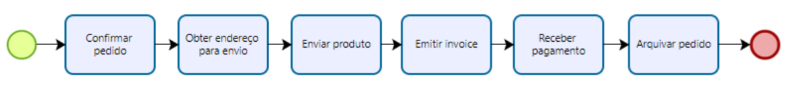
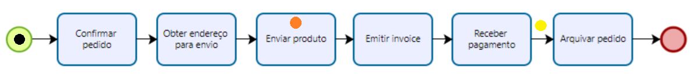
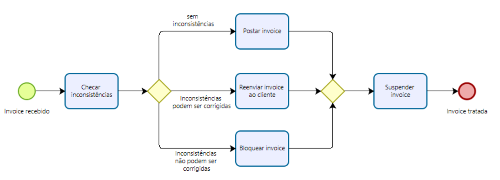
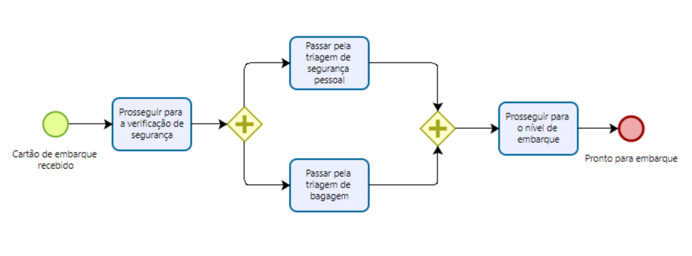
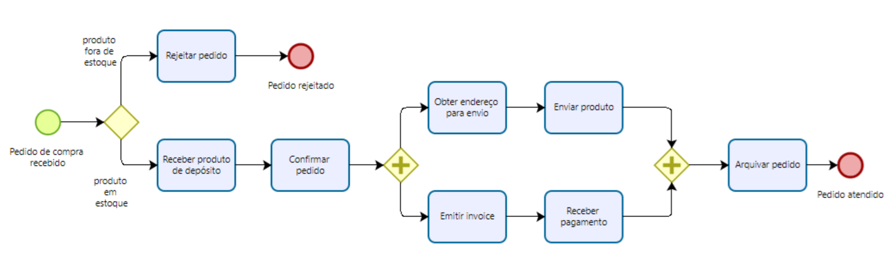

# Capítulo 3: Modelagem Essencial de Processos

Os modelos de processos de negócios são importantes em várias etapas do ciclo de vida do BPM. Antes de começar a modelar um processo, é crucial entender por que estamos modelando-o. Os modelos que produzimos terão aparências bem diferentes dependendo do motivo pelo qual estamos modelando-os. Existem muitos motivos para modelar um processo. O primeiro é simplesmente entender o processo e compartilhar nossa compreensão do processo com as pessoas que estão envolvidas com ele diariamente. De fato, os participantes do processo normalmente executam atividades bastante especializadas em um processo, de modo que dificilmente são confrontados com a complexidade do processo como um todo. Portanto, a modelagem de processos ajuda a entender melhor o processo e a identificar e prevenir problemas. Este passo em direção a uma compreensão completa é o pré-requisito para conduzir a análise, redesign ou automação do processo.

Nesta seção, familiarizaremos-nos com os ingredientes básicos da modelagem de processos usando a linguagem BPMN. Com esses conceitos, seremos capazes de produzir modelos de processos de negócios que capturam relações temporais e lógicas simples entre atividades, objetos de dados e recursos. Primeiro, descreveremos alguns conceitos essenciais de modelos de processos, nomeadamente como os modelos de processos se relacionam com as instâncias de processos. Em seguida, explicaremos os quatro principais blocos estruturais de ramificação e junção em modelos de processos. Estes definem decisões exclusivas, execução paralela, decisões inclusivas e repetição. Finalmente, abordaremos artefatos de informação e recursos envolvidos em um processo.

## 3.1 Primeiros Passos com BPMN

Com mais de 100 símbolos, o BPMN é uma linguagem bastante complexa. O uso de alguns desses símbolos já permitirá cobrir muitas necessidades de modelagem. Depois de dominar esse subconjunto do BPMN, os símbolos restantes virão naturalmente com a prática. Portanto, em vez de descrever cada símbolo do BPMN em detalhes, aprenderemos BPMN introduzindo seus símbolos e conceitos gradualmente, por meio de exemplos.

 Processo simples de atendimento de pedidos

### Exemplo 3.1

A Figura 3.1 mostra uma sequência simples de atividades modelando um processo de atendimento de pedidos no BPMN. Esse processo começa sempre que um pedido de compra é recebido de um cliente. A primeira atividade realizada é confirmar o pedido. Em seguida, o endereço de envio é recebido para que o produto possa ser enviado ao cliente. Depois, a fatura é emitida e, uma vez que o pagamento é recebido, o pedido é arquivado, concluindo assim o processo.

A partir do exemplo acima, notamos que os dois eventos são representados com dois símbolos ligeiramente diferentes. **Usamos círculos com uma borda fina para capturar eventos de início** e **círculos com uma borda grossa para capturar eventos de fim**. Eventos de início e fim têm um papel importante em um modelo de processo: o evento de início indica quando as instâncias do processo começam, enquanto o evento de fim indica quando as instâncias são concluídas. Por exemplo, uma nova instância do processo de atendimento de pedidos é acionada sempre que um pedido de compra é recebido, e é concluída quando o pedido é atendido. Vamos imaginar que o processo de atendimento de pedidos é realizado na organização de um vendedor. Todos os dias, essa organização executará várias **instâncias desse processo**, cada instância sendo independente das outras. Uma vez que uma instância de processo tenha sido iniciada, usamos a noção de **token** para identificar o progresso (ou **estado**) dessa instância. Tokens são criados em um evento de início, fluem por todo o modelo de processo até serem destruídos em um evento de fim. Representamos tokens como pontos coloridos sobre um modelo de processo. 

Por exemplo, a Figura 3.2 mostra o estado de três instâncias do processo de atendimento de pedidos: uma instância acabou de começar (token preto no evento de início), outra está enviando o produto (token vermelho na atividade “Enviar produto”) e a terceira recebeu o pagamento e está prestes a iniciar o arquivamento do pedido (token verde no fluxo de sequência entre “Receber pagamento” e “Arquivar pedido”).

 Progresso de três instâncias do processo simples de atendimento de pedidos

Embora seja natural dar um **nome** (também chamado de **rótulo**) para cada atividade, não devemos esquecer de dar rótulos aos eventos também. Por exemplo, dar um nome a cada evento de início nos permite comunicar o que aciona uma instância do processo, ou seja, quando uma nova instância do processo deve ser iniciada. Da mesma forma, dar um rótulo a cada evento de fim nos permite comunicar quais condições são válidas quando uma instância do processo é concluída, ou seja, qual é o resultado do processo.

Recomendamos as seguintes convenções de nomenclatura. **Para atividades, o rótulo deve começar com um verbo no infinitivo** seguido de um substantivo, normalmente se referindo a um objeto de negócio, por exemplo, “Aprovar pedido”. O substantivo pode ser precedido por um adjetivo, por exemplo, “Emitir carteira de motorista”, e o verbo pode ser seguido por um complemento para explicar como a ação está sendo feita, por exemplo, “Renovar carteira de motorista através de agências offline”. No entanto, evitaremos rótulos longos, pois isso pode prejudicar a legibilidade do modelo. Como regra geral, evitaremos rótulos com mais de cinco palavras, excluindo preposições e conjunções. Artigos são tipicamente evitados para encurtar rótulos. Para eventos, o rótulo deve começar com um substantivo (novamente, isso normalmente seria um objeto de negócio) e terminar com um verbo no particípio passado, por exemplo, “Fatura emitida”. O verbo é um particípio passado para indicar algo que acabou de acontecer. Semelhante aos rótulos de atividade, o substantivo pode ser prefixado por um adjetivo, por exemplo, “Pedido urgente enviado”. Capitalizamos a primeira palavra dos rótulos de atividades e eventos.

Verbos gerais como “fazer”, “realizar”, “executar” ou “conduzir” devem ser substituídos por verbos significativos que capturem as especificidades da atividade sendo realizada ou do evento ocorrendo. Palavras como “processo” ou “pedido” também são ambíguas em termos de sua classe gramatical. Ambas podem ser usadas como verbo (“processar”, “pedir”) e como substantivo (“um processo”, “um pedido”). Recomendamos usar essas palavras de forma consistente, apenas em uma classe gramatical, por exemplo, “pedido” sempre como substantivo.

**Para nomear um modelo de processo, devemos usar um substantivo**, potencialmente precedido por um adjetivo, por exemplo, “processo de atendimento de pedidos” ou “processo de gerenciamento de reclamações”. Esse rótulo pode ser obtido nominalizando o verbo que descreve a ação principal de um processo de negócio, por exemplo, “atender pedido” (a ação principal) torna-se “atendimento de pedidos” (o rótulo do processo). Substantivos em forma hifenizada como “pedido-para-dinheiro” e “compra-para-pagamento” indicando a sequência de ações principais no processo, também são possíveis. Não capitalizamos a primeira palavra dos nomes dos processos, por exemplo, o “processo de atendimento de pedidos”. Seguindo essas convenções de nomenclatura, manteremos nossos modelos mais consistentes, tornando-os mais fáceis de entender para fins de comunicação e aumentando sua reutilizabilidade.

O exemplo na Figura 3.1 representa uma maneira possível de modelar o processo de atendimento de pedidos. No entanto, poderíamos ter produzido um modelo de processo bem diferente. Por exemplo, poderíamos ter negligenciado certas atividades ou expandido outras, dependendo da intenção específica de nossa modelagem. A caixa “Um pouco sobre teoria de modelagem” reflete sobre as propriedades que sustentam um modelo e relaciona essas propriedades ao caso específico de modelos de processos.

### Um Pouco Sobre Teoria de Modelagem

Um modelo é caracterizado por três propriedades:

- mapeamento,
- abstração e
- adequação ao propósito.

Primeiro, um modelo implica um mapeamento de um fenômeno do mundo real—o sujeito da modelagem. Por exemplo, um edifício residencial a ser construído pode ser modelado via uma miniatura de madeira. Segundo, um modelo documenta apenas aspectos relevantes do sujeito, ou seja, abstrai de certos detalhes que são irrelevantes. O modelo de madeira do edifício claramente abstrai dos materiais dos quais o edifício será construído. Terceiro, um modelo serve a um propósito particular, que determina os aspectos da realidade a serem omitidos ao criar um modelo. Sem um propósito específico, não teríamos indicação do que omitir. Considere novamente o modelo de madeira. Ele serve ao propósito de ilustrar como o edifício parecerá. Portanto, ele negligencia aspectos que são irrelevantes para julgar a aparência, como o sistema elétrico do edifício. Portanto, podemos dizer que um modelo é um meio de abstrair de um sujeito dado com a intenção de capturar aspectos específicos do sujeito.

Uma maneira de determinar o propósito de um modelo é entender o público-alvo do modelo. No caso do modelo de madeira, o público-alvo pode ser um comprador em potencial do edifício. Portanto, é importante focar na aparência do edifício, em vez das tecnicalidades da construção. Por outro lado, o modelo de madeira seria de pouca utilidade para um engenheiro que precisa projetar o sistema elétrico. Nesse caso, um blueprint do edifício seria mais apropriado.

Portanto, ao modelar um processo de negócios, precisamos ter em mente o propósito específico e o público-alvo para os quais estamos criando o modelo. Existem dois principais propósitos para a modelagem de processos: design organizacional e design de sistemas de aplicação. Modelos de processos para design organizacional são orientados para negócios. Eles são construídos por analistas de processos e usados principalmente para entendimento e comunicação, mas também para benchmarking e melhoria. Como tal, eles precisam ser intuitivos o suficiente para serem compreendidos pelos diversos stakeholders, e geralmente abstraem dos aspectos relacionados à TI. O público-alvo inclui gerentes, proprietários de processos e analistas de negócios. Modelos de processos para design de sistemas de aplicação são orientados para TI. Eles são construídos por engenheiros de sistemas e desenvolvedores, e usados para automação. Portanto, eles devem conter detalhes de implementação para serem implantados em um BPMS, ou usados como blueprints para desenvolvimento de software.

Neste e no próximo capítulo, focaremos nos **modelos de processos orientados para negócios**.

## 3.2 Ramificação e Junção

Atividades e eventos podem não ser necessariamente executados sequencialmente. Por exemplo, no contexto de um processo de gerenciamento de reclamações, a aprovação e a rejeição de uma reclamação são duas atividades que se excluem mutuamente. Portanto, essas atividades não podem ser executadas em sequência, pois uma instância desse processo executará uma dessas atividades. **Quando duas ou mais atividades são alternativas entre si, dizemos que são mutuamente exclusivas**.

Vamos considerar outra situação. No processo de gerenciamento de reclamações, uma vez que a reclamação foi aprovada, o reclamante é notificado e o pagamento é feito. Notificação e pagamento são duas atividades que geralmente são executadas por duas unidades de negócios diferentes, portanto, são independentes entre si e, como tal, **não precisam ser executadas em sequência**: podem ser executadas em paralelo, ou seja, ao mesmo tempo. **Quando duas ou mais atividades não são interdependentes, são concorrentes**.

Para modelar esses comportamentos, precisamos introduzir a noção de ***gateway***. O termo *gateway* implica que há um mecanismo de controle que permite ou não a passagem de tokens através do gateway. À medida que os tokens chegam a um *gateway*, eles podem ser mesclados na entrada ou divididos na saída, dependendo do tipo de gateway. Representamos *gateways* como losangos e distinguimos entre ***splits*** (ramificação) e ***joins*** (junção). Um ***split gateway*** representa um ponto onde o fluxo do processo diverge, enquanto um ***join gateway*** representa um ponto onde o fluxo do processo converge. *Splits* têm um fluxo de sequência de entrada e vários fluxos de sequência de saída (representando os ramos que divergem), enquanto joins têm vários fluxos de sequência de entrada (representando os ramos a serem mesclados) e um fluxo de sequência de saída.

Vamos ver agora como exemplos como os acima podem ser modelados com *gateways*.

### 3.2.1 Decisões Exclusivas

Para modelar a relação entre duas ou mais atividades alternativas, como no caso da aprovação ou rejeição de uma reclamação, usamos um split exclusivo (XOR). Usamos um XOR-join para mesclar dois ou mais ramos alternativos que podem ter sido previamente divididos com um XOR-split. **Um gateway XOR é indicado com um losango vazio** ou com um losango marcado com um "X".

 Exemplo de uso de *gateway* XOR

#### Exemplo 3.2

Processo de verificação de faturas. Assim que uma fatura é recebida de um cliente, ela precisa ser verificada quanto a inconsistências. A verificação pode resultar em uma dessas três opções: i) não há inconsistências, caso em que a fatura é lançada; ii) há inconsistências, mas estas podem ser corrigidas, caso em que a fatura é reenviada ao cliente; e iii) há inconsistências, mas estas não podem ser corrigidas, caso em que a fatura é bloqueada. Uma vez que uma dessas três atividades é realizada, a fatura é arquivada e o processo é concluído.

Para modelar esse processo, começamos com uma atividade de decisão, a saber “Verificar fatura quanto a inconsistências” após um evento de início “Fatura recebida”. Uma atividade de decisão é uma atividade que leva a diferentes resultados. Em nosso exemplo, essa atividade resulta em três resultados possíveis, que são mutuamente exclusivos; portanto, precisamos usar um XOR-split após essa atividade para dividir o fluxo em três ramos. Consequentemente, três fluxos de sequência emanam deste gateway, um em direção à atividade “Lançar fatura”, realizada se não houver inconsistências, outro em direção a “Reenviar fatura ao cliente”, realizada se existirem inconsistências mas puderem ser corrigidas, e um terceiro fluxo em direção a “Bloquear fatura”, realizada se existirem inconsistências que não podem ser corrigidas (ver Figura 3.4). Do ponto de vista do token, um XOR-split roteia o token vindo de seu ramo de entrada para um de seus ramos de saída, ou seja, apenas um ramo de saída pode ser seguido.

Ao usar um XOR-split, certifique-se de que cada fluxo de sequência de saída seja anotado com um rótulo capturando a condição sob a qual aquele ramo específico é seguido. Além disso, sempre use condições mutuamente exclusivas, ou seja, apenas uma delas pode ser verdadeira cada vez que o XOR-split é alcançado por um token. Esta é a característica do gateway XOR-split. Em nosso exemplo, uma fatura pode estar correta, ou conter inconsistências que podem ser corrigidas, ou inconsistências que não podem ser corrigidas: apenas uma dessas condições é verdadeira por fatura recebida.

Na Figura 3.4, o fluxo rotulado como inconsistências existentes que não podem ser corrigidas” é marcado com um corte oblíquo. Esta notação é opcional e é usada para indicar o fluxo padrão, ou seja, o fluxo que será seguido pelo token vindo do XOR-split caso as condições anexadas a todos os outros fluxos de saída sejam falsas. Como este arco tem o significado de “caso contrário”, ele pode ser deixado sem rótulo. No entanto, recomendamos fortemente que ainda rotule este arco com uma condição para fins de legibilidade.

Uma vez que uma das três atividades alternativas tenha sido executada, mesclamos o fluxo de volta para executar a atividade “Arquivar fatura”, que é comum a todos os três casos. Para isso, usamos um XOR-join. Este *gateway* em particular atua como uma passagem, significando que espera um token chegar de um de seus arcos de entrada e, assim que recebe o token, envia o token para o arco de saída. Em outras palavras, com um XOR-join prosseguimos sempre que um ramo de entrada foi concluído.

Voltando ao nosso exemplo, completamos o modelo de processo com um evento de fim “Fatura tratada”. Certifique-se de sempre completar um modelo de processo com um evento de fim, mesmo que seja óbvio como o processo seria concluído.

### Exercício 3.1

Modele o seguinte fragmento de um processo de negócios para avaliação de pedidos de empréstimo.
Uma vez que um pedido de empréstimo foi aprovado pelo provedor de empréstimo, um pacote de aceitação é preparado e enviado ao cliente. O pacote de aceitação inclui um cronograma de pagamento com o qual o cliente precisa concordar enviando os documentos assinados de volta ao provedor de empréstimo. Este, então, verifica o acordo de pagamento: se o solicitante não concordar com o cronograma de pagamento, o provedor de empréstimo cancela o pedido; se o solicitante concordar, o provedor de empréstimo aprova o pedido. Em qualquer caso, o processo é concluído com o provedor de empréstimo notificando o solicitante sobre o status do pedido.

### 3.2.2 Execução Paralela

Quando duas ou mais atividades não têm dependências de ordem entre si (ou seja, uma atividade não precisa seguir a outra, nem exclui a outra), elas podem ser executadas simultaneamente, ou em paralelo. O *gateway* paralelo (AND) é usado para modelar essa relação particular. Especificamente, usamos um AND-split para modelar a execução paralela de dois ou mais ramos, e um AND-join para sincronizar a execução de dois ou mais ramos paralelos. **Um gateway AND é representado como um losango com um sinal de “+”.**

 Exemplo de uso de *gateway* AND

#### Exemplo 3.3

Verificação de segurança no aeroporto.
Uma vez que o cartão de embarque foi recebido, os passageiros prosseguem para a verificação de segurança. Aqui, eles precisam passar pela triagem de segurança pessoal e pela triagem de bagagem. Depois, podem prosseguir para o nível de embarque.

Este processo consiste em quatro atividades. Começa com a atividade “Prosseguir para a verificação de segurança” e termina com a atividade “Prosseguir para o nível de embarque”. Essas duas atividades têm uma dependência de ordem clara: um passageiro só pode ir para o nível de embarque após passar pelas verificações de segurança necessárias. Após a primeira atividade, e antes da última, precisamos realizar duas atividades que podem ser executadas em qualquer ordem, ou seja, que não dependem uma da outra: “Passar pela triagem de segurança pessoal” e “Passar pela triagem de bagagem”. Para modelar essa situação, usamos um AND-split ligando a atividade “Prosseguir para a verificação de segurança” às duas atividades de triagem, e um AND-join ligando as duas atividades de triagem à atividade “Prosseguir para o nível de embarque” (ver Figura 3.5).

O AND-split divide o token vindo da atividade “Prosseguir para a verificação de segurança” em dois tokens. Cada um desses tokens flui independentemente por um dos dois ramos. Isso significa que, quando alcançamos um AND-split, seguimos todos os ramos de saída (observe que um AND-split pode ter múltiplos arcos de saída). Como dissemos antes, um token é usado para indicar o estado de uma dada instância. Quando múltiplos tokens da mesma cor são distribuídos em um modelo de processo, por exemplo, como resultado da execução de um AND-split, eles coletivamente representam o estado de uma instância. Por exemplo, se um token está no arco emitido da atividade “Passar pela triagem de bagagem” e outro token da mesma cor está no arco incidente à atividade “Passar pela triagem de segurança pessoal”, isso indica uma instância do processo de verificação de segurança onde um passageiro acabou de passar pela triagem de bagagem, mas ainda não começou a triagem de segurança pessoal.

O AND-join do nosso exemplo espera um token chegar de cada um dos dois arcos de entrada e, uma vez que todos estão disponíveis, mescla os tokens de volta em um. O único token é então enviado para a atividade “Prosseguir para o nível de embarque”. Isso significa que prosseguimos quando todos os ramos de entrada foram concluídos (observe novamente que um AND-join pode ter múltiplos arcos de entrada). Esse comportamento de esperar que um número de tokens chegue e depois mesclar os tokens em um é chamado de sincronização.

#### Exemplo 3.4

Vamos estender o exemplo de atendimento de pedidos da Figura 3.1 assumindo que um pedido de compra só é confirmado se o produto estiver em estoque, caso contrário o processo é concluído rejeitando o pedido. Além disso, se o pedido for confirmado, o endereço de envio é recebido e o produto solicitado é enviado enquanto a fatura é emitida e o pagamento é recebido. Depois, o pedido é arquivado e o processo é concluído.

O modelo resultante é mostrado na Figura 3.6. Vamos fazer algumas observações. Primeiro, este modelo possui duas atividades que são mutuamente exclusivas: “Confirmar pedido” e “Rejeitar pedido”, portanto, precedemos elas com um XOR-split (lembre-se de colocar uma atividade antes de um XOR-split para permitir que a decisão seja tomada, como uma verificação, como neste caso, ou uma aprovação). Segundo, as duas sequências “Obter endereço de envio”–“Enviar produto” e “Emitir fatura”–“Receber pagamento” podem ser realizadas independentemente uma da outra, então as colocamos em um bloco entre um AND-split e um AND-join. De fato, esses dois conjuntos de atividades são tipicamente tratados por diferentes recursos dentro da organização do vendedor, como um vendedor para o envio e um oficial financeiro para a fatura, e, portanto, podem ser executados em paralelo (observe a palavra “enquanto” na descrição do processo, o que indica que duas ou mais atividades podem ser executadas ao mesmo tempo).

 Diagrama de processo mais elaborado de atendimento de pedidos

Vamos comparar esta nova versão do processo de atendimento de pedidos com a da Figura 3.1 em termos de eventos. A nova versão apresenta dois eventos de fim, enquanto a primeira versão apresenta um evento de fim. Em um modelo BPMN, podemos ter múltiplos eventos de fim, cada um capturando um resultado diferente do processo (por exemplo, saldo pago vs. saldo processado, pedido aprovado vs. pedido rejeitado). O BPMN adota a chamada semântica de terminação implícita, significando que uma instância de processo é concluída apenas quando cada token fluindo no modelo atinge um evento de fim. Da mesma forma, podemos ter múltiplos eventos de início em um modelo BPMN, cada evento capturando um gatilho diferente para iniciar uma instância de processo. Por exemplo, podemos iniciar nosso processo de atendimento de pedidos sempre que um novo pedido de compra é recebido ou quando um pedido revisado é reenviado. Se um pedido revisado é reenviado, primeiro recuperamos os detalhes do pedido do banco de dados de pedidos e, em seguida, continuamos com o restante do processo. Esta variante do modelo de atendimento de pedidos é mostrada na Figura 3.7. Uma instância deste modelo de processo é acionada pelo primeiro evento que ocorre (observe o uso de um XOR-join para mesclar os ramos vindo dos dois eventos de início).

### Exercício 3.2

Modele o seguinte fragmento de um processo de negócios para avaliação de pedidos de empréstimo.
Um pedido de empréstimo é aprovado se passar por duas verificações: (i) a avaliação do risco do solicitante, feita automaticamente por um sistema, e (ii) a avaliação do imóvel para o qual o empréstimo foi solicitado, realizada por um avaliador de imóveis. A avaliação de risco requer uma verificação de histórico de crédito do solicitante, que é realizada por um oficial financeiro. Uma vez que tanto a avaliação de risco quanto a avaliação do imóvel tenham sido realizadas, um oficial de empréstimos pode avaliar a elegibilidade do solicitante. Se o solicitante não for elegível, o pedido é rejeitado, caso contrário, o pacote de aceitação é preparado e enviado ao solicitante.

Existem duas situações em que um gateway pode ser omitido. Um XOR-join pode ser omitido antes de uma atividade ou evento. Nesse caso, os arcos de entrada para o XOR-join são conectados diretamente à atividade/evento. Um exemplo dessa notação abreviada é mostrado na Figura 1.6, onde há dois arcos incidentes à atividade “Selecionar equipamento adequado”. Um AND-split também pode ser omitido quando segue uma atividade ou evento. Nesse caso, os arcos de saída do AND-split emanam diretamente da atividade/evento.

### 3.2.3 Decisões Inclusivas

Às vezes, podemos precisar seguir um ou mais ramos após uma atividade de decisão. Considere o seguinte processo de negócios.

#### Exemplo 3.5

Processo de distribuição de pedidos.
Uma empresa possui dois armazéns que armazenam diferentes produtos: Amsterdã e Hamburgo. Quando um pedido é recebido, ele é distribuído entre esses armazéns: se alguns dos produtos relevantes estiverem armazenados em Amsterdã, um subpedido é enviado para lá; da mesma forma, se alguns produtos relevantes estiverem armazenados em Hamburgo, um subpedido é enviado para lá. Depois, o pedido é registrado e o processo é concluído.

Podemos modelar o cenário acima usando uma combinação de gateways AND e XOR? A resposta é sim. No entanto, há alguns problemas. As Figuras 3.8 e 3.9 mostram duas soluções possíveis. Na primeira, usamos um XOR-split com três ramos alternativos: um seguido se o pedido contiver apenas produtos de Amsterdã (onde o subpedido é encaminhado para o armazém de Amsterdã), outro seguido se o pedido contiver apenas produtos de Hamburgo (da mesma forma, neste ramo o subpedido é encaminhado para o armazém de Hamburgo) e um terceiro ramo a ser seguido caso o pedido contenha produtos de ambos os armazéns (nesse caso, subpedidos são encaminhados para ambos os armazéns). Esses três ramos convergem em um XOR-join que leva ao registro do pedido.

Embora esse modelo capture nosso cenário corretamente, o diagrama resultante é um tanto convoluto, pois precisamos duplicar as duas atividades que encaminham subpedidos para os respectivos armazéns duas vezes. E se tivéssemos mais de dois armazéns, o número de atividades duplicadas aumentaria. Por exemplo, se tivéssemos três armazéns, precisaríamos de um XOR-split com sete ramos de saída, e cada atividade precisaria ser duplicada quatro vezes. Claramente, essa solução não é escalável.

Na segunda solução, usamos um AND-split com dois arcos de saída, cada um levando a um XOR-split com dois ramos alternativos. Um é seguido se o pedido contiver produtos de Amsterdã (Hamburgo), caso em que uma atividade é realizada para encaminhar o subpedido para o respectivo armazém; o outro ramo é seguido se o pedido não contiver produtos de Amsterdã (Hamburgo), caso em que nada é feito até o XOR-join, que mescla os dois ramos de volta. Depois, um AND-join mescla os dois ramos paralelos vindos do AND-split e o processo é concluído registrando o pedido.

Qual é o problema com essa segunda solução? O cenário do exemplo permite três casos: os produtos estão apenas em Amsterdã, apenas em Hamburgo ou em ambos os armazéns, enquanto essa solução permite um caso a mais, ou seja, quando os produtos não estão em nenhum dos armazéns. Esse caso ocorre quando os dois ramos vazios dos dois XOR-splits são seguidos e resulta em não fazer nada entre a atividade “Verificar itens do pedido” e a atividade “Registrar pedido”. Portanto, essa solução, apesar de ser mais compacta do que a primeira, está errada.

Para modelar situações em que uma decisão pode levar a uma ou mais opções sendo seguidas ao mesmo tempo, precisamos usar um gateway de divisão inclusiva (OR). Um OR-split é semelhante ao XOR-split, mas as condições em seus ramos de saída não precisam ser mutuamente exclusivas, ou seja, mais de uma delas pode ser verdadeira ao mesmo tempo. Quando encontramos um OR-split, seguimos um ou mais ramos dependendo de quais condições são verdadeiras. Em termos de semântica de token, isso significa que o OR-split pega o token de entrada e gera um número de tokens equivalente ao número de condições de saída que são verdadeiras, onde esse número pode ser pelo menos um e, no máximo, o número total de ramos de saída. Semelhante ao gateway XOR-split, um OR-split também pode ser equipado com um fluxo padrão, que é seguido apenas quando todas as outras condições são falsas.

A Figura 3.10 mostra a solução para nosso exemplo usando o gateway OR. Depois que o subpedido foi encaminhado para um dos dois armazéns ou para ambos, usamos um OR-join para sincronizar o fluxo e continuar com o registro do pedido. Um OR-join prossegue quando todos os ramos ativos de entrada foram concluídos. Esperar por um ramo ativo significa esperar por um ramo de entrada que, em última análise, entregará um token ao OR-join. Se o ramo estiver ativo, o OR-join esperará por esse token, caso contrário, não esperará. Uma vez que todos os tokens dos ramos ativos tenham chegado, o OR-join sincroniza esses tokens em um (semelhante ao que um AND-join faz) e envia esse token para seu arco de saída. Chamamos esse comportamento de mesclagem sincronizadora, em oposição à mesclagem simples do XOR-join e à sincronização do AND-join.

Vamos nos aprofundar no conceito de ramo ativo. Considere o modelo na Figura 3.11, que apresenta um gateway de junção com tipo indefinido (o cinza com um ponto de interrogação). Qual tipo devemos atribuir a essa junção? Vamos tentar um AND-join para combinar com o AND-split anterior. Lembramos que um AND-join espera um token chegar de cada ramo de entrada. Enquanto o token do ramo com a atividade “C” sempre chegará, o token do ramo com as atividades “B” e “D” pode não chegar se for roteado para “E” pelo XOR-split. Então, se a atividade “D” não for executada, o AND-join esperará indefinidamente por aquele token, com a consequência de que a instância do processo não poderá progredir mais. Esta anomalia comportamental é chamada de deadlock e deve ser evitada.

Vamos tentar um XOR-join. Lembramos que o XOR-join funciona como uma passagem, encaminhando para seu ramo de saída cada token que chega através de um de seus ramos de entrada. Em nosso exemplo, isso significa que podemos executar a atividade “F” uma ou duas vezes, dependendo se o XOR-split roteia o token para “E” (neste caso, “F” é executado uma vez) ou para “D” (“F” é executado duas vezes). Embora essa solução possa funcionar, temos o problema de não saber se a atividade “F” será executada uma ou duas vezes, e pode ser que não queiramos executá-la duas vezes. Além disso, se for o caso, sinalizaremos que o processo foi concluído duas vezes, já que o evento de fim após “F” receberá dois tokens. E isso, novamente, é algo que queremos evitar.

O único tipo de junção que resta tentar é o OR-join. Um OR-join esperará que todos os ramos ativos de entrada sejam concluídos. Se o XOR-split rotear o controle para “E”, o OR-join não esperará um token do ramo que contém a atividade “D”, pois este nunca chegará. Assim, ele prosseguirá assim que o token da atividade “C” chegar. Por outro lado, se o XOR-split rotear o controle para “D”, o OR-join esperará um token chegar também desse ramo, e uma vez que ambos os tokens tenham chegado, ele os mesclará em um e enviará esse token para fora, para que “F” possa ser executado uma vez e o processo possa ser concluído normalmente.

#### Pergunta: Quando devemos usar um OR-join?

Como a semântica do OR-join não é simples, a presença deste elemento em um modelo pode confundir o leitor. Portanto, sugerimos usá-lo apenas quando for estritamente necessário. Claramente, é fácil ver que um OR-join deve ser usado sempre que precisarmos sincronizar o controle de um OR-split anterior. Da mesma forma, devemos usar um AND-join para sincronizar o controle de um AND-split anterior e um XOR-join para mesclar um conjunto de ramos que são mutuamente exclusivos. Em outros casos, o modelo não terá uma estrutura enxuta como os exemplos nas Figuras 3.8 ou 3.10, onde o modelo é composto de blocos aninhados, cada um delimitado por um split e um join do mesmo tipo. O modelo pode, em vez disso, parecer com o da Figura 3.11, onde pode haver pontos de entrada ou pontos de saída de uma estrutura de bloco. Nesses casos, jogue o jogo do token para entender o tipo de junção correto. Comece com um XOR-join; em seguida, tente um AND-join e, se ambos os gateways levarem a modelos incorretos, use o OR-join, que funcionará com certeza.

Agora que aprendemos os três gateways principais, vamos usá-los para estender o processo de atendimento de pedidos. Suponha que, se o produto não estiver em estoque, ele pode ser fabricado. Dessa forma, um pedido nunca pode ser rejeitado.

#### Exemplo 3.6

Se o produto solicitado não estiver em estoque, ele precisa ser fabricado antes que o atendimento do pedido possa continuar. Para fabricar um produto, as matérias-primas necessárias precisam ser encomendadas. Dois fornecedores preferenciais fornecem diferentes tipos de matéria-prima. Dependendo do produto a ser fabricado, matérias-primas podem ser encomendadas de ambos os fornecedores ou de apenas um deles. Uma vez que as matérias-primas estejam disponíveis, o produto pode ser fabricado e o pedido pode ser confirmado. Por outro lado, se o produto estiver em estoque, ele é retirado do armazém antes de confirmar o pedido. Em seguida, o processo continua normalmente.

O modelo para este processo de atendimento de pedidos estendido é mostrado na Figura 3.12.

### Exercício 3.3

Modele o seguinte fragmento de um processo de negócios para avaliação de pedidos de empréstimo.
Um pedido de empréstimo pode ser acompanhado de um seguro residencial, oferecido a preços com desconto. O solicitante pode manifestar interesse em um plano de seguro residencial no momento de enviar seu pedido de empréstimo ao provedor de empréstimo. Com base nessa informação, se o pedido de empréstimo for aprovado, o provedor de empréstimo pode enviar apenas um pacote de aceitação ao solicitante ou também enviar uma cotação de seguro residencial. O processo então continua com a verificação do acordo de pagamento.

### 3.2.4 Retrabalho e Repetição

Até agora, vimos estruturas que são lineares, ou seja, cada atividade é executada no máximo uma vez. No entanto, às vezes podemos precisar repetir uma ou várias atividades, por exemplo, devido a uma verificação falhada.

#### Exemplo 3.7

No gabinete do ministro da fazenda, uma vez que uma consulta ministerial foi recebida, ela é primeiro registrada no sistema. Em seguida, a consulta é investigada para que uma resposta ministerial possa ser preparada. A finalização de uma resposta inclui a preparação da resposta pelo oficial do gabinete e a revisão da resposta pelo registrador principal. Se o registrador não aprovar a resposta, esta precisa ser preparada novamente pelo oficial do gabinete para revisão. O processo só termina quando a resposta for aprovada.

Para modelar retrabalho ou repetição, primeiro precisamos identificar as atividades, ou mais geralmente o fragmento do processo, que podem ser repetidos. Em nosso exemplo, isso consiste na sequência de atividades “Preparar resposta ministerial” e “Revisar resposta ministerial”. Vamos chamar isso de nosso bloco de repetição. A propriedade de um bloco de repetição é que a última de suas atividades deve ser uma atividade de decisão. De fato, isso nos permitirá decidir se voltamos antes do início do bloco de repetição, para que isso possa ser repetido, ou se continuamos com o restante do processo. Como tal, essa atividade de decisão deve ter dois resultados. Em nosso exemplo, a atividade de decisão é “Revisar resposta ministerial” e seus resultados são: “resposta aprovada” (nesse caso, continuamos com o processo) e “resposta não aprovada” (voltamos). Para modelar esses dois resultados, usamos um XOR-split com dois ramos de saída: um que nos permite continuar com o restante do processo (em nosso exemplo, isso é simplesmente o evento de fim “Correspondência ministerial tratada”), o outro que volta antes da atividade “Preparar resposta ministerial”. Usamos um XOR-join para reconectar esse ramo ao ponto do modelo de processo logo antes do bloco de repetição. O modelo para nosso exemplo é ilustrado na Figura 3.13.

#### Pergunta: Por que precisamos mesclar o ramo de retorno de um bloco de repetição com um XOR-join?

A razão para usar um XOR-join é que este gateway tem uma semântica muito simples: ele move qualquer token que recebe em seu arco de entrada para seu arco de saída, que é o que precisamos neste caso. De fato, se mesclássemos o ramo de retorno com o restante do modelo usando um AND-join, teríamos um deadlock, pois este gateway tentaria sincronizar os dois ramos de entrada quando sabemos que apenas um deles pode estar ativo de cada vez: se estivermos em um loop, receberíamos o token do ramo de retorno; caso contrário, receberíamos do outro ramo, indicando que estamos entrando no bloco de repetição pela primeira vez. Um OR-join funcionaria, mas é um exagero, pois sabemos que apenas um ramo estará ativo de cada vez.

### Exercício 3.4

Modele o seguinte fragmento de um processo de negócios para avaliação de pedidos de empréstimo.
Uma vez que um pedido de empréstimo é recebido pelo provedor de empréstimo, e antes de proceder com sua avaliação, o próprio pedido precisa ser verificado quanto à completude. Se o pedido estiver incompleto, ele é devolvido ao solicitante, para que este preencha as informações faltantes e envie de volta ao provedor de empréstimo. Este processo é repetido até que o pedido seja considerado completo.

Aprendemos como combinar atividades, eventos e gateways para modelar processos de negócios básicos. Para cada um desses elementos, mostramos sua representação gráfica, as regras para combiná-lo com outros elementos de modelagem e explicamos seu comportamento em termos de regras de token. Todos esses aspectos estão sob o termo componentes de uma linguagem de modelagem. Se você quiser saber mais sobre este tópico, pode ler a caixa “Componentes de uma linguagem de modelagem”.

### Componentes de uma Linguagem de Modelagem

Uma linguagem de modelagem consiste em três partes: sintaxe, semântica e notação. A sintaxe fornece um conjunto de elementos de modelagem e um conjunto de regras para governar como esses elementos podem ser combinados. A semântica vincula os elementos sintáticos e suas descrições textuais a um significado preciso. A notação define um conjunto de símbolos gráficos para a visualização dos elementos.

Por exemplo, a sintaxe do BPMN inclui atividades, eventos, gateways e fluxos de sequência. Um exemplo de regra sintática é que eventos de início só têm fluxos de sequência de saída, enquanto eventos de fim só têm fluxos de sequência de entrada. A semântica do BPMN descreve que tipo de comportamento é representado pelos vários elementos. Em essência, isso se relaciona à questão de como os elementos podem ser executados em termos de fluxo de tokens. Por exemplo, um AND-join precisa esperar que todos os ramos de entrada sejam concluídos antes de poder passar o controle para seu ramo de saída. Um exemplo de notação do BPMN é o uso de caixas arredondadas rotuladas para representar atividades.

## 3.3 Artefatos de Informação

Como mostrado no Capítulo 2, um processo de negócios envolve diferentes aspectos organizacionais, como funções, artefatos de negócios, humanos e sistemas de software. Esses aspectos são capturados por diferentes perspectivas de modelagem de processos. Até agora, vimos a perspectiva funcional, que indica quais atividades devem ocorrer no processo, e a perspectiva de fluxo de controle, que indica quando atividades e eventos devem ocorrer. Outra perspectiva importante que devemos considerar ao modelar processos de negócios é a perspectiva de dados. A perspectiva de dados indica quais artefatos de informação (por exemplo, documentos de negócios, arquivos) são necessários para realizar uma atividade e quais são produzidos como resultado da realização de uma atividade.

Vamos enriquecer o processo de atendimento de pedidos do Exemplo 3.6 com artefatos. Vamos começar identificando os artefatos que cada atividade requer para ser executada e aqueles que cada atividade cria como resultado de sua execução. Por exemplo, a primeira atividade do processo de atendimento de pedidos é “Verificar disponibilidade de estoque”. Isso requer um Pedido de compra como entrada para verificar se o produto solicitado está em estoque. Este artefato também é necessário para a atividade “Verificar disponibilidade de matérias-primas” caso o produto seja fabricado. Artefatos como Pedido de compra são chamados de objetos de dados no BPMN. Objetos de dados representam informações que fluem para dentro e para fora das atividades; podem ser artefatos físicos, como uma fatura ou uma carta em papel, ou artefatos eletrônicos, como um e-mail ou um arquivo. Representamos eles como um documento com o canto superior direito dobrado e os ligamos às atividades com uma seta pontilhada com uma ponta de seta aberta (chamada de associação de dados no BPMN). A Figura 3.14 mostra os objetos de dados envolvidos no modelo de processo de atendimento de pedidos.

Usamos a direção da associação de dados para estabelecer se um objeto de dados é uma entrada ou saída para uma dada atividade. Uma associação de entrada, como a usada do Pedido de compra para a atividade “Verificar disponibilidade de estoque”, indica que Pedido de compra é um objeto de entrada para esta atividade; uma associação de saída, como a usada da atividade “Obter matérias-primas do Fornecedor 1” para Matérias-primas, indica que Matérias-primas é um objeto de saída para esta atividade. Para evitar sobrecarregar o diagrama com associações de dados que cruzam fluxos de sequência, podemos repetir um objeto de dados várias vezes dentro do mesmo modelo de processo. No entanto, todas as ocorrências de um dado objeto referem-se conceitualmente ao mesmo artefato. Por exemplo, na Figura 3.14, o Pedido de compra é repetido duas vezes como entrada para “Verificar disponibilidade de estoque” e para “Confirmar pedido”, já que essas duas atividades estão distantes uma da outra em termos de layout do modelo.

Freqüentemente, a saída de uma atividade coincide com a entrada de uma atividade subsequente. Por exemplo, uma vez que as Matérias-primas foram obtidas, elas são usadas pela atividade “Fabricar produto” para criar um Produto. O Produto, por sua vez, é embalado e enviado ao cliente pela atividade “Enviar produto”. Efetivamente, objetos de dados nos permitem modelar o fluxo de informações entre as atividades do processo. No entanto, tenha em mente que objetos de dados e suas associações com atividades não podem substituir o fluxo de sequência. Em outras palavras, mesmo se um objeto for passado de uma atividade A para uma atividade B, ainda precisamos modelar o fluxo de sequência de A para B. Uma notação abreviada para passar um objeto de uma atividade para outra é conectando diretamente o objeto de dados ao fluxo de sequência entre duas atividades consecutivas através de uma associação não direcionada. Veja, por exemplo, o Endereço de envio sendo passado da atividade “Obter endereço de envio” para a atividade “Enviar produto”, que é uma abreviação para indicar que Endereço de envio é uma saída de “Obter endereço de envio” e uma entrada para “Enviar produto”.

Às vezes, podemos precisar representar o estado de um objeto de dados. Por exemplo, a atividade “Confirmar pedido” leva um Pedido de compra como entrada e retorna um Pedido de compra “confirmado” como saída: objeto de entrada e saída são os mesmos, mas o estado do objeto mudou para “confirmado”. Da mesma forma, a atividade “Receber pagamento” leva como entrada um Pedido de compra “confirmado” e o transforma em um Pedido de compra “pago”. Um objeto pode passar por vários estados, por exemplo, uma fatura é primeiro “aberta”, depois “aprovada” ou “rejeitada” e, finalmente, “arquivada”. Indicar os estados dos objetos de dados é opcional: podemos fazê-lo acrescentando o nome do estado entre colchetes ao rótulo do objeto de dados, por exemplo, “Pedido de compra [confirmado]”, “Produto [embalado]”.

Um repositório de dados é um local contendo objetos de dados que precisam ser persistidos além da duração de uma instância de processo, por exemplo, um banco de dados para artefatos eletrônicos ou um arquivo de documentos para artefatos físicos. Atividades do processo podem ler/gravar objetos de dados de/em repositórios de dados. Por exemplo, a atividade “Verificar disponibilidade de estoque” recupera os Níveis de estoque para o produto solicitado do banco de dados do Armazém, que contém informações sobre Níveis de estoque dos vários Produtos. Da mesma forma, a atividade “Verificar disponibilidade de matérias-primas” consulta o catálogo de Fornecedores para verificar qual Fornecedor contatar. O banco de dados do Armazém ou o catálogo de Fornecedores são exemplos de repositórios de dados usados como entrada para atividades. Um exemplo de repositório de dados usado como saída é o banco de dados de Pedidos, que é usado pela atividade “Arquivar pedido” para armazenar o Pedido de compra confirmado. Dessa forma, o pedido recém-arquivado estará disponível para outros processos de negócios dentro da mesma organização, por exemplo, para um processo de negócios que trata de solicitações de devolução de produtos. Repositórios de dados são representados como um cilindro vazio (o símbolo típico de banco de dados) com uma borda superior tripla. Semelhante aos objetos de dados, eles são conectados às atividades por meio de associações de dados.

#### Pergunta: Objetos de dados afetam o fluxo de tokens?

Objetos de dados de entrada são necessários para uma atividade ser executada. Mesmo se um token estiver disponível no arco de entrada daquela atividade, ela não poderá ser executada até que todos os objetos de dados de entrada também estejam disponíveis. Um objeto de dados está disponível se tiver sido criado como resultado da conclusão de uma atividade anterior (cuja saída foi o próprio objeto de dados) ou porque é uma entrada para todo o processo (como Pedido de compra). Objetos de dados de saída afetam o fluxo de tokens apenas indiretamente, ou seja, quando são usados por atividades subsequentes.

#### Pergunta: Precisamos sempre modelar objetos de dados?

Objetos de dados ajudam o leitor a entender o fluxo de dados de negócios de uma atividade para outra. No entanto, o preço a pagar é um aumento na complexidade do diagrama. Portanto, sugerimos usá-los apenas quando forem necessários para um propósito específico, por exemplo, para destacar possíveis problemas no processo em análise (cf. Capítulos 6 e 7) ou para automação (cf. Capítulo 9).

Às vezes, podemos precisar fornecer informações adicionais ao leitor do modelo de processo, a fim de melhorar a compreensão do modelo. Por exemplo, no processo de atendimento de pedidos, podemos querer especificar que a atividade “Enviar produto” inclui a embalagem do produto. Além disso, podemos querer esclarecer qual regra de negócios está sendo seguida na escolha das matérias-primas dos Fornecedores. Essas informações adicionais podem ser fornecidas por meio de anotações de texto. Uma anotação é representada como um retângulo aberto encapsulando o texto da anotação e é vinculada a um elemento de modelagem de processo por meio de uma linha pontilhada (chamada de associação)—veja a Figura 3.14 para um exemplo. Anotações de texto não possuem semântica, portanto, não afetam o fluxo de tokens através do modelo de processo.

### Exercício 3.5

Junte os quatro fragmentos do processo de avaliação de pedidos de empréstimo que você criou nos Exercícios 3.1–3.4.
Dica: Olhe para os rótulos dos eventos de início/fim para entender as dependências de ordem entre os vários fragmentos. Em seguida, estenda o modelo resultante adicionando todos os artefatos necessários. Além disso, anexe anotações para especificar as regras de negócios por trás (i) da verificação da completude de um pedido, (ii) da avaliação da elegibilidade de um pedido e (iii) da verificação de um acordo de pagamento.

## 3.4 Recursos

Um aspecto adicional que precisamos considerar ao modelar processos de negócios é a perspectiva de recursos. Esta perspectiva, também chamada de perspectiva organizacional, indica quem ou o que realiza qual atividade. Recurso é um termo genérico para se referir a qualquer pessoa ou coisa envolvida na execução de uma atividade de processo. Um recurso pode ser:
- Um participante do processo, ou seja, uma pessoa individual, como o funcionário João Silva.
- Um sistema de software, por exemplo, um servidor ou um aplicativo de software.
- Um equipamento, como uma impressora ou uma planta de manufatura.

Distinguimos entre recursos ativos, ou seja, recursos que podem realizar autonomamente uma atividade, e recursos passivos, ou seja, recursos que estão meramente envolvidos na execução de uma atividade. Por exemplo, uma fotocopiadora é usada por um participante para fazer uma cópia de um documento, mas é o participante que realiza a atividade de fotocópia. Portanto, a fotocopiadora é um recurso passivo, enquanto o participante é um recurso ativo. Um trator é outro exemplo de recurso passivo, pois é o operador que realiza a atividade na qual o trator é usado.

A perspectiva de recursos de um processo está interessada em recursos ativos, então, de agora em diante, com o termo “recurso” nos referimos a um “recurso ativo”.

Frequente 

Atividades, eventos, gateways, artefatos e recursos pertencem às principais perspectivas de modelagem de um processo de negócios. A perspectiva funcional captura as atividades que são realizadas em um processo de negócios, enquanto a perspectiva de fluxo de controle combina essas atividades e eventos relacionados em uma determinada ordem. A perspectiva de dados cobre os artefatos manipulados no processo, enquanto a perspectiva de recursos cobre os recursos que realizam as várias atividades. No próximo capítulo, aprenderemos a modelar processos de negócios complexos, explorando as várias extensões dos elementos principais do BPMN que apresentamos aqui.

## 3.6 Soluções para os Exercícios

### Solução 3.1

### Solução 3.2

### Solução 3.3

### Solução 3.4

### Solução 3.5

### Solução 3.6

Veja o pool do Provedor de Empréstimo no modelo da Solução 3.7.

### Solução 3.7

## 3.7 Exercícios Adicionais

### Exercício 3.8

Que tipos de splits e joins podemos modelar em um processo? Faça um exemplo para cada um deles usando a verificação de segurança em um aeroporto como cenário.

### Exercício 3.9

Descreva o seguinte modelo de processo.

### Exercício 3.10

Modele o seguinte processo de negócios para lidar com adiantamentos.
O processo de manuseio de adiantamentos começa quando uma solicitação de pagamento é aprovada. Envolve a inserção da solicitação de adiantamento no sistema, o pagamento automático subsequente, a emissão da fatura direta e a liquidação dos itens de linha do fornecedor. A liquidação dos itens de linha do fornecedor pode resultar em um saldo devedor ou credor. Em caso de saldo devedor, os atrasos são processados, caso contrário, o saldo restante é pago.

### Exercício 3.11

Modele o seguinte processo de negócios para avaliar riscos de crédito.
Quando uma nova solicitação de crédito é recebida, o risco é avaliado. Se o risco estiver acima de um limite, uma avaliação avançada de risco precisa ser realizada, caso contrário, uma avaliação simples de risco será suficiente. Uma vez que a avaliação tenha sido concluída, o cliente é notificado com o resultado da avaliação e, ao mesmo tempo, a liberação do crédito é organizada. Para simplificação, assuma que o resultado de uma avaliação é sempre positivo.

### Exercício 3.12

Modele o seguinte fragmento de um processo de negócios para sinistros de seguro.
Após um sinistro ser registrado, ele é examinado por um oficial de sinistros que então escreve uma recomendação de liquidação. Esta recomendação é então verificada por um oficial sênior de sinistros que pode marcar o sinistro como “OK” ou “Não OK”. Se o sinistro for marcado como “Não OK”, ele é enviado de volta ao oficial de sinistros e a recomendação é repetida. Se o sinistro for “OK”, o processo de manuseio de sinistros prossegue.

### Exercício 3.13

Modele o fluxo de controle do seguinte processo de negócios para compensação de danos.
Se um inquilino for despejado por danos à propriedade, um processo precisa ser iniciado pelo tribunal para realizar uma audiência para avaliar o valor da compensação que o inquilino deve ao proprietário da propriedade. Este processo começa quando um caixa do tribunal recebe uma solicitação de compensação do proprietário. O caixa então recupera o arquivo para aquela propriedade específica e verifica se a solicitação é aceitável para arquivamento e está em conformidade com a descrição da propriedade no arquivo. Marcar uma data de audiência acarreta taxas para o proprietário. Pode ser que o proprietário já tenha pago as taxas com a solicitação, caso em que o caixa aloca uma data de audiência e o processo é concluído. Pode ser que taxas adicionais sejam necessárias, mas o proprietário já tenha pago também essas taxas. Nesse caso, o caixa gera um recibo para as taxas adicionais e procede com a alocação da data de audiência. Finalmente, se o proprietário não pagou as taxas necessárias, o caixa produz um aviso de taxas e espera que o proprietário pague as taxas antes de reavaliar a conformidade do documento.

### Exercício 3.14

O modelo de processo abaixo pode ser executado corretamente? Se não, como pode ser corrigido sem afetar o ciclo, ou seja, de modo que “F”, “G” e “E” permaneçam no ciclo?

### Exercício 3.15

Escreva um modelo BPMN para o processo descrito no Exercício 1.1. Certifique-se de incluir artefatos e anotações onde apropriado.

### Exercício 3.16

Estenda o modelo do Exercício 3.13 adicionando os artefatos que são manipulados.

### Exercício 3.17

Estenda o modelo do Exercício 3.16 adicionando os recursos envolvidos. Há algum recurso não humano?

### Exercício 3.18

Modele o seguinte processo de negócios. Use gateways e objetos de dados onde necessário.
Em um tribunal, todas as manhãs, os arquivos que ainda precisam ser processados são verificados para garantir que estão em ordem para a audiência do tribunal naquele dia. Se alguns arquivos estiverem faltando, uma busca é iniciada, caso contrário, os arquivos podem ser rastreados fisicamente até o local pretendido. Uma vez que todos os arquivos estejam prontos, eles são entregues ao Associado; enquanto isso, a lista de audiências do juiz é distribuída às pessoas relevantes. Depois, as audiências de instruções são realizadas.

### Exercício 3.19

Modele o seguinte processo de negócios. Use pools/lanes onde necessário.
O processo de manuseio de sinistros de automóveis começa quando um cliente envia um sinistro com a documentação relevante. O departamento de notificação da seguradora de automóveis verifica a documentação quanto à completude e registra o sinistro. Em seguida, o departamento de Manuseio assume o sinistro e verifica o seguro. Depois, uma avaliação é realizada. Se a avaliação for positiva, uma oficina é contatada para autorizar os reparos e o pagamento é agendado (nesta ordem). Caso contrário, o sinistro é rejeitado. Em qualquer caso (seja o resultado positivo ou negativo), uma carta é enviada ao cliente.
