# Capítulo 4: Modelagem Avançada de Processos

Nesta seção aprenderemos como modelar processos de negócios complexos com BPMN. As construções apresentadas neste capítulo se baseiam no conhecimento adquirido na seção anterior. Em particular, expandiremos sobre atividades, eventos e gateways. Aprenderemos a usar atividades para modelar subprocessos e como reutilizar esses subprocessos em diferentes processos. Também estenderemos as atividades para modelar formas mais sofisticadas de retrabalho e repetição. Quanto aos eventos, expandiremos sobre eventos de mensagem, apresentaremos eventos temporais e mostraremos como condições de corrida podem ser modeladas entre esses tipos de eventos por meio de um novo tipo de gateway. Também aprenderemos a usar eventos para lidar com exceções em processos de negócios. Finalmente, mostraremos como um diagrama de colaboração pode ser abstraído em um diagrama de coreografia que foca apenas nas interações entre as partes envolvidas nos negócios.

## 4.1 Decomposição de Processos

Ao capturar processos de negócios complexos, o modelo resultante pode ser grande demais para ser entendido de uma vez. Pegue o modelo do processo de atendimento de pedidos da seção anterior - 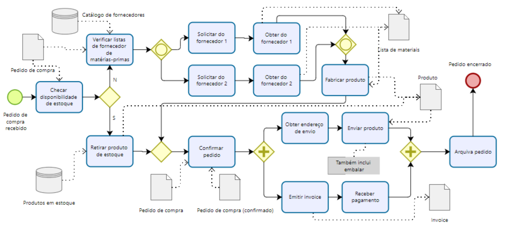.

Enquanto o cenário em questão ainda é relativamente simples, este modelo já contém 14 atividades, seis gateways e dois eventos. À medida que adicionamos objetos de dados e fluxos de mensagens, o modelo fica maior e, portanto, mais difícil de entender. Para melhorar sua legibilidade, podemos simplificar o processo ocultando certas partes dentro de um subprocesso. **Um subprocesso representa uma atividade composta autônoma que pode ser subdividida em unidades menores de trabalho**. Por outro lado, uma atividade atômica, também chamada de tarefa, é uma atividade que captura uma unidade de trabalho que não pode ser subdividida.

Para usar um subprocesso, primeiro precisamos identificar grupos de atividades relacionadas, ou seja, aquelas atividades que juntas alcançam um objetivo particular ou geram um resultado específico no modelo de processo em análise. No nosso exemplo de atendimento de pedidos, podemos ver que as atividades "Verificar listas de fornecedor de matérias-primas" e "Comprar matérias-primas do Fornecedor 1(2)" levam juntas à aquisição de matérias-primas. Portanto, essas atividades, e seus gateways conectores, podem ser encapsuladas em um subprocesso. Em outras palavras, elas podem ser vistas como etapas internas de uma macroatividade chamada "Adquirir matérias-primas". 

Da mesma forma, os dois ramos paralelos para envio e faturamento do pedido podem ser agrupados sob outra atividade de subprocesso chamada "Enviar e faturar". A Figura 4.1 ilustra o modelo resultante, onde as atividades acima foram incluídas em duas atividades de subprocesso. Representamos tais atividades com uma grande caixa arredondada que envolve as etapas internas. Como podemos observar na Figura 4.1, também adicionamos um evento de início e um evento de fim dentro de cada atividade de subprocesso, para indicar explicitamente quando o subprocesso começa e termina.

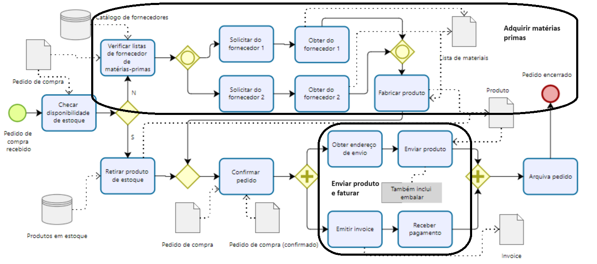 Identificação de subprocessos

Lembre-se de que nosso objetivo inicial era simplificar um modelo de processo. Uma vez que identificamos os limites dos subprocessos, podemos simplificar o modelo ocultando o conteúdo de seus subprocessos, como mostrado na Figura 4.2. Isso é feito substituindo a macroatividade que representa o subprocesso por uma atividade de tamanho padrão. Indicamos que essa atividade oculta um subprocesso marcando-a com um pequeno quadrado com um sinal de mais (+) dentro (como se pudéssemos expandir o conteúdo dessa atividade pressionando o botão de mais). Esta operação é chamada de colapsar um subprocesso. Ao colapsar um subprocesso, reduzimos o número total de atividades (o processo de atendimento de pedidos agora tem apenas seis atividades), melhorando assim a legibilidade do modelo. No BPMN, um subprocesso que oculta suas etapas internas é chamado de subprocesso colapsado, em oposição a um subprocesso expandido que mostra suas etapas internas (como na Figura 4.1).

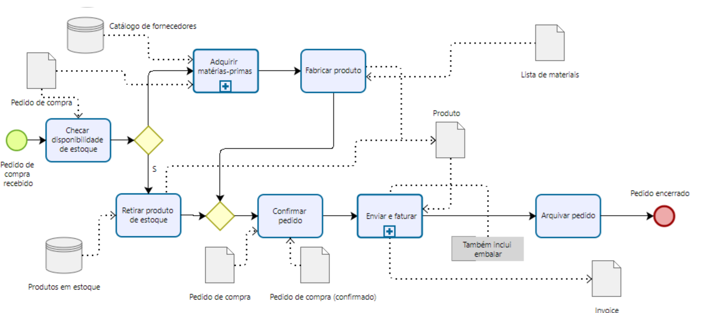 Versão simplificada do processo de atendimento de pedidos com a definição de subprocessos

### Exercício 4.1

Identifique subprocessos adequados no processo de avaliação de pedidos de empréstimo modelado no Exercício 3.5.
Dica: Use os blocos de construção que você criou nos exercícios anteriores.

Colapsar um subprocesso não implica perder seu conteúdo. O subprocesso ainda está lá, apenas **definido em um nível de abstração abaixo**. Na verdade, podemos aninhar subprocessos em vários níveis, de modo a decompor um modelo de processo hierarquicamente. À medida que descemos na decomposição hierárquica de um modelo de processo, podemos adicionar mais detalhes. Por exemplo, podemos estabelecer uma convenção de que, no nível superior, modelamos apenas atividades principais de negócios, no segundo nível adicionamos pontos de decisão, e assim por diante, até modelar exceções e detalhes que são relevantes apenas para automação de processos.

### Pergunta: Quando devemos decompor um modelo de processo em subprocessos?

Devemos usar subprocessos sempre que um modelo se tornar tão grande que seja difícil de entender. Embora seja difícil definir precisamente quando um modelo de processo é "grande demais", já que a compreensibilidade é subjetiva, foi demonstrado que usar mais de aproximadamente 30 objetos de fluxo (ou seja, atividades, eventos, gateways) leva a uma maior probabilidade de cometer erros em um modelo de processo (por exemplo, introduzindo problemas comportamentais). Portanto, sugerimos usar o menor número possível de elementos por nível de modelo de processo e, em particular, decompor um modelo de processo se este tiver mais de 30 objetos de fluxo.

Reduzir o tamanho de um modelo de processo, por exemplo, colapsando seus subprocessos, é uma das maneiras mais eficazes de **melhorar a legibilidade de um modelo de processo**. Outros aspectos estruturais que afetam a legibilidade incluem a densidade das conexões do modelo de processo, o número de ramos paralelos, o caminho mais longo de um evento de início a um evento de fim, bem como aspectos cosméticos, como o layout, o estilo dos rótulos (por exemplo, sempre use um estilo verbo-substantivo), a paleta de cores, a espessura das linhas, etc.

Mostramos que podemos simplificar um modelo de processo primeiro identificando o conteúdo de um subprocesso e depois ocultando esse conteúdo colapsando a atividade do subprocesso. Às vezes, podemos desejar proceder na direção oposta, significando que, ao modelar um processo, já identificamos atividades que podem ser subdivididas em etapas menores, mas intencionalmente subespecificamos seu conteúdo. Em outras palavras, não vinculamos a atividade do subprocesso a um modelo de processo em um nível inferior que capture seu conteúdo (como se, ao pressionar o botão de mais, nada acontecesse). A razão para fazer isso é informar ao leitor que algumas atividades são compostas de subetapas, mas que divulgar os detalhes dessas não é relevante. Este poderia ser o caso da atividade "Enviar produto" no exemplo de atendimento de pedidos, para a qual modelar a distinção entre suas etapas internas de embalagem e envio não é relevante.

## 4.2 Reutilização de Processos

Por padrão, um subprocesso está incorporado dentro de seu modelo de processo pai e, como tal, só pode ser invocado de dentro desse modelo de processo. Muitas vezes, ao modelar um processo de negócios, podemos precisar reutilizar partes de outros modelos de processos da mesma organização. Por exemplo, um fornecedor de empréstimos pode reutilizar o subprocesso para assinatura de empréstimos contido na concessão de empréstimos habitacionais para outros tipos de empréstimo, como um processo de concessão de empréstimos estudantis ou empréstimos para veículos.

No BPMN, podemos definir o conteúdo de um subprocesso fora de seu processo pai, **definindo o subprocesso como um modelo de processo global**. **Um modelo de processo global é um modelo de processo que não está incorporado em nenhum modelo de processo** e, como tal, pode ser invocado por outros modelos de processos dentro da mesma coleção de modelos de processos. Para indicar que o subprocesso sendo invocado é um modelo de processo global, usamos a atividade de subprocesso colapsado com uma borda mais espessa (esse tipo de atividade é chamado de atividade de chamada no BPMN). Voltando ao exemplo de concessão de empréstimos da Figura 4.3, podemos destacar o subprocesso para assinatura de empréstimos e defini-lo como um modelo de processo global, para que também possa ser invocado por um modelo de processo para concessão de empréstimos estudantis (veja a Figura 4.4).

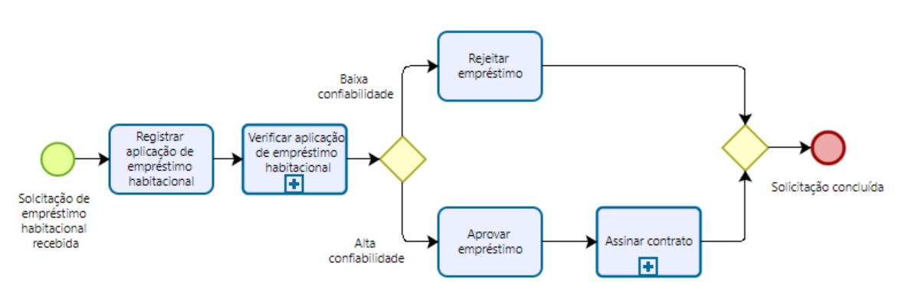 Utilização de subprocesso com escopo global

### Pergunta: Subprocesso incorporado ou global?

**Nossa escolha padrão deve ser definir subprocessos como modelos de processos globais para maximizar sua reutilização dentro de nossa coleção de modelos de processos**. Processos de suporte como pagamento, faturamento, RH, impressão são bons candidatos para serem definidos como modelos de processos globais, já que normalmente são compartilhados por vários processos de negócios dentro de uma organização. **Além da reutilização, outra vantagem de usar modelos de processos globais é que qualquer alteração feita nesses modelos será automaticamente propagada para todos os modelos de processos que os invocam**. Em alguns casos, no entanto, podemos querer manter as mudanças internas a um processo específico. Por exemplo, um processo de faturamento usado para liquidação de pedidos corporativos seria tipicamente diferente do processo de faturamento para pedidos privados. Nesse caso, devemos manter duas variantes do modelo de subprocesso de faturamento, cada uma incorporada em seu modelo de processo pai: liquidação de pedidos corporativos e pedidos privados.

### Exemplo 4.1

Vamos considerar o processo de compras de uma empresa farmacêutica.
Uma empresa farmacêutica possui diferentes unidades de negócios dentro de seu departamento de manufatura, cada uma produzindo um tipo específico de medicamento. Por exemplo, há uma unidade de negócios responsável por medicamentos inalatórios e outra produzindo vacinas. As várias unidades de negócios fazem uso de um processo de compras diretas para pedir produtos químicos e de um processo de compras indiretas para pedir peças de reposição para seus equipamentos.

O processo de compras diretas depende das matérias-primas necessárias para produzir um tipo específico de medicamento. Por exemplo, vacinas geralmente incluem adjuvantes que ajudam a melhorar a eficácia da vacina, que não estão contidos em medicamentos inalatórios. Da mesma forma, medicamentos inalatórios contêm um propelente químico para expelir o medicamento do inalador, que não é necessário para vacinas. Como esse processo de compras é específico para cada unidade de negócios, precisamos modelá-lo como um subprocesso incorporado dentro do modelo de processo de manufatura de cada unidade. Por outro lado, o processo para pedir peças de reposição para os equipamentos de síntese de produtos químicos pode ser compartilhado entre todas as unidades, já que todas as unidades usam os mesmos equipamentos. Assim, modelaremos esse processo com um modelo de processo global.

Antes de concluir nossa discussão sobre subprocessos, precisamos apontar algumas regras sintáticas para usar esse elemento. Um subprocesso é um modelo de processo regular. Ele deve começar com pelo menos um evento de início e terminar com pelo menos um evento de fim. **Se houver vários eventos de início, o subprocesso será acionado pelo primeiro evento que ocorrer. Se houver vários eventos de fim, o subprocesso retornará o controle para seu processo pai apenas quando cada token fluindo neste modelo alcançar um evento de fim**. Além disso, não podemos cruzar o limite de um subprocesso com um fluxo de sequência. Para passar o controle para um subprocesso ou receber o controle de um subprocesso, devemos sempre usar eventos de início e fim. Por outro lado, fluxos de mensagens podem cruzar os limites de um subprocesso para indicar mensagens que emanam de, ou são direcionadas para, atividades ou eventos internos do subprocesso.

### Exercício 4.2

Identifique subprocessos adequados no processo de negócios do Exercício 1.7. Entre esses subprocessos, identifique aqueles que são específicos deste processo de negócios versus aqueles que podem ser potencialmente compartilhados com outros processos de negócios da mesma empresa.

## 4.3 Mais Sobre Retrabalho e Repetição

No capítulo anterior, descrevemos como modelar retrabalho e repetição via gateways XOR. Subprocessos expandidos oferecem uma maneira alternativa de modelar partes de um processo que podem ser repetidas. Vamos considerar novamente o processo de tratamento de correspondência ministerial (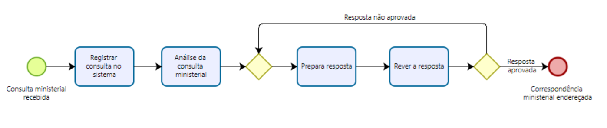). Para tornar esse modelo mais simples, podemos pegar o fragmento identificado pelo XOR-join e o XOR-split (que inclui o bloco de repetição e o ramo de retorno) e substituí-lo por um subprocesso contendo as atividades no bloco de repetição. Para identificar que este subprocesso pode ser repetido (se a resposta não for aprovada), marcamos a atividade de subprocesso com um símbolo de loop, conforme mostrado na Figura 4.5. Podemos usar uma anotação para especificar a condição de loop, por exemplo, "até a resposta ser aprovada".

Como qualquer subprocesso, você pode decidir não especificar o conteúdo de um subprocesso de loop. No entanto, se você fizer isso, não se esqueça de colocar uma atividade de decisão como a última atividade dentro do subprocesso, caso contrário, não há como determinar quando repetir o subprocesso.

### Pergunta: Atividade de loop ou ciclo?

A atividade de loop é uma notação abreviada para um ciclo estruturado, ou seja, um bloco de repetição delimitado por um único ponto de entrada no ciclo e um único ponto de saída do ciclo, como no exemplo acima. Às vezes, pode haver mais de um ponto de entrada e/ou saída, ou o ponto de entrada/saída pode estar dentro do bloco de repetição. Considere, por exemplo, o modelo na Figura 4.6. Aqui, o bloco de repetição é composto pelas atividades "Avaliar aplicação", "Notificar rejeição" e "Receber feedback do cliente"; o ciclo tem um ponto de entrada e dois pontos de saída, dos quais um dentro do bloco de repetição. Quando um ciclo não estruturado tem múltiplos pontos de saída, como neste caso, uma atividade de loop não pode ser usada, a menos que condições adicionais sejam usadas para especificar as situações em que o ciclo pode ser encerrado, o que tornaria o modelo mais complexo.

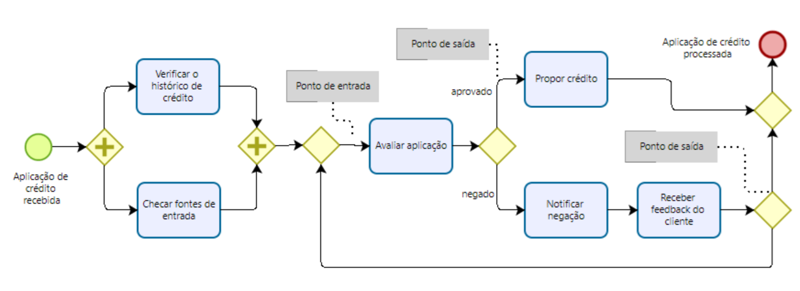 Um exemplo de ciclo não estruturado

### Exercício 4.3

1. Identifique os pontos de entrada e saída que delimitam os ciclos não estruturados nos modelos de processo mostrados na Solução 3.4 e no Exercício 3.9. Quais são os blocos de repetição?

2. Modele o processo de negócios da Solução 3.4 usando uma atividade de loop.

### 4.3.1 Repetição Paralela

A atividade de loop nos permite capturar a repetição sequencial, significando que as instâncias da atividade de loop são executadas uma após a outra. Às vezes, no entanto, podemos precisar executar múltiplas instâncias da mesma atividade ao mesmo tempo, como no exemplo a seguir.

### Exemplo 4.2

Em um processo de compras, uma cotação deve ser obtida de todos os fornecedores preferenciais. Após todas as cotações serem recebidas, elas são avaliadas e a melhor cotação é selecionada. Um pedido de compra correspondente é então feito.

Vamos supor que existam cinco fornecedores preferenciais. Podemos usar um AND-split para modelar cinco tarefas em paralelo, cada uma para obter uma cotação de um fornecedor, conforme mostrado na Figura 4.7. No entanto, há vários problemas com essa solução. Primeiro, quanto maior o número de fornecedores, maior será o modelo resultante, já que precisamos usar uma tarefa por fornecedor. Segundo, precisamos revisar o modelo sempre que o número de fornecedores mudar. Na verdade, é comum na realidade que uma lista atualizada de fornecedores seja mantida em um banco de dados organizacional que é consultado antes de contatar os fornecedores.

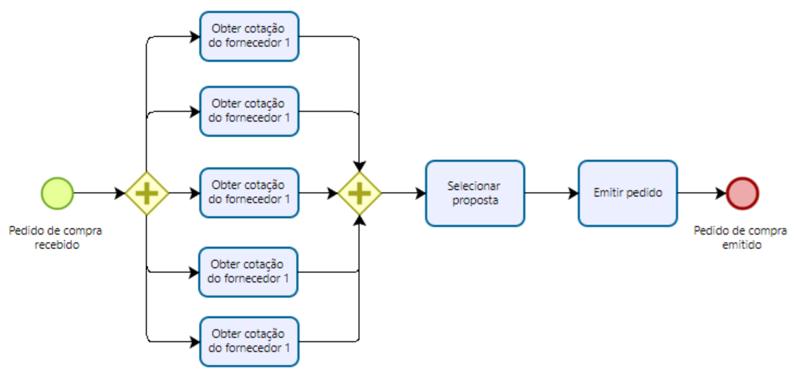 Obtendo proposta de cinco fornecedores

Para resolver esses problemas, o BPMN fornece um objeto chamado **atividade de multi-instância**. **Uma atividade de multi-instância indica uma atividade (seja uma tarefa ou um subprocesso) que é executada múltiplas vezes simultaneamente**. Tal objeto     é útil quando a mesma atividade precisa ser executada para múltiplas entidades ou itens de dados, como por exemplo, solicitar cotações de múltiplos fornecedores (como em nosso exemplo), verificar a disponibilidade de cada item de linha em um pedido separadamente, enviar e coletar questionários para múltiplas testemunhas no contexto de um sinistro de seguro, etc.

Uma atividade de multi-instância é representada como uma atividade marcada com três pequenas linhas verticais na parte inferior. A Figura 4.8 mostra uma versão revisada do modelo de processo de compras na Figura 4.7. **Obs. No Bizagi, para incluir o artefato de múltiplas instâncias deve-se selecionar o objeto de subprocesso e em `Tipo de loop` escolher Múltiplas instâncias.

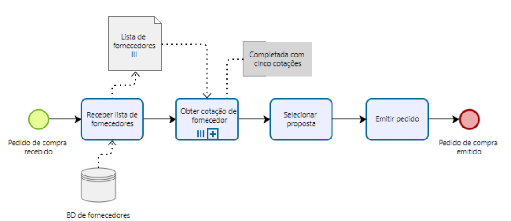 Obtendo proposta de cinco fornecedores com múltiplas instâncias

Este modelo não só é menor, mas também pode funcionar com uma lista dinâmica de fornecedores, que pode mudar de uma instância para outra. Para fazer isso, adicionamos uma tarefa para recuperar a lista de fornecedores e passamos essa lista para uma tarefa de multi-instância, que contata os vários fornecedores. Você deve ter notado que neste exemplo também marcamos o objeto de dados Lista de Fornecedores com o símbolo de multi-instância. Isso é usado para indicar uma coleção de objetos de dados semelhantes, como uma lista de itens de pedido ou uma lista de clientes. Quando uma coleção é usada como entrada para uma atividade de multi-instância, o número de itens na coleção determina o número de instâncias de atividade a serem criadas. Alternativamente, podemos especificar o número de instâncias a serem criadas por meio de uma anotação na atividade de multi-instância (por exemplo, "15 fornecedores" ou "conforme banco de dados de fornecedores").

Vamos voltar ao nosso exemplo. Suponha que a lista de fornecedores tenha se tornado bastante grande ao longo do tempo, digamos que existam 20 fornecedores no banco de dados. Conforme nossas políticas organizacionais, no entanto, cinco cotações de cinco fornecedores diferentes são suficientes para tomar uma decisão. Portanto, não queremos esperar que todos os 20 fornecedores respondam ao nosso pedido de cotação. Para fazer isso, podemos anotar a atividade de multi-instância com o número mínimo de instâncias que precisam ser concluídas antes de passar o controle para o arco de saída (por exemplo, "concluir quando cinco cotações obtidas", como mostrado na Figura 4.8). Quando a atividade de multi-instância é acionada, 20 tokens são gerados, cada um marcando o progresso de uma das 20 instâncias. Então, assim que as primeiras cinco instâncias forem concluídas, todas as outras instâncias são canceladas (os respectivos tokens são destruídos) e um token é enviado para o arco de saída para sinalizar a conclusão.

Vamos pegar o exemplo de atendimento de pedidos na Figura 4.2 e expandir o conteúdo do subprocesso para aquisição de matérias-primas. Para tornar este modelo mais realista, podemos usar um subprocesso de multi-instância no lugar da estrutura delimitada pelos dois gateways OR, assumindo que a lista de fornecedores a serem contatados será determinada dinamicamente a partir de um banco de dados de fornecedores (o modelo atualizado é mostrado na Figura 4.9). Pelo mesmo princípio, substituímos os dois pools "Fornecedor 1" e "Fornecedor 2" por um único pool, denominado "Fornecedor", que também marcamos com o símbolo de multi-instância — um pool de multi-instância representa um conjunto de classes de recursos, ou recursos, com características semelhantes.

### Exercício 4.4

Modele o seguinte fragmento de processo.
Após um acidente de carro, é solicitado um depoimento de duas testemunhas das cinco que estavam presentes, a fim de registrar a reclamação de seguro. Assim que os dois primeiros depoimentos são recebidos, a reclamação pode ser registrada na companhia de seguros sem esperar pelos outros depoimentos.

### 4.3.2 Repetição Não Controlada

Às vezes, podemos precisar modelar que uma ou mais atividades podem ser repetidas várias vezes, sem uma ordem específica, até que uma condição seja atendida. Por exemplo, suponha que o cliente do nosso processo de atendimento de pedidos precise consultar o andamento do seu pedido. O cliente pode fazer isso simplesmente enviando um e-mail para o vendedor. Isso pode ser feito a qualquer momento após o cliente ter enviado o pedido de compra e quantas vezes o cliente desejar. Da mesma forma, o cliente pode tentar cancelar o pedido ou atualizar seus dados pessoais antes que o pedido tenha sido atendido. **Essas atividades são não controladas**, no sentido de que podem ser repetidas várias vezes sem uma ordem específica, ou não ocorrerem de forma alguma, até que uma condição seja atendida — em nosso caso, o pedido sendo atendido.

Para modelar um conjunto de atividades não controladas, podemos usar um **subprocesso ad-hoc**. A Figura 4.10 mostra o exemplo do processo do cliente, onde a condição de conclusão ("até o pedido ser atendido") foi especificada por meio de uma anotação. O subprocesso ad-hoc é marcado com um símbolo de til na parte inferior da caixa do subprocesso. Pode-se estabelecer uma ordem parcial entre as atividades de um subprocesso ad-hoc por meio do fluxo de sequência. No entanto, não podemos representar eventos de início e fim em um subprocesso ad-hoc.

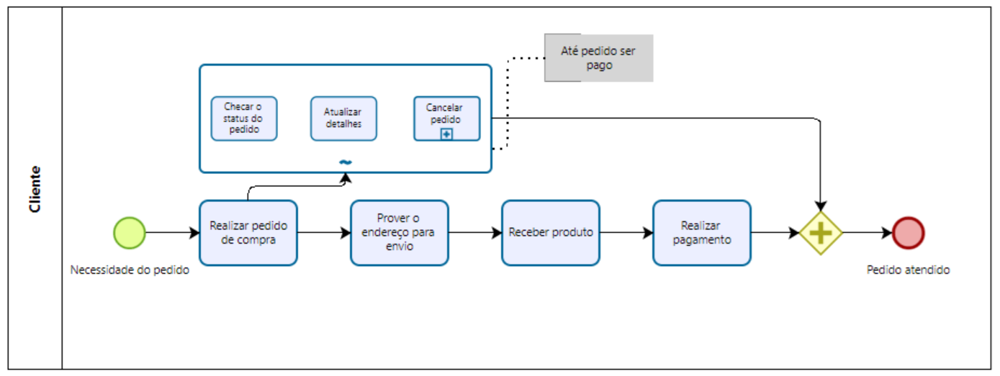 Usando um subprocesso ad-hoc para modelar repetição não controlada

### Exercício 4.5

Modele o seguinte trecho de processo.
Um típico processo de recrutamento do exército começa com a seleção das candidaturas de todos os candidatos. Os candidatos selecionados são então chamados para realizar os seguintes testes: drogas e álcool, visão, visão de cores, audição, sangue, urina, peso, coleta de impressões digitais e exame médico. O teste de visão de cores só pode ser feito após o teste de visão, enquanto o exame médico só pode ser feito após a visão de cores, audição, sangue, urina e peso terem sido testados. Além disso, pode ser necessário para alguns candidatos repetirem alguns desses testes várias vezes para obter uma avaliação correta, por exemplo, o teste de sangue pode precisar ser repetido se o candidato tiver ingerido muito açúcar nas últimas 24 horas. Os candidatos que passarem em todos os testes são chamados para fazer um exame mental e um exame físico, seguidos por uma entrevista. Somente aqueles que também passarem nesses dois exames e se saírem bem na entrevista podem ser recrutados para o exército.

## 4.4 Tratamento de Eventos

Como apontamos na seção anterior, os eventos são usados para modelar algo que acontece instantaneamente em um processo. Vimos eventos de início, que sinalizam como as instâncias de processo começam (**os tokens são criados**), e eventos de fim, que sinalizam quando as instâncias de processo terminam (**os tokens são destruídos**). Quando um evento ocorre durante um processo, por exemplo, uma confirmação de pedido é recebida após o envio de um pedido ao cliente e antes de prosseguir com o envio, o **evento é chamado de intermediário**. Um token permanece preso no fluxo de sequência de entrada de um evento intermediário até que o evento ocorra. Então, o token atravessa o evento instantaneamente, ou seja, eventos não podem reter tokens. **Um evento intermediário é representado como um círculo com uma borda dupla**.

### 4.4.1 Eventos de Mensagem

Na seção anterior, mostramos que podemos marcar um evento de início com um envelope vazio para especificar que novas instâncias de processo são acionadas pelo recebimento de uma mensagem. Além do evento de início de mensagem, também podemos marcar um evento de fim e um evento intermediário com um envelope para capturar a interação entre nosso processo e outra parte. Esses tipos de eventos são coletivamente chamados de **eventos de mensagem**. **Um evento de fim de mensagem sinaliza que um processo é concluído ao enviar uma mensagem**. Um evento intermediário de mensagem sinaliza o recebimento de uma mensagem, ou que uma mensagem acabou de ser enviada, durante a execução do processo. Eventos intermediários e de fim de mensagem representam uma notação alternativa para aquelas atividades que são usadas exclusivamente para enviar ou receber uma mensagem. Pegue, por exemplo, as atividades "Retornar aplicação ao solicitante" e "Receber aplicações atualizadas" na Figura 4.11a.

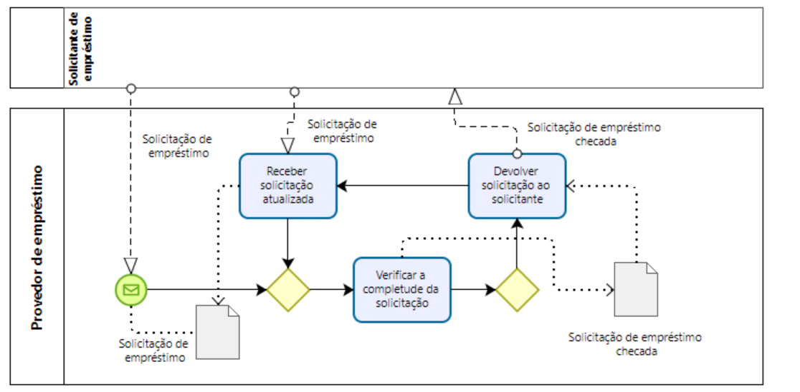 Processo de solicitação de empréstimo (parcialmente completo) **sem** evento intermediário

É mais significativo substituir a primeira atividade por um evento intermediário de envio de mensagem e a segunda atividade por um evento intermediário de recebimento de mensagem, conforme ilustrado na Figura 4.11b, pois essas atividades não representam realmente unidades de trabalho, mas sim o envio ou recebimento mecânico de uma mensagem. Um evento intermediário de mensagem que recebe uma mensagem é representado como um **evento de início de mensagem**, mas com uma borda dupla. **Se o evento intermediário sinaliza uma mensagem sendo enviada, o envelope é escurecido**.

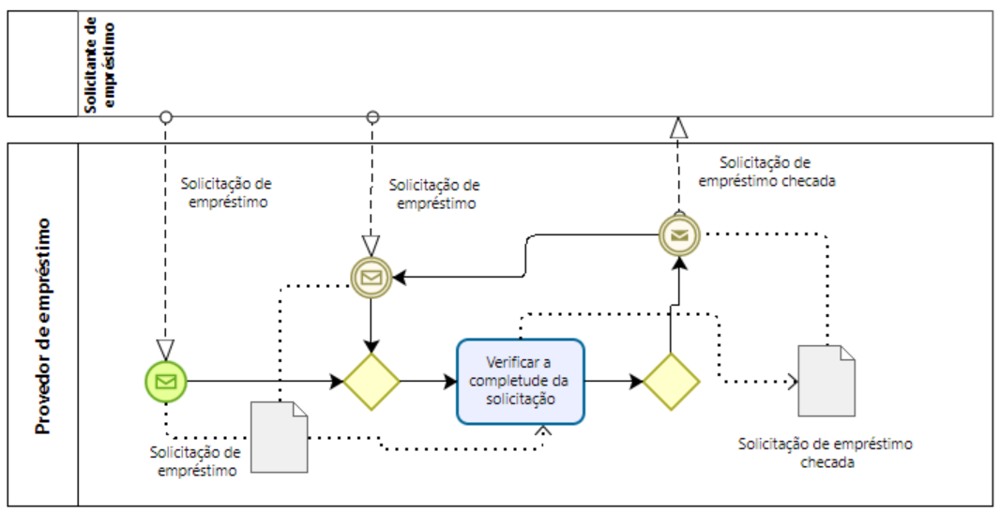 Processo de solicitação de empréstimo (parcialmente completo) **com** evento intermediário

Além disso, se a atividade de envio for imediatamente seguida por um evento de fim não tipado, podemos substituir isso por um **evento de fim de mensagem**, já que novamente, essa atividade é usada apenas para enviar uma mensagem após a qual o processo é concluído. Um evento de fim de mensagem é representado como um evento de fim marcado com um envelope escurecido. Cuidado que um evento de início de mensagem não é uma notação alternativa para um evento de início não tipado seguido por uma atividade de recebimento: esses dois constructos não são intercambiáveis. No primeiro caso, as instâncias de processo começam ao receber uma mensagem específica; no segundo caso, as instâncias de processo podem começar a qualquer momento, após o qual a primeira atividade requer uma mensagem para ser realizada.

### Pergunta: Evento tipado ou não tipado?

Sugerimos especificar o tipo de um evento sempre que isso for conhecido, pois isso ajudará o leitor a entender melhor o modelo de processo. **Eventos tipados são eventos que têm um tipo específico atribuído a eles, o que define o que dispara o evento e/ou qual o efeito que ele tem no processo**. Estes eventos têm um ícone específico que indica seu tipo, proporcionando clareza sobre seu papel dentro do fluxo de trabalho. Alguns tipos comuns de eventos tipados incluem:

Evento de Início (Start Event)

- Mensagem (Message Start Event): O processo começa quando uma mensagem é recebida.
- Temporizador (Timer Start Event): O processo começa em um momento específico ou após um período de tempo.

Evento Intermediário (Intermediate Event)

- Mensagem (Message Intermediate Event): O processo espera por uma mensagem ou envia uma mensagem.
- Erro (Error Intermediate Event): Indica que um erro ocorreu durante a execução do processo.

Evento de Fim (End Event):

- Mensagem (Message End Event): O processo envia uma mensagem ao terminar.
- Erro (Error End Event): Indica que o processo termina devido a um erro.

No BPMN, os eventos vêm em dois tons com base no preenchimento de seu marcador. Um marcador sem preenchimento, como aquele no evento de início de mensagem, denota um **evento de captura, ou seja, um evento que captura um gatilho**, tipicamente originado de fora do processo. Um marcador com preenchimento escuro, como aquele no evento de fim de mensagem, denota um **evento de lançamento, ou seja, um evento que lança um gatilho de dentro do processo**. Um evento intermediário de mensagem tem ambos os sabores, pois pode ser usado tanto como um evento de captura (a mensagem é recebida de outro pool) quanto como um evento de lançamento (a mensagem é enviada para outro pool).

### 4.4.2 Eventos Temporais

Além do evento de mensagem, há outros gatilhos que podem ser especificados para um evento de início. Um que vale a pena mencionar é o **evento de temporizador**. Este tipo de evento indica que as instâncias de processo começam com a ocorrência de um evento temporal específico, por exemplo, toda sexta-feira de manhã, todos os dias úteis do mês, todas as manhãs às 7h.

Um evento de temporizador também pode ser usado como evento intermediário, para modelar um intervalo temporal que precisa decorrer antes que a instância do processo possa prosseguir. Para indicar um evento de temporizador, marcamos o símbolo do evento com um relógio claro dentro do círculo. Eventos de temporizador são apenas eventos de captura, já que um temporizador é um gatilho fora do controle do processo. Em outras palavras, o processo não gera o temporizador, mas sim reage a ele. Veja o exemplo da figura 4.12.

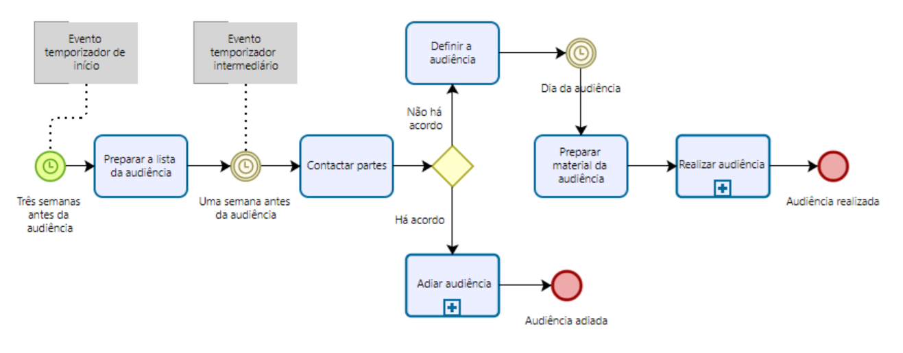 Processo com evento temporizador

### Exemplo 4.3

Vamos considerar o seguinte processo em um tribunal de pequenas causas.
Em um tribunal de pequenas causas, audiências preliminares ocorrem uma vez por mês, para agendar as matérias para os julgamentos futuros. O processo para configurar uma audiência preliminar começa três semanas antes do dia da audiência, com a preparação da lista de audiência contendo informações como detalhes de contato das partes envolvidas e data estimada de audiência. Uma semana antes da audiência, as partes envolvidas são contatadas para determinar se estão todas prontas para ir a julgamento. Se este for o caso, a audiência é marcada, caso contrário, é adiada para a próxima data disponível. Finalmente, no dia da audiência, o material da audiência é preparado e a audiência é realizada.

Este processo é conduzido por três eventos temporais: começa três semanas antes da data da audiência, continua uma semana antes da data da audiência e conclui no dia da audiência. Para modelar esses eventos temporais, precisamos de um evento de início e dois eventos intermediários de temporizador. Vamos ver como esse processo funciona do ponto de vista da semântica de token. Um token capturando uma nova instância é gerado toda vez que faltam três semanas para a data da audiência (assumimos que esta data foi agendada por outro processo). Uma vez que a primeira atividade "Preparar lista de audiência" foi concluída, o token é enviado através do arco de entrada do evento intermediário seguinte, nomeadamente "1 semana antes do dia da audiência". O evento então se torna habilitado. O token permanece preso no arco de entrada deste evento até que o evento temporal ocorra, ou seja, apenas quando faltar uma semana para o dia da audiência. Uma vez que este seja o caso, o token atravessa instantaneamente o símbolo do evento e se move para o arco de saída. É por isso que os eventos são considerados instantâneos, pois não podem reter tokens, ao contrário das atividades, que retêm tokens durante sua execução (lembre-se de que atividades consomem tempo).

### Exercício 4.7

Modele o processo de faturamento de um Provedor de Serviços de Internet (ISP).
O ISP envia uma fatura por e-mail ao cliente no primeiro dia útil de cada mês (Dia 1). No Dia 7, o cliente tem o valor total pendente debitado automaticamente de sua conta bancária. Se uma transação automática falhar por qualquer motivo, o cliente é notificado no Dia 8. No Dia 9, a transação que falhou no Dia 7 é tentada novamente. Se falhar novamente, no Dia 10 uma taxa de atraso é cobrada na conta bancária do cliente. Nesta fase, o pagamento automático não é mais tentado. No Dia 14, o serviço de Internet é suspenso até que o pagamento seja recebido. Se no Dia 30 o pagamento ainda estiver pendente, a conta é fechada e uma taxa de desconexão é aplicada. Um procedimento de recuperação de dívida é então iniciado.

### 4.4.3 Eventos de Corrida

Um cenário típico encontrado ao modelar processos com eventos é aquele em que dois eventos externos competem entre si. O primeiro dos dois eventos que ocorre determina a continuação do processo. Por exemplo, após uma cotação de seguro ter sido enviada a um cliente, o cliente pode responder com uma mensagem de aceitação, caso em que um contrato de seguro será feito, ou com uma rejeição, caso em que a cotação será descartada.

Essa corrida entre eventos externos é capturada por meio do **split exclusivo baseado em eventos (XOR)**. Um split exclusivo baseado em eventos é representado por um gateway marcado por um pentágono vazio envolto em um círculo de linha dupla. A Figura 4.13 apresenta um split exclusivo baseado em eventos. Quando a execução do processo chega a este ponto (em outras palavras — quando um token chega a este gateway), a execução para até que ocorra o evento de mensagem ou o evento de temporizador. Qualquer evento que ocorra primeiro determinará o caminho pelo qual a execução prosseguirá. Se o evento de temporizador ocorrer primeiro, uma consulta de status de envio será iniciada e o fluxo de execução voltará ao gateway exclusivo baseado em eventos. Se a mensagem sinalizando a entrega da carga for recebida primeiro, o fluxo de execução prosseguirá pelo fluxo de sequência que leva ao AND-join.

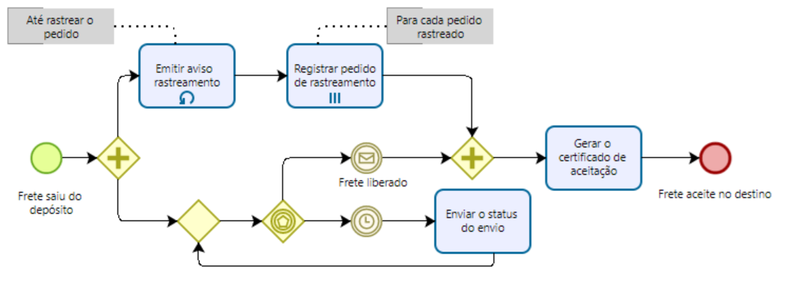 Processo com evento de corrida

A diferença entre o XOR-split que vimos na seção anterior e o split baseado em eventos é que o primeiro modela uma escolha interna que é determinada pelo resultado de uma atividade de decisão, enquanto o segundo modela uma escolha que é determinada pelo ambiente do processo. Uma escolha interna é determinada pelo resultado de uma atividade de decisão. Assim, o split exclusivo baseado em eventos só pode ser seguido por eventos intermediários de captura, como um evento de temporizador ou de mensagem, ou por atividades de recebimento. Como a escolha é adiada até que um evento aconteça, o split baseado em eventos também é conhecido como escolha adiada. Não há um XOR-join baseado em eventos, então os ramos emanados de um split baseado em eventos são mesclados com um XOR-join normal.

### Exercício 4.8

Modele o seguinte processo.
Uma cadeia de restaurantes envia um pedido de compra (PO) para reabastecer seus armazéns todas as quintas-feiras. O sistema de compras da cadeia de restaurantes espera receber uma "Resposta ao PO" ou uma mensagem de erro. No entanto, também pode acontecer que nenhuma resposta seja recebida devido a erros no sistema ou a atrasos no processamento do PO pelo fornecedor. Se nenhuma resposta for recebida até a tarde de sexta-feira ou se uma mensagem de erro for recebida, um funcionário de compras na sede da cadeia de restaurantes deve ser notificado. Caso contrário, a Resposta ao PO é processada normalmente.

O split baseado em eventos pode ser usado como a contraparte de uma decisão interna em uma parte colaboradora. Gateways baseados em eventos também podem ser usados para evitar anomalias comportamentais na comunicação entre pools.

## 4.5 Tratamento de Exceções

**Exceções são eventos que desviam um processo de seu curso normal**, ou seja, do que é comumente conhecido como o cenário "dia de sol". Essas situações "dia de chuva" acontecem frequentemente na realidade e, como tal, devem ser modeladas quando o objetivo é identificar todas as possíveis causas de problemas em um determinado processo. **Exceções incluem falhas de negócios**, como uma exceção devido a um produto fora de estoque ou descontinuado, e falhas tecnológicas, como uma falha de banco de dados, uma interrupção de rede ou uma violação de lógica de programa. Elas desviam o curso normal do processo, pois causam a interrupção ou aborto do processo em execução. Por exemplo, no caso de um produto fora de estoque, um processo de pedido pode precisar ser interrompido para solicitar o produto de um fornecedor, ou abortado totalmente se o produto não puder ser fornecido dentro de um determinado prazo.

### 4.5.1 Aborto do Processo

**A maneira mais simples de lidar com uma exceção é abortar o processo em execução e sinalizar uma terminação inadequada do processo**. Isso pode ser feito usando um evento de término, conforme mostrado na Figura 4.18. Um evento de término (representado como um evento de fim marcado com um círculo cheio dentro), causa a cessação imediata da instância do processo em seu nível atual e de qualquer subprocesso.

No exemplo da Figura 4.18 — uma variante do empréstimo habitacional que já vimos na Figura 4.3 — um empréstimo habitacional é rejeitado e o processo é abortado se o solicitante tiver dívidas e/ou baixa responsabilidade. Do ponto de vista da semântica de token, o evento de término destrói todos os tokens no modelo de processo e em qualquer subprocesso. Em nosso exemplo, isso é necessário para evitar que o processo entre em deadlock no AND-join, pois um token pode permanecer preso antes do AND-join se houver alta responsabilidade e dívidas ou baixa responsabilidade e nenhuma dívida. Observe que, se um evento de término for acionado de dentro de um subprocesso, ele não causará o aborto do processo pai, mas apenas do subprocesso, ou seja, o evento de término é propagado apenas para baixo em uma hierarquia de processo.

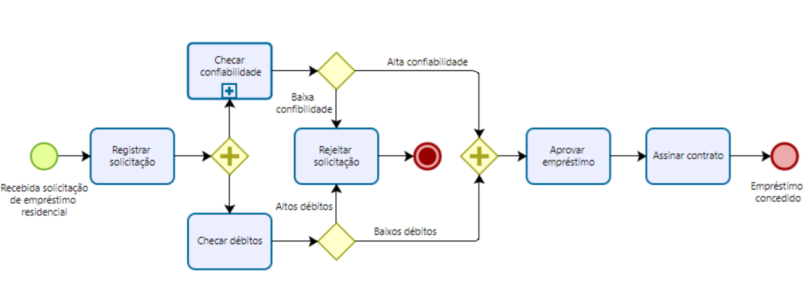 Aborto de processo

### 4.5.2 Exceções Internas

Em vez de abortar todo o processo, podemos lidar com uma exceção interrompendo a atividade específica que causou a exceção. Em seguida, podemos iniciar um procedimento de recuperação para trazer o processo de volta a um estado consistente e continuar sua execução e, se isso não for possível, apenas então, abortar o processo totalmente. O BPMN fornece o evento de erro para capturar esses tipos de cenário. Um evento de erro de fim é usado para interromper o subprocesso envolvente e lançar uma exceção. Esta exceção é então capturada por um evento de erro intermediário de captura que é anexado à borda do mesmo subprocesso. Por sua vez, este evento de borda aciona o procedimento de recuperação por meio de um ramo de saída chamado fluxo de exceção.

O evento de erro é representado como um evento com um marcador de raio. Seguindo as convenções do BPMN para eventos de lançamento e captura, o raio está vazio para o evento intermediário de captura e cheio para o evento de fim de lançamento.

Um exemplo de eventos de erro pode ser aplicado no contexto do nosso processo de atendimento de pedidos. Se houver uma exceção de falta de estoque, a aquisição de matérias-primas é interrompida e o procedimento de recuperação é acionado, que neste caso consiste simplesmente em uma tarefa para notificar o cliente antes de abortar o processo. Em termos de semântica de token, ao lançar um evento de erro de fim, todos os tokens são removidos do subprocesso envolvente (causando sua interrupção) e um token é enviado através do fluxo de exceção emanando do evento de erro de borda. Não há restrições sobre os elementos de modelagem que podemos colocar no fluxo de exceção para modelar o procedimento de recuperação. Normalmente, completaríamos o fluxo de exceção com um evento de término para abortar o processo ou conectaríamos esse fluxo de volta ao fluxo de sequência normal se a exceção tivesse sido devidamente tratada.

### 4.5.3 Exceções Externas

Uma exceção também pode ser causada por um evento externo que ocorra durante uma atividade. Por exemplo, ao verificar a disponibilidade de estoque para o produto em um pedido de compra, o Vendedor pode receber um cancelamento de pedido do cliente. Após esta solicitação, o Vendedor deve interromper a verificação de disponibilidade de estoque e lidar com o cancelamento do pedido. Cenários como o acima são chamados de exceções não solicitadas, pois se originam externamente ao processo. **Eles podem ser capturados anexando um evento de mensagem intermediário de captura à borda de uma atividade, conforme mostrado na Figura 4.20**. Do ponto de vista da semântica de token, quando o evento de mensagem intermediário é acionado, o token é removido da atividade envolvente, consequentemente causando a interrupção da atividade, e enviado através do fluxo de exceção emanando do evento de borda, para realizar o procedimento de recuperação.

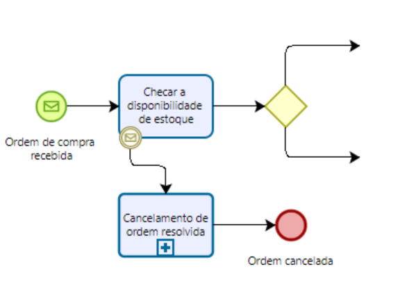 Anexando evento a uma atividade

### Exercício 4.11

Modele a seguinte rotina para fazer login em uma conta bancária pela Internet.
A rotina para fazer login em uma conta bancária pela Internet começa uma vez que as credenciais inseridas pelo usuário foram recuperadas. Primeiro, o nome de usuário é validado. Se o nome de usuário não for válido, a rotina é interrompida e o nome de usuário inválido é registrado. Se o nome de usuário for válido, o número de tentativas de senha é definido como zero. Em seguida, a senha é validada. Se não for válida, o contador para o número de tentativas é incrementado e, se for menor que três, o usuário é solicitado a inserir a senha novamente, desta vez juntamente com um teste CAPTCHA para aumentar o nível de segurança. Se o número de tentativas falhas atingir três vezes, a rotina é interrompida e a conta é congelada. Além disso, a validação do nome de usuário e da senha pode ser interrompida se o servidor de validação não estiver disponível. Da mesma forma, o servidor para testar o CAPTCHA pode não estar disponível no momento do login. Nestes casos, o procedimento é interrompido após notificar o usuário para tentar novamente mais tarde. A qualquer momento durante a rotina de login, o cliente pode fechar a página da web, resultando na interrupção da rotina.

### 4.5.4 Timeouts de Atividade

Outro tipo de exceção é aquele provocado pela interrupção de uma atividade que está demorando muito para ser concluída. Para modelar que uma atividade deve ser concluída dentro de um determinado período de tempo (por exemplo, uma aprovação deve ser concluída em 24 horas), podemos anexar um evento de temporizador intermediário à borda da atividade: o temporizador é ativado quando a atividade envolvente começa, e se ele disparar antes que a atividade seja concluída, provoca a interrupção da atividade. Em outras palavras, um evento de temporizador funciona como um timeout quando anexado à borda de uma atividade.

### Exercício 4.12

Modele o seguinte fragmento de processo.
Uma vez que um pedido por atacado foi confirmado, o fornecedor transmite este pedido ao transportador para a preparação da cotação de transporte. Para preparar a cotação, o transportador precisa calcular o plano de rota (incluindo todos os pontos de rastreamento que precisam ser percorridos durante a viagem) e estimar o uso do trailer (por exemplo, se é uma carga completa, meia carga ou um único pacote). Por contrato, os pedidos por atacado devem ser despachados dentro de quatro dias após o recebimento do pedido. Isso implica que as cotações de transporte devem ser preparadas dentro de 48 horas após o recebimento do pedido para permanecer dentro dos termos do contrato.

### 4.5.5 Eventos Não Interrompíveis e Exceções Complexas

Existem situações em que um evento externo que ocorre durante uma atividade deve apenas acionar um procedimento sem interromper a própria atividade. Por exemplo, no processo de atendimento de pedidos, o cliente pode enviar uma solicitação para atualizar seus dados durante a verificação de disponibilidade de estoque. Os dados devem ser atualizados no banco de dados do cliente sem interromper a verificação de estoque. Para indicar que o evento de borda não é interrompível, usamos uma borda dupla tracejada, conforme mostrado na Figura 4.21.

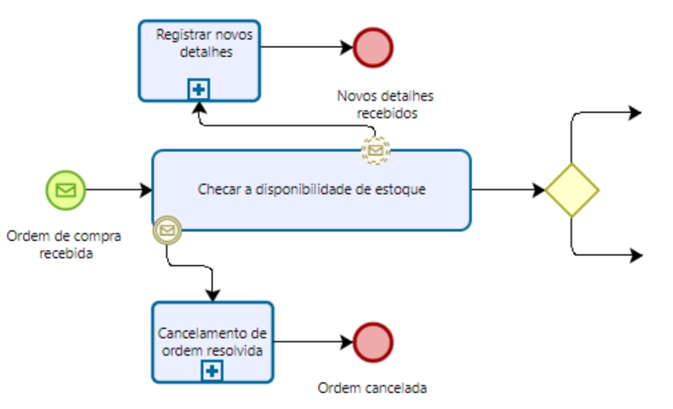 Anexando evento não interrompível a uma atividade

Eventos não interrompíveis podem ser usados para modelar cenários de tratamento de exceções mais complexos. 

### 4.5.6 Interlúdio: Subprocessos de Evento

Uma notação alternativa para eventos de borda é o **subprocesso de evento**. **Um subprocesso de evento é iniciado pelo evento que, de outra forma, seria anexado à borda de uma atividade e envolve o procedimento que seria acionado pelo evento de borda**. Uma diferença importante com eventos de borda é que subprocessos de evento não precisam se referir a uma atividade específica, mas podem modelar eventos que ocorrem durante a execução de todo o processo. Por exemplo, a qualquer momento durante o processo de atendimento de pedidos, o cliente pode enviar uma consulta sobre o status do pedido. Para lidar com essa solicitação, que não é específica para uma atividade particular deste processo, podemos usar um subprocesso de evento, conforme mostrado na Figura 4.23.

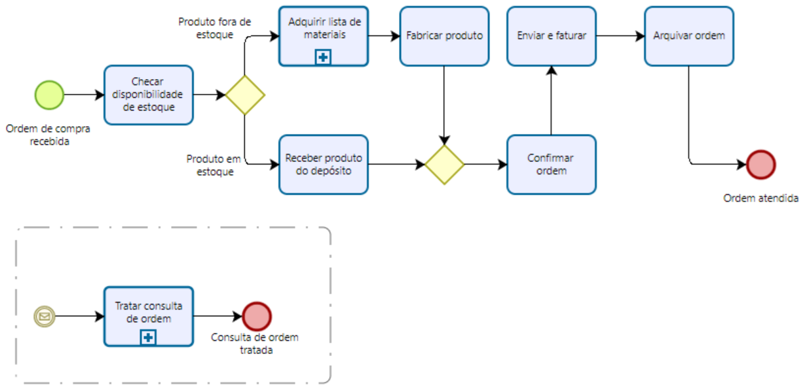 Subprocessos de evento podem ser usados no lugar de eventos de limite e para capturar eventos lançados de fora do escopo de um subprocesso específico.

O subprocesso de evento é representado dentro de um retângulo pontilhado com cantos arredondados que é colocado em um subprocesso expandido ou no processo de nível superior. Semelhante aos eventos de borda, um subprocesso de evento pode ou não interromper o processo envolvente, dependendo se seu evento de início é interrompível ou não. Se seu evento de início não for interrompível, isso é representado com uma borda tracejada (única).

Todas as regras sintáticas para um subprocesso se aplicam ao subprocesso de evento, exceto para eventos de borda, que não podem ser definidos em subprocessos de evento. Por exemplo, o subprocesso de evento também pode ser representado como um subprocesso colapsado. Nesse caso, o evento de início é representado no canto superior esquerdo do retângulo do subprocesso de evento colapsado para indicar como este subprocesso de evento é acionado.

### Pergunta: Subprocessos de evento ou eventos de borda?

Subprocessos de evento são autônomos, significando que devem concluir com um evento de fim. Isso tem a desvantagem de que o procedimento capturado dentro de um subprocesso de evento não pode ser conectado de volta ao restante do fluxo de sequência. A vantagem é que um subprocesso de evento também pode ser definido como um modelo de processo global e, portanto, ser reutilizado em outros modelos de processos da mesma organização. Outra vantagem é que subprocessos de evento podem ser definidos no nível de um processo inteiro, enquanto eventos de borda devem se referir a uma atividade específica. Portanto, sugerimos usar subprocessos de evento quando o evento que precisa ser tratado pode ocorrer durante todo o processo ou quando precisamos capturar um procedimento reutilizável. Para todos os outros casos, eventos de borda são mais apropriados, pois o procedimento acionado por esses eventos pode ser conectado de volta ao restante do fluxo.

### Exercício 4.14

Modele o seguinte processo de negócios para reembolso de despesas.
Após um Relatório de Despesas ser recebido de um funcionário, o funcionário é notificado sobre o recebimento do relatório. Em seguida, uma nova conta deve ser criada se o funcionário ainda não tiver uma. O relatório é então revisado para aprovação automática. Valores abaixo de €1.000 são aprovados automaticamente, enquanto valores iguais ou superiores a €1.000 requerem aprovação manual. Em caso de rejeição, o funcionário deve receber um Aviso de Rejeição por e-mail. Em caso de aprovação, o reembolso é depositado diretamente na conta bancária do funcionário. A qualquer momento durante a revisão, o funcionário pode enviar uma Solicitação de Retificação de Valor. Nesse caso, a retificação é registrada e o relatório precisa ser revisado novamente. Além disso, se o relatório não for tratado dentro de 30 dias, o processo é interrompido e o funcionário recebe um e-mail de Cancelamento para que ele possa enviar novamente o relatório de despesas do zero.

### 4.5.7 Compensação de Atividades

Como parte de um procedimento de recuperação, podemos precisar desfazer uma ou mais etapas que já foram concluídas, devido a uma exceção que ocorreu no subprocesso envolvente. Na verdade, os resultados dessas etapas, e possivelmente seus efeitos colaterais, podem não ser mais desejados e, por essa razão, devem ser revertidos. Esta operação é chamada de compensação e tenta restaurar o processo para um estado de negócios próximo ao estado antes de iniciar o subprocesso que foi interrompido.

Vamos aprofundar o subprocesso para manuseio de envio e faturamento do exemplo de atendimento de pedidos e assumir que esta atividade também pode ser interrompida ao receber uma solicitação de cancelamento de pedido. Após comunicar a penalidade de cancelamento ao cliente, precisamos reverter os efeitos do envio e do pagamento. Especificamente, se o envio já tiver sido feito, precisamos tratar o retorno do produto, enquanto se o pagamento já tiver sido feito, precisamos reembolsar o Cliente. Essas compensações podem ser modeladas por meio de um manipulador de compensação. Um manipulador de compensação é composto por um evento de compensação de lançamento (um evento marcado com um símbolo de retrocesso), um evento de compensação intermediário de captura e uma atividade de compensação. O evento de compensação de lançamento é usado dentro do procedimento de recuperação de uma exceção para iniciar a compensação e pode ser um evento intermediário ou de fim (neste último caso, o procedimento de recuperação é concluído com a compensação). O evento de compensação intermediário de captura é anexado àquelas atividades que precisam ser compensadas — em nosso exemplo "Enviar produto" e "Receber pagamento". Esses eventos de borda capturam a solicitação de compensação e acionam uma atividade de compensação específica para a atividade a ser compensada. Por exemplo, a atividade de compensação para "Receber pagamento" é "Reembolsar cliente". O evento de borda é conectado à atividade de compensação por meio de uma seta pontilhada com uma ponta de seta aberta, chamada de associação de compensação (cuja notação é a mesma da associação de dados). Esta atividade é marcada com o símbolo de compensação para indicar sua finalidade e não deve ter nenhum fluxo de saída: caso o procedimento de compensação seja complexo, esta atividade pode ser um subprocesso.

A compensação só é efetiva se a atividade anexada tiver sido concluída. Uma vez que todas as atividades que poderiam ser compensadas são compensadas, o processo retoma após o evento de compensação de lançamento, a menos que este seja um evento de fim. Se a compensação for para todo o processo, podemos usar um subprocesso de evento com um evento de início de compensação em vez do evento de borda.

Nesta seção, vimos várias maneiras de lidar com exceções em processos de negócios, desde o simples aborto do processo até o tratamento de exceções complexas. Antes de adicionar exceções, é importante entender bem o cenário "dia de sol". Portanto, comece modelando isso. Em seguida, pense em todas as situações possíveis que podem dar errado. Para cada uma dessas exceções, identifique qual tipo de mecanismo de tratamento de exceção precisa ser usado. Primeiro, determine a causa da exceção: interna ou externa. Em seguida, decida se abortar o processo é suficiente ou se um procedimento de recuperação precisa ser acionado. Finalmente, avalie se a atividade interrompida precisa ser compensada como parte do procedimento de recuperação.

### Exercício 4.15

Modifique o modelo que você criou no Exercício 4.14 da seguinte forma.
Se o relatório não for tratado dentro de 30 dias, o processo é interrompido, o funcionário recebe um e-mail de cancelamento e deve enviar novamente o relatório de despesas. No entanto, se o reembolso das despesas do funcionário já tiver sido feito, uma recuperação de dinheiro precisa ser feita, para recuperar o dinheiro do funcionário, antes de enviar o e-mail de cancelamento.

## 4.6 Processos e Regras de Negócio

**Uma regra de negócios implementa uma política ou prática organizacional**. Por exemplo, em uma loja online, clientes platinum têm um desconto de 20% para cada compra acima de €250. Regras de negócios podem aparecer de diferentes formas em um modelo de processo. Vimos elas modeladas em uma atividade de decisão e na condição de um fluxo saindo de um (X)OR-split. Uma terceira opção é usar um evento BPMN dedicado chamado **evento condicional**. **Um evento condicional causa a ativação de seu fluxo de saída quando a respectiva regra de negócios é cumprida**. Eventos condicionais, identificados por um marcador de página alinhado, podem ser usados como eventos de início ou intermediários de captura, incluindo após um gateway baseado em eventos ou anexado à borda de uma atividade. Um exemplo de evento condicional é mostrado na Figura 4.25.

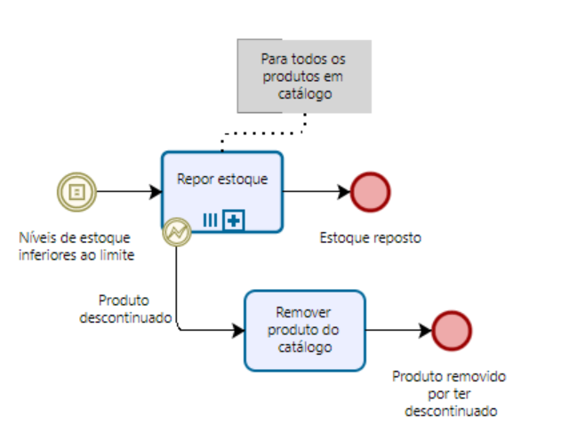 Uma ordem de reposição é acionada toda vez que os níveis de estoque caem abaixo de um limite.

A diferença entre um evento condicional intermediário e uma condição em um fluxo é que esta última é testada apenas uma vez, e se não for satisfeita, o fluxo correspondente não é tomado (outro fluxo ou o fluxo padrão será tomado em vez disso). O evento condicional, por outro lado, é testado até que a regra associada seja satisfeita. Em outras palavras, o token permanece preso antes do evento até que a regra seja satisfeita.

No exemplo da Figura 4.25, observe o uso do evento de erro na borda de uma atividade de multi-instância. Este evento interrompe apenas a instância da atividade que se refere ao produto específico sendo descontinuado, ou seja, a instância da qual o evento de erro é lançado. Todos os outros eventos de borda interrompíveis, ou seja, mensagem, temporizador, sinal e condicional, interrompem todas as instâncias de uma atividade de multi-instância.

### Exercício 4.16

Modele o seguinte trecho de processo.
Em uma bolsa de valores, as variações de preço das ações são continuamente monitoradas durante o dia. Um dia começa quando o sino de abertura toca e conclui quando o sino de fechamento toca. Entre os dois sinos, toda vez que o preço das ações muda mais de 10%, a entidade da mudança é primeiro determinada. Em seguida, se a mudança for alta, um alerta de "alto preço das ações" é enviado, caso contrário, um alerta de "baixo preço das ações" é enviado.

## 4.7 Coreografias de Processos

Às vezes pode ser difícil enquadrar uma colaboração de negócios entre duas ou mais partes, por exemplo, duas organizações, trabalhando diretamente no nível do diagrama de colaboração. Primeiro, o diagrama de colaboração é tipicamente de baixo nível e se os termos das interações entre as duas partes não estiverem claros ainda, pode ser confuso misturar aspectos de comunicação com atividades internas. Segundo, uma parte pode não estar disposta a expor suas atividades internas para outras partes (por exemplo, a lógica por trás de uma aprovação de reclamação deve permanecer privada). Portanto, pode ser oportuno primeiro focar nas interações que devem ocorrer entre todas as partes envolvidas e na ordem em que essas interações podem ocorrer. No BPMN, essa informação é capturada por um diagrama de coreografia. Um **diagrama de coreografia é o modelo de processo das interações que ocorrem entre duas ou mais partes. Esta visão de alto nível sobre uma colaboração atua como um contrato entre todas as partes envolvidas**. Uma vez que este contrato tenha sido elaborado, cada parte pode pegá-lo e refiná-lo em seus processos privados, ou alternativamente, todas as partes podem trabalhar juntas para refinar a coreografia em um diagrama de colaboração. **O Bizagi não suporta o desenho de diagramas de coreografia.**
