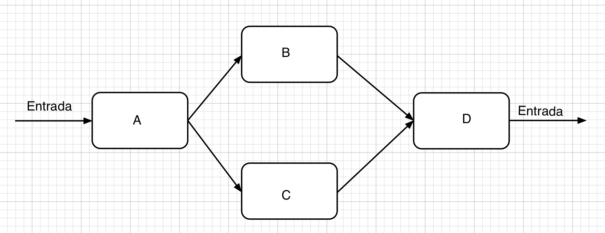

# Prática 7. Circuitos combinacionais utilizando portas lógicas

## Caso 1. Dado o circuito apresentado na figura abaixo, atender ao que se pede.

Projetar um circuito para controle de linha de produção

1. Seja uma linha de produção definida pelas células apresentadas na figura  
  
1. As células B e C realizam as mesmas operações
2. Cada célula possui um sensor que acusa quando ocorre uma falha
3. Apresentar a expressão booleana de um circuito de controle que **gera um alarme quando a linha falha**
4. Minimizar a expressão - se for possível
5. Propor um circuito digital para implementar a expressão minimizada com portas OR, AND e INVERSORES
6. Implementar o circuito

# Somador
1. Um sistema digital precisa de circuito que realize a soma binária de um um número de 2 bits com um número de 1 bit
2. Apresentar a expressão booleana de cada uma das saídas do circuito somador
3. Minimizar a expressão de cada uma das saídas - se for possível 
4. Propor um circuito digital para implementar a expressão minimizada com portas OR, AND e INVERSORES
5. Implementar o circuito

___
**[Home Conteúdo Sistemas Digitais](https://github.com/claytonjasilva/claytonjasilva.github.io/blob/main/sisdig_aulas.md)**  
